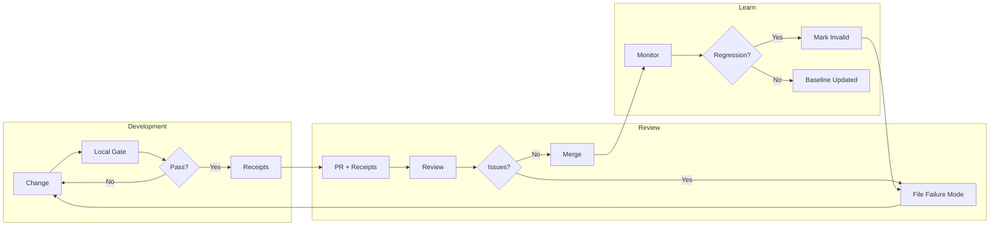

# Audit Infrastructure

This directory contains operational artifacts for tracking PR quality, failure modes, and development costs.

## Purpose

The audit infrastructure supports **traceable wrongness** and **mechanized prevention**:

- Claims only count if they point to evidence
- If evidence doesn't exist (or turns out invalid), we write that down explicitly and link the fix/prevention
- DevLT + machine cost form a composite budget to buy trust

## Contents

| File | Description |
|------|-------------|
| [AUDIT_PATH.md](AUDIT_PATH.md) | 15-minute cold-reader validation checklist |
| [EXHIBITS.md](EXHIBITS.md) | Annotated PRs demonstrating audit workflow |
| [FAILURE_MODES.md](FAILURE_MODES.md) | Taxonomy of failure types and prevention patterns |
| [PR_DOSSIER_SCHEMA.md](PR_DOSSIER_SCHEMA.md) | Schema for structured PR analysis (v2) |
| [PR_LEDGER_TEMPLATE.md](PR_LEDGER_TEMPLATE.md) | Markdown template for PR initial comments |
| [PR_ANALYSIS_WORKFLOW.md](PR_ANALYSIS_WORKFLOW.md) | How to use Claude Code to analyze PRs |
| [pr/](pr/) | Directory for per-PR dossier JSON files |
| [calibration/](calibration/) | DevLT estimation calibration infrastructure |

---

## Trust Loop



**Key properties:**
- Local gate is the trust boundary (not CI)
- Receipts travel with the change
- Failures feed back into taxonomy, not just fixes
- Regressions invalidate prior claims explicitly

## PR Dossiers

For significant PRs, we generate structured dossiers in `docs/audit/pr/`:

```
docs/audit/pr/
  ├── README.md   # directory documentation
  ├── 123.json    # structured dossier for PR #123
  └── 456.json
```

### Generating Dossiers

Use the helper script to bootstrap a dossier from GitHub data:

```bash
# Generate both JSON dossier and markdown ledger
python scripts/generate-pr-ledger.py --pr 123

# JSON only
python scripts/generate-pr-ledger.py --pr 123 --format json --output docs/audit/pr/123.json

# Markdown only (for PR description)
python scripts/generate-pr-ledger.py --pr 123 --format markdown
```

The script:
- Fetches PR metadata from GitHub (requires `gh` CLI)
- Calculates wall-clock time and active work estimate
- Identifies top directories and key files
- Generates a template with TODO placeholders for manual fields

## Usage

### Reporting Wrongness in PRs

When something is wrong, add to your PR:

```markdown
### What was wrong / surprises
- [description] → [disposition: fixed here | fixed in #X | still open]
```

### Recording DevLT and Cost

```markdown
### Cost & attention (this PR)
- DevLT: author ~18m, review ~7m
- Machine spend: ~$2.40 (or "unknown")
```

### Filing a Failure Mode

When you discover a new class of failure:

1. Add an entry to [FAILURE_MODES.md](FAILURE_MODES.md)
2. Link the discovery PR
3. Document prevention (gate/contract) if one was added

## Principles

1. **Honest over impressive** — record what went wrong, not just what went right
2. **Traceable** — link findings to evidence (PRs, commits, receipts)
3. **Prevention-focused** — every failure mode should have a "detection" and ideally a "prevention" section
4. **Lightweight** — don't over-engineer; consistency beats precision
