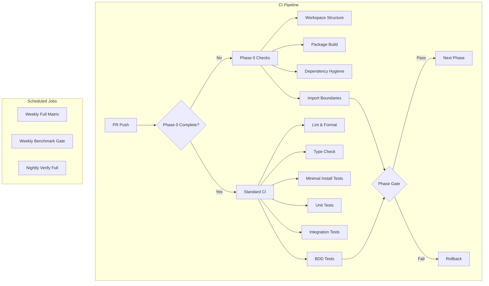
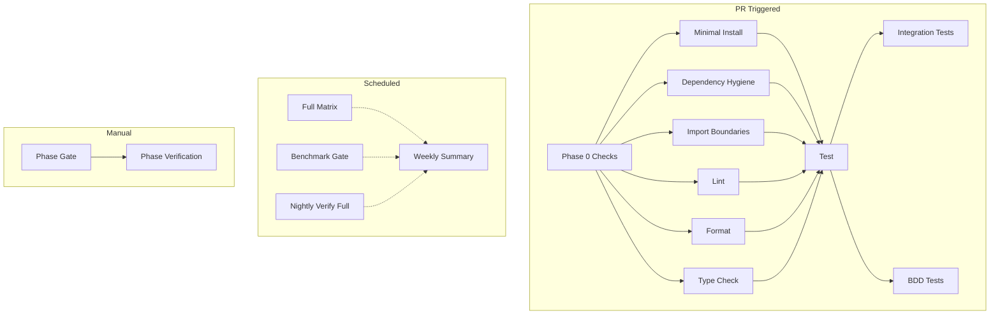

# CI Verification Plan: Slower-Whisper Modularization - Complete Version

**Version:** 1.0
**Created:** 2026-01-30
**Purpose:** Comprehensive CI verification strategy for transforming monolithic slower-whisper into a monorepo with 12+ microlibraries

---

## Table of Contents

1. [CI Verification Strategy Overview](#ci-verification-strategy-overview)
2. [Phase 0 Verification Checklist](#phase-0-verification-checklist)
3. [Minimal Install Test Specifications](#minimal-install-test-specifications)
4. [Dependency Hygiene Test Specifications](#dependency-hygiene-test-specifications)
5. [Import Boundary Test Specifications](#import-boundary-test-specifications)
6. [Phase-by-Phase Verification Checklists](#phase-by-phase-verification-checklists)
7. [Full Matrix Test Specifications](#full-matrix-test-specifications)
8. [Version Skew Tests (Future)](#version-skew-tests-future)
9. [GitHub Actions Workflow Templates](#github-actions-workflow-templates)
10. [Pre-commit Hook Configurations](#pre-commit-hook-configurations)
11. [CI Execution Timeline and Resource Estimates](#ci-execution-timeline-and-resource-estimates)

---

## CI Verification Strategy Overview

### Goals

The CI verification strategy ensures that the modularization of slower-whisper into 16 microlibraries maintains:

1. **Workspace integrity** - All packages build and install correctly
2. **Dependency hygiene** - Packages only declare their actual dependencies
3. **Import boundaries** - No forbidden cross-package imports
4. **Backward compatibility** - Existing code continues to work via compat layer
5. **Version consistency** - All packages stay in sync during release train
6. **Performance parity** - No regressions in core workflows

### CI Architecture



### CI Job Categories

| Category | Purpose | Frequency | Criticality |
|----------|---------|------------|-------------|
| **Phase 0 Checks** | Verify workspace setup | Every PR until Phase 0 complete | Blocking |
| **Minimal Install Tests** | Verify packages install without heavy deps | Every PR | Blocking |
| **Dependency Hygiene** | Verify dependency declarations | Every PR | Blocking |
| **Import Boundary** | Verify no forbidden imports | Every PR | Blocking |
| **Standard CI** | Lint, format, typecheck, tests | Every PR | Blocking |
| **Full Matrix** | Test all package combinations | Weekly | Non-blocking |
| **Benchmark Gate** | Performance regression detection | Weekly | Non-blocking (scheduled) |
| **Verify Full** | End-to-end verification | Nightly | Non-blocking |

### Rollback Criteria

| Trigger | Action |
|---------|--------|
| Phase 0 checks fail | Stop modularization, investigate |
| Import boundary violations detected | Fix before proceeding to next phase |
| Minimal install tests fail | Fix dependency declarations |
| Backward compatibility broken | Fix compat layer |
| Performance regression > 20% | Investigate and fix |
| Circular dependencies detected | Redesign package boundaries |

---

## Phase 0 Verification Checklist

### Overview

Phase 0 creates the monorepo workspace structure. All checks must pass before proceeding to Phase 1.

### Checklist

#### Workspace Structure Verification

- [ ] **Directory Structure**
  - [ ] `packages/` directory exists at repository root
  - [ ] All 16 package directories created:
    - [ ] `packages/slower-whisper-contracts/`
    - [ ] `packages/slower-whisper-config/`
    - [ ] `packages/slower-whisper-io/`
    - [ ] `packages/slower-whisper-device/`
    - [ ] `packages/slower-whisper-audio/`
    - [ ] `packages/slower-whisper-asr/`
    - [ ] `packages/slower-whisper-safety/`
    - [ ] `packages/slower-whisper-intel/`
    - [ ] `packages/slower-whisper-prosody/`
    - [ ] `packages/slower-whisper-emotion/`
    - [ ] `packages/slower-whisper-diarization/`
    - [ ] `packages/slower-whisper-streaming/`
    - [ ] `packages/slower-whisper-server/`
    - [ ] `packages/slower-whisper-client/`
    - [ ] `packages/slower-whisper/`
    - [ ] `packages/slower-whisper-compat/`
  - [ ] Each package has `src/` directory
  - [ ] Each package has `tests/` directory
  - [ ] Each package has `pyproject.toml`

- [ ] **Root Configuration**
  - [ ] Root `pyproject.toml` has `[tool.uv.workspace]` section
  - [ ] Root `pyproject.toml` lists all 16 packages as members
  - [ ] Root `pyproject.toml` has `[tool.uv.sources]` for workspace packages
  - [ ] Root `pyproject.toml` has workspace-level dev dependencies
  - [ ] `uv.lock` exists (after `uv sync`)

#### Package pyproject.toml Verification

- [ ] **All packages have valid pyproject.toml**
  - [ ] `build-system` section present with `hatchling>=1.25.0`
  - [ ] `project.name` matches expected package name
  - [ ] `project.version` matches workspace version (2.0.0)
  - [ ] `project.requires-python` is `>=3.12,<3.15`
  - [ ] `project.license` is `{text = "Apache-2.0"}`
  - [ ] `project.authors` includes Effortless Metrics
  - [ ] `[tool.hatch.build.targets.wheel]` packages correct src directory
  - [ ] `[tool.hatch.build.targets.sdist]` includes src, tests, README.md

- [ ] **Dependencies are correct**
  - [ ] `contracts` has NO external dependencies (stdlib only)
  - [ ] `device` has NO external dependencies (stdlib only)
  - [ ] `config` depends on `contracts` and `pyyaml`
  - [ ] `io` depends on `contracts` only
  - [ ] `audio` depends on `contracts`, `device`, and `numpy`
  - [ ] `asr` depends on `contracts`, `device`, `audio`, and `faster-whisper`
  - [ ] `safety` depends on `contracts` only
  - [ ] `intel` depends on `contracts` and `safety`
  - [ ] `prosody` depends on `contracts`, `audio`, and `numpy`
  - [ ] `emotion` depends on `contracts`, `audio`, `device` (torch optional)
  - [ ] `diarization` depends on `contracts`, `audio`, `device` (pyannote optional)
  - [ ] `streaming` depends on contracts, asr, audio, prosody, emotion, diarization, intel, safety
  - [ ] `server` depends on `contracts`, `config`, `asr`, `streaming`, `intel`, fastapi, uvicorn
  - [ ] `client` depends on `contracts`, `streaming`, httpx, websockets
  - [ ] `meta` depends on all other packages
  - [ ] `compat` depends on `meta` only

- [ ] **Inter-package dependencies use exact pinning**
  - [ ] All inter-package deps use `==` not `>=` or `~=`
  - [ ] All inter-package deps are version 2.0.0
  - [ ] No circular dependencies in dependency graph

#### Workspace Tooling Verification

- [ ] **uv sync works**
  - [ ] `uv sync` completes without errors
  - [ ] `uv sync --extra dev` completes without errors
  - [ ] `uv.lock` is generated and valid

- [ ] **Test commands work**
  - [ ] `uv run pytest` runs (even if no tests yet)
  - [ ] `uv run ruff check .` runs
  - [ ] `uv run ruff format . --check` runs
  - [ ] `uv run mypy packages/*/src` runs

- [ ] **Build commands work**
  - [ ] `uv build ./packages/slower-whisper-contracts` creates wheel
  - [ ] `uv build ./packages/slower-whisper-config` creates wheel
  - [ ] All packages can be built individually

#### Circular Dependency Verification

- [ ] **No circular dependencies**
  - [ ] Dependency graph is a DAG
  - [ ] Topological sort succeeds
  - [ ] No package depends on itself (directly or indirectly)

### Rollback Criteria for Phase 0

**Immediate rollback if:**
- Any package fails to build
- Circular dependencies detected
- Workspace sync fails
- Invalid pyproject.toml files

---

## Minimal Install Test Specifications

### Overview

Minimal install tests verify that packages can be installed without pulling in heavy ML dependencies. This is critical for users who only need specific functionality.

### Test Matrix

| Package | Expected Install Time | Forbidden Dependencies | Required Imports |
|---------|----------------------|----------------------|-------------------|
| `slower-whisper-contracts` | < 2 seconds | torch, faster-whisper, pyannote, librosa, fastapi | All public exports |
| `slower-whisper-client` | < 5 seconds | torch, faster-whisper, pyannote | StreamingClient, create_client |
| `slower-whisper-device` | < 2 seconds | torch, faster-whisper, pyannote, numpy | resolve_device, ResolvedDevice |
| `slower-whisper-config` | < 3 seconds | torch, faster-whisper, pyannote | TranscriptionConfig, EnrichmentConfig |
| `slower-whisper-io` | < 2 seconds | torch, faster-whisper, pyannote | write_json, write_txt, write_srt |
| `slower-whisper-safety` | < 2 seconds | torch, faster-whisper, pyannote | format_smart, redact_pii |

### Test Script: `scripts/test_minimal_install.py`

The test script is defined in the main plan document. Key features:

1. Creates temporary venv for each package
2. Installs package and measures time
3. Checks installed dependencies against forbidden list
4. Tests that required imports work
5. Reports failures with clear error messages

### CI Job: Minimal Install Tests

```yaml
minimal-install:
  name: Minimal Install Tests
  runs-on: ubuntu-latest
  timeout-minutes: 30
  
  steps:
    - name: Checkout repository
      uses: actions/checkout@v6
    
    - name: Install uv
      uses: astral-sh/setup-uv@v7
      with:
        enable-cache: true
        cache-dependency-glob: |
          pyproject.toml
          uv.lock
    
    - name: Set up Python
      run: uv python install 3.12
    
    - name: Run minimal install tests
      run: |
        uv run python scripts/test_minimal_install.py
    
    - name: Upload test results
      if: always()
      uses: actions/upload-artifact@v6
      with:
        name: minimal-install-results
        path: minimal-install-logs/
        retention-days: 7
```

---

## Dependency Hygiene Test Specifications

### Overview

Dependency hygiene tests verify that packages only declare their actual dependencies and that optional dependencies are properly guarded with runtime imports.

### Test Categories

#### 1. Actual vs Declared Dependencies

Verify that packages only declare dependencies they actually use.

#### 2. Optional Dependency Guards

Verify that optional dependencies are properly guarded with runtime imports and try/except blocks.

### CI Job: Dependency Hygiene Tests

```yaml
dependency-hygiene:
  name: Dependency Hygiene Tests
  runs-on: ubuntu-latest
  timeout-minutes: 15
  
  steps:
    - name: Checkout repository
      uses: actions/checkout@v6
    
    - name: Install uv
      uses: astral-sh/setup-uv@v7
      with:
        enable-cache: true
        cache-dependency-glob: |
          pyproject.toml
          uv.lock
    
    - name: Set up Python
      run: uv python install 3.12
    
    - name: Run dependency hygiene tests
      run: |
        uv run python scripts/test_dependency_hygiene.py
    
    - name: Run optional dependency guard tests
      run: |
        uv run python scripts/test_optional_deps.py
    
    - name: Upload test results
      if: always()
      uses: actions/upload-artifact@v6
      with:
        name: dependency-hygiene-results
        path: dependency-hygiene-logs/
        retention-days: 7
```

---

## Import Boundary Test Specifications

### Overview

Import boundary tests verify that packages only import from allowed dependencies based on the dependency hierarchy defined in Phase 0.

### Forbidden Import Edges

Based on dependency graph from Phase 0 specification:

| From Package | Forbidden To Import | Reason |
|-------------|---------------------|---------|
| `contracts` | Any other package | Foundation - must have no dependencies |
| `device` | Any other package | Foundation - stdlib only |
| `config` | device, audio, asr, etc. | Only depends on contracts |
| `io` | device, audio, asr, etc. | Only depends on contracts |
| `audio` | asr, safety, intel, etc. | Only depends on contracts + device |
| `asr` | streaming, server, client, etc. | Only depends on contracts + device + audio |
| `safety` | audio, asr, intel, etc. | Only depends on contracts |
| `intel` | audio, prosody, etc. | Only depends on contracts + safety |
| `prosody` | asr, intel, etc. | Only depends on contracts + audio |
| `emotion` | asr, prosody, etc. | Only depends on contracts + audio + device |
| `diarization` | asr, prosody, etc. | Only depends on contracts + audio + device |
| `streaming` | server, client, meta, compat | Orchestrates packages, not used by them |
| `server` | client, meta, compat | Service package, not used by others |
| `client` | server, meta, compat | Client package, not used by others |
| `meta` | compat | Meta package, not used by compat |

### Test Script

The import boundary checker script is already defined in [`scripts/check_import_boundaries.py`](phase0-workspace-specification.md) from Phase 0 specification. This script:

1. Parses all Python files in packages/
2. Collects import statements
3. Validates against allowed edges matrix
4. Reports violations with file paths and line numbers

### CI Job: Import Boundary Tests

```yaml
import-boundaries:
  name: Import Boundary Tests
  runs-on: ubuntu-latest
  timeout-minutes: 10
  
  steps:
    - name: Checkout repository
      uses: actions/checkout@v6
    
    - name: Install uv
      uses: astral-sh/setup-uv@v7
      with:
        enable-cache: true
        cache-dependency-glob: |
          pyproject.toml
          uv.lock
    
    - name: Set up Python
      run: uv python install 3.12
    
    - name: Run import boundary checks
      run: |
        uv run python scripts/check_import_boundaries.py --verbose
    
    - name: Upload violation report
      if: failure()
      uses: actions/upload-artifact@v6
      with:
        name: import-boundary-violations
        path: import-boundary-report.txt
        retention-days: 30
```

### Pre-commit Hook

Add to `.pre-commit-config.yaml`:

```yaml
repos:
  - repo: local
    hooks:
      - id: check-import-boundaries
        name: Check import boundaries
        entry: uv run python scripts/check_import_boundaries.py
        language: system
        pass_filenames: false
        always_run: true
```

---

## Phase-by-Phase Verification Checklists

### Overview

Each phase of modularization has specific verification requirements. These checklists ensure that each phase is complete before proceeding to the next.

### Phase 1: Extract Contracts

**Goal:** Extract core data models, exceptions, events, and schemas.

**Verification Checklist:**

- [ ] **File Moves**
  - [ ] All 11 files moved to `packages/slower-whisper-contracts/src/slower_whisper_contracts/`
  - [ ] `schema/` directory moved
  - [ ] `schemas/` JSON files moved

- [ ] **Import Updates**
  - [ ] `transcription/__init__.py` updated to import from `slower_whisper_contracts`
  - [ ] All files importing from moved modules updated

- [ ] **Package Tests**
  - [ ] `slower-whisper-contracts` builds successfully
  - [ ] `slower-whisper-contracts` installs successfully
  - [ ] All imports from `slower_whisper_contracts` work
  - [ ] No external dependencies in pyproject.toml

- [ ] **CI Tests**
  - [ ] Minimal install test passes for `slower-whisper-contracts`
  - [ ] Dependency hygiene test passes for `slower-whisper-contracts`
  - [ ] Import boundary test passes (no violations)
  - [ ] Existing tests still pass

**Rollback Criteria:**
- Any test failure
- Import errors in existing code
- Package build fails

### Phase 2: Extract Config + IO + Device

**Goal:** Extract foundational packages that depend only on contracts.

**Verification Checklist:**

- [ ] **File Moves**
  - [ ] Config files moved to `packages/slower-whisper-config/`
  - [ ] IO files moved to `packages/slower-whisper-io/`
  - [ ] Device files moved to `packages/slower-whisper-device/`

- [ ] **Import Updates**
  - [ ] All files importing from config, io, device updated
  - [ ] `transcription/__init__.py` updated
  - [ ] `transcription/pipeline.py` updated

- [ ] **Package Tests**
  - [ ] All three packages build successfully
  - [ ] All three packages install successfully
  - [ ] Imports from all three packages work
  - [ ] Dependencies are correct (config/io depend on contracts, device has no deps)

- [ ] **CI Tests**
  - [ ] Minimal install tests pass for all three packages
  - [ ] Dependency hygiene tests pass for all three packages
  - [ ] Import boundary tests pass (no violations)
  - [ ] Existing tests still pass

**Rollback Criteria:**
- Any test failure
- Import errors in existing code
- Circular dependencies detected

### Phase 3: Extract Audio + ASR

**Goal:** Extract audio processing and ASR engine packages.

**Verification Checklist:**

- [ ] **File Moves**
  - [ ] Audio files moved to `packages/slower-whisper-audio/`
  - [ ] ASR files moved to `packages/slower-whisper-asr/`

- [ ] **Import Updates**
  - [ ] All files importing from audio, asr updated
  - [ ] `transcription/__init__.py` updated
  - [ ] `transcription/pipeline.py` updated

- [ ] **Package Tests**
  - [ ] Both packages build successfully
  - [ ] Both packages install successfully
  - [ ] Imports from both packages work
  - [ ] Dependencies are correct (audio depends on contracts+device, asr depends on contracts+device+audio)

- [ ] **CI Tests**
  - [ ] Minimal install tests pass for both packages
  - [ ] Dependency hygiene tests pass for both packages
  - [ ] Import boundary tests pass (no violations)
  - [ ] Existing tests still pass
  - [ ] ASR tests still work with faster-whisper

**Rollback Criteria:**
- Any test failure
- Import errors in existing code
- ASR functionality broken

### Phase 4: Extract Safety + Intel + Prosody

**Goal:** Extract safety, intelligence, and prosody packages.

**Verification Checklist:**

- [ ] **File Moves**
  - [ ] Safety files moved to `packages/slower-whisper-safety/`
  - [ ] Intel files moved to `packages/slower-whisper-intel/`
  - [ ] Prosody files moved to `packages/slower-whisper-prosody/`

- [ ] **Import Updates**
  - [ ] All files importing from safety, intel, prosody updated
  - [ ] `transcription/__init__.py` updated

- [ ] **Package Tests**
  - [ ] All three packages build successfully
  - [ ] All three packages install successfully
  - [ ] Imports from all three packages work
  - [ ] Dependencies are correct

- [ ] **CI Tests**
  - [ ] Minimal install tests pass for all three packages
  - [ ] Dependency hygiene tests pass for all three packages
  - [ ] Import boundary tests pass (no violations)
  - [ ] Existing tests still pass
  - [ ] Optional dependency guards work (prosody praat)

**Rollback Criteria:**
- Any test failure
- Import errors in existing code
- Optional dependency guards broken

### Phase 5: Extract Emotion + Diarization

**Goal:** Extract emotion recognition and speaker diarization packages.

**Verification Checklist:**

- [ ] **File Moves**
  - [ ] Emotion files moved to `packages/slower-whisper-emotion/`
  - [ ] Diarization files moved to `packages/slower-whisper-diarization/`

- [ ] **Import Updates**
  - [ ] All files importing from emotion, diarization updated
  - [ ] `transcription/__init__.py` updated

- [ ] **Package Tests**
  - [ ] Both packages build successfully
  - [ ] Both packages install successfully
  - [ ] Imports from both packages work
  - [ ] Dependencies are correct (torch/pyannote optional)

- [ ] **CI Tests**
  - [ ] Minimal install tests pass for both packages
  - [ ] Dependency hygiene tests pass for both packages
  - [ ] Import boundary tests pass (no violations)
  - [ ] Existing tests still pass
  - [ ] Optional dependency guards work (torch, pyannote)
  - [ ] Heavy tests for emotion and diarization still pass

**Rollback Criteria:**
- Any test failure
- Import errors in existing code
- Optional dependency guards broken
- Heavy ML tests fail

### Phase 6: Extract Streaming Core

**Goal:** Extract streaming state machine, events, and callbacks.

**Verification Checklist:**

- [ ] **File Moves**
  - [ ] All streaming files moved to `packages/slower-whisper-streaming/`

- [ ] **Import Updates**
  - [ ] All files importing from streaming updated
  - [ ] `transcription/__init__.py` updated

- [ ] **Package Tests**
  - [ ] Package builds successfully
  - [ ] Package installs successfully
  - [ ] Imports from package work
  - [ ] Dependencies are correct (depends on multiple feature packages)

- [ ] **CI Tests**
  - [ ] Minimal install tests pass
  - [ ] Dependency hygiene tests pass
  - [ ] Import boundary tests pass (no violations)
  - [ ] Existing tests still pass
  - [ ] Streaming tests still pass
  - [ ] Event envelope protocol maintained

**Rollback Criteria:**
- Any test failure
- Import errors in existing code
- Streaming protocol broken
- Event envelope contract violated

### Phase 7: Extract Server + Client

**Goal:** Extract FastAPI service and Python SDK.

**Verification Checklist:**

- [ ] **File Moves**
  - [ ] Server files moved to `packages/slower-whisper-server/`
  - [ ] Client files moved to `packages/slower-whisper-client/`

- [ ] **Import Updates**
  - [ ] All files importing from server, client updated
  - [ ] `transcription/__init__.py` updated

- [ ] **Package Tests**
  - [ ] Both packages build successfully
  - [ ] Both packages install successfully
  - [ ] Imports from both packages work
  - [ ] Dependencies are correct

- [ ] **CI Tests**
  - [ ] Minimal install tests pass for both packages
  - [ ] Dependency hygiene tests pass for both packages
  - [ ] Import boundary tests pass (no violations)
  - [ ] Existing tests still pass
  - [ ] API BDD tests still pass
  - [ ] Integration tests still pass
  - [ ] Server starts and responds
  - [ ] Client can connect and stream

**Rollback Criteria:**
- Any test failure
- Import errors in existing code
- API contract broken
- Server fails to start
- Client cannot connect

### Phase 8: Meta + Compat Packaging

**Goal:** Create meta package and compat layer.

**Verification Checklist:**

- [ ] **File Moves**
  - [ ] Meta files moved to `packages/slower-whisper/`
  - [ ] Compat package created with `packages/slower-whisper-compat/`

- [ ] **Meta Package Tests**
  - [ ] Package builds successfully
  - [ ] Package installs successfully
  - [ ] All public APIs re-exported
  - [ ] Dependencies are correct (depends on all packages)

- [ ] **Compat Package Tests**
  - [ ] Package builds successfully
  - [ ] Package installs successfully
  - [ ] Legacy import paths work via compat
  - [ ] All existing imports from `transcription.*` still work

- [ ] **CI Tests**
  - [ ] Minimal install tests pass
  - [ ] Dependency hygiene tests pass
  - [ ] Import boundary tests pass (no violations)
  - [ ] Existing tests still pass
  - [ ] Backward compatibility tests pass
  - [ ] CLI still works
  - [ ] Full test suite passes

**Rollback Criteria:**
- Any test failure
- Import errors in existing code
- Backward compatibility broken
- CLI broken

### Phase 9: Optional Features

**Goal:** Handle optional features (historian, integrations, store).

**Verification Checklist:**

- [ ] **Optional Features**
  - [ ] `historian/` remains in `transcription/` or moved to `optional-features/`
  - [ ] `integrations/` remains in `transcription/` or moved to `optional-features/`
  - [ ] `store/` remains in `transcription/` or moved to `optional-features/`
  - [ ] Documentation updated to reflect optional status

- [ ] **CI Tests**
  - [ ] Existing tests still pass
  - [ ] Optional features can still be used
  - [ ] No impact on core packages

**Rollback Criteria:**
- Any test failure
- Optional features broken

---

## Full Matrix Test Specifications

### Overview

Full matrix tests verify that all package combinations work correctly together. This ensures that the monorepo maintains compatibility across all packages.

### Test Matrix

| Test | Python Version | Extras | Purpose |
|-------|----------------|---------|---------|
| Minimal | 3.12, 3.13, 3.14 | None | Verify base installation |
| Enrich Basic | 3.12, 3.13 | enrich-basic | Verify prosody extraction |
| Enrich Full | 3.12 | enrich-full | Verify all enrichment features |
| API | 3.12, 3.13 | api | Verify FastAPI service |
| All | 3.12 | all | Verify full installation |

### CI Job: Full Matrix Tests

```yaml
full-matrix:
  name: Full Matrix Tests
  runs-on: ubuntu-latest
  timeout-minutes: 60
  
  strategy:
    fail-fast: false
    matrix:
      python-version: ["3.12", "3.13", "3.14"]
      extras: ["", "enrich-basic", "enrich-full", "api"]
      exclude:
        # Exclude 3.14 for heavy extras
        - python-version: "3.14"
          extras: "enrich-full"
        - python-version: "3.14"
          extras: "api"
  
  steps:
    - name: Checkout repository
      uses: actions/checkout@v6
    
    - name: Install uv
      uses: astral-sh/setup-uv@v7
      with:
        enable-cache: true
        cache-dependency-glob: |
          pyproject.toml
          uv.lock
    
    - name: Set up Python ${{ matrix.python-version }}
      run: uv python install ${{ matrix.python-version }}
    
    - name: Install system dependencies
      run: |
        sudo apt-get update
        sudo apt-get install -y ffmpeg libsndfile1
    
    - name: Install with extras
      run: |
        if [ "${{ matrix.extras }}" = "" ]; then
          uv sync
        else
          uv sync --extra ${{ matrix.extras }}
        fi
    
    - name: Test imports
      run: |
        uv run python -c "
        from slower_whisper import WhisperModel, Segment, Word, TranscriptionInfo
        from slower_whisper import TranscriptionConfig, EnrichmentConfig
        from slower_whisper import resolve_device, ResolvedDevice
        print('All imports successful')
        "
    
    - name: Run tests
      run: |
        uv run pytest -v -m "not slow and not heavy"
```

---

## Version Skew Tests (Future)

### Overview

Version skew tests verify that packages work correctly with compatible version ranges. This is for future independent versioning.

### Test Strategy

When packages move to independent versioning:

1. **Pin Compatibility Tests**
   - Test that exact pins work
   - Test that compatible ranges work (e.g., `~=2.0.0`)
   - Test that incompatible ranges fail gracefully

2. **Matrix Tests**
   - Test different version combinations
   - Verify backward compatibility
   - Verify forward compatibility

3. **Upgrade Path Tests**
   - Test upgrading from version X to X+1
   - Test upgrading from version X to X+2
   - Verify no breaking changes in minor upgrades

---

## GitHub Actions Workflow Templates

### Overview

These workflow templates define CI jobs for the modularized monorepo.

### Workflow: Modularization CI

The modularization CI workflow includes:

- Phase 0 checks (workspace structure, package builds, dependency hygiene, import boundaries)
- Minimal install tests
- Dependency hygiene tests
- Import boundary tests
- Lint, format, typecheck
- Unit tests (Python 3.12 and 3.13)
- Integration tests
- BDD tests
- Full matrix tests (weekly)

### Workflow: Phase Gate

The phase gate workflow allows manual verification of specific phases:

```yaml
name: Phase Gate

on:
  workflow_dispatch:
    inputs:
      phase:
        description: 'Phase number (1-9)'
        required: true
        type: choice
        options:
          - 1
          - 2
          - 3
          - 4
          - 5
          - 6
          - 7
          - 8
          - 9

jobs:
  phase-gate:
    name: Phase ${{ inputs.phase }} Gate
    runs-on: ubuntu-latest
    timeout-minutes: 30
    
    steps:
      - name: Checkout repository
        uses: actions/checkout@v6
      
      - name: Install uv
        uses: astral-sh/setup-uv@v7
        with:
          enable-cache: true
          cache-dependency-glob: |
            pyproject.toml
            uv.lock
      
      - name: Set up Python
        run: uv python install 3.12
      
      - name: Install system dependencies
        run: |
          sudo apt-get update
          sudo apt-get install -y ffmpeg libsndfile1
      
      - name: Install dependencies
        run: uv sync --extra dev
      
      - name: Run phase ${{ inputs.phase }} verification
        run: |
          uv run python scripts/verify_phase.py --phase ${{ inputs.phase }}
      
      - name: Run import boundary checks
        run: |
          uv run python scripts/check_import_boundaries.py --verbose
      
      - name: Run tests
        run: |
          uv run pytest -v -m "not slow and not heavy"
```

---

## Pre-commit Hook Configurations

### Overview

Pre-commit hooks ensure code quality before commits are made.

### Updated `.pre-commit-config.yaml`

```yaml
# Pre-commit hooks for slower-whisper monorepo
# Install: pip install pre-commit
# Setup: pre-commit install
# Run manually: pre-commit run --all-files

repos:
  # Validation checks (no auto-fix, must pass)
  - repo: https://github.com/pre-commit/pre-commit-hooks
    rev: v5.0.0
    hooks:
      - id: check-yaml
        exclude: ^k8s/.*\.yaml$
      - id: check-json
      - id: check-toml
      - id: check-added-large-files
        args: ['--maxkb=1000']
      - id: check-merge-conflict
      - id: debug-statements
  
  # Import boundary checks
  - repo: local
    hooks:
      - id: check-import-boundaries
        name: Check import boundaries
        entry: uv run python scripts/check_import_boundaries.py
        language: system
        pass_filenames: false
        always_run: true
  
  # Dependency hygiene checks
  - repo: local
    hooks:
      - id: check-dependency-hygiene
        name: Check dependency hygiene
        entry: uv run python scripts/test_dependency_hygiene.py
        language: system
        pass_filenames: false
        always_run: true
  
  # Ruff (linting - no auto-fix)
  - repo: https://github.com/astral-sh/ruff-pre-commit
    rev: v0.14.9
    hooks:
      - id: ruff
        args: [--check, .]

# Configuration
default_language_version:
  python: python3.12

ci:
  autofix_prs: false
  autofix_commit_msg: "chore: pre-commit autofix"
```

---

## CI Execution Timeline and Resource Estimates

### Job Duration Estimates

| Job | Duration | CPU | Memory | Frequency |
|------|-----------|------|---------|------------|
| Phase 0 Checks | 5-10 min | 2 cores | 4 GB | Every PR (until Phase 0 complete) |
| Minimal Install Tests | 10-15 min | 2 cores | 4 GB | Every PR |
| Dependency Hygiene | 5-10 min | 2 cores | 4 GB | Every PR |
| Import Boundaries | 2-5 min | 2 cores | 4 GB | Every PR |
| Lint | 3-5 min | 2 cores | 4 GB | Every PR |
| Format | 2-3 min | 2 cores | 4 GB | Every PR |
| Type Check | 5-10 min | 2 cores | 4 GB | Every PR |
| Tests (3.12) | 10-15 min | 2 cores | 4 GB | Every PR |
| Tests (3.13) | 10-15 min | 2 cores | 4 GB | Every PR |
| Integration Tests | 10-15 min | 2 cores | 4 GB | Every PR |
| BDD Tests | 10-15 min | 2 cores | 4 GB | Every PR |
| Full Matrix | 30-45 min | 2 cores | 4 GB | Weekly |
| Benchmark Gate | 20-30 min | 2 cores | 8 GB | Weekly |

### Total Pipeline Duration

| Scenario | Duration |
|----------|-----------|
| Fast PR (no heavy tests) | 30-45 min |
| Full PR | 45-60 min |
| Weekly Full Matrix | 60-90 min |
| Nightly Verify Full | 90-120 min |

### Resource Optimization

**Parallel Execution:**
- Lint, format, type-check can run in parallel
- Tests for different Python versions can run in parallel
- Minimal install, dependency hygiene, import boundaries can run in parallel

**Caching:**
- uv cache reduces dependency install time by 50-70%
- Python cache reduces setup time by 30-50%
- HuggingFace cache reduces model download time by 80-90%

**Cost Estimates (GitHub Actions):**
- PR pipeline: ~30-45 minutes per PR
- Weekly matrix: ~60-90 minutes per week
- Monthly: ~200-300 minutes of CI time
- Within free tier limits for most projects

### Phase-by-Phase Timeline

| Phase | Estimated Duration | CI Impact |
|-------|-------------------|------------|
| Phase 0 | 1-2 days | New jobs added |
| Phase 1 | 1 day | Minimal impact |
| Phase 2 | 1-2 days | Low impact |
| Phase 3 | 2-3 days | Medium impact |
| Phase 4 | 2-3 days | Medium impact |
| Phase 5 | 2-3 days | Medium impact |
| Phase 6 | 3-5 days | High impact |
| Phase 7 | 3-5 days | High impact |
| Phase 8 | 3-5 days | High impact |
| Phase 9 | 1 day | Low impact |

### Total Estimated Timeline

| Phase | Cumulative Duration |
|-------|-------------------|
| Phase 0 | 1-2 days |
| Phase 1-2 | 2-4 days |
| Phase 1-3 | 4-7 days |
| Phase 1-4 | 6-10 days |
| Phase 1-5 | 8-13 days |
| Phase 1-6 | 11-18 days |
| Phase 1-7 | 14-23 days |
| Phase 1-8 | 17-28 days |
| Phase 1-9 | 18-29 days |

**Total estimated time: 3-5 weeks**

---

## Appendix: Test Scripts Reference

| Script | Purpose | Location |
|--------|---------|----------|
| [`scripts/check_import_boundaries.py`](phase0-workspace-specification.md) | Validate import boundaries | Already defined in Phase 0 spec |
| `scripts/test_minimal_install.py` | Test minimal package installs | New (defined in this plan) |
| `scripts/test_dependency_hygiene.py` | Test dependency declarations | New (defined in this plan) |
| `scripts/test_optional_deps.py` | Test optional dependency guards | New (defined in this plan) |
| `scripts/test_full_matrix.py` | Test all package combinations | New (defined in this plan) |
| `scripts/test_version_skew.py` | Test version compatibility | New (defined in this plan) |
| `scripts/verify_workspace.py` | Verify workspace structure | To be created |
| `scripts/verify_package_configs.py` | Verify package pyproject.toml files | To be created |
| `scripts/verify_no_circular_deps.py` | Verify no circular dependencies | To be created |
| `scripts/verify_phase.py` | Verify specific phase completion | To be created |

---

## Appendix: CI Job Dependency Graph



---

## Conclusion

This CI verification plan provides a comprehensive strategy for ensuring slower-whisper modularization maintains code quality, dependency hygiene, and backward compatibility throughout the 9-phase migration process.

### Key Success Factors

1. **Phase 0 completion** is prerequisite for all subsequent work
2. **Minimal install tests** ensure packages can be used without heavy dependencies
3. **Dependency hygiene** prevents dependency bloat and ensures correctness
4. **Import boundary enforcement** maintains clean architecture
5. **Phase-by-phase verification** catches issues early
6. **Full matrix testing** validates all package combinations
7. **CI automation** ensures consistent quality gates

### Next Steps

1. Review and approve this plan
2. Implement Phase 0 workspace setup
3. Create verification scripts referenced in this plan
4. Update CI workflows with new jobs
5. Begin Phase 1 (Extract Contracts)

---

**Document Version:** 1.0
**Last Updated:** 2026-01-30
**Status:** Ready for Implementation
