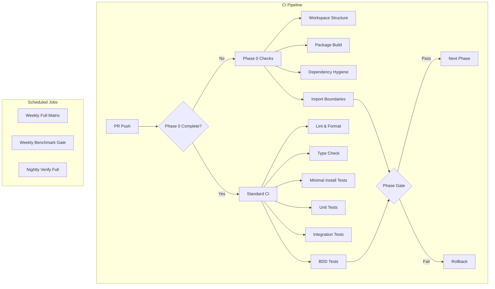

# CI Verification Plan: Slower-Whisper Modularization

**Version:** 1.0
**Created:** 2026-01-30
**Purpose:** Comprehensive CI verification strategy for transforming monolithic slower-whisper into a monorepo with 12+ microlibraries

---

## Table of Contents

1. [CI Verification Strategy Overview](#ci-verification-strategy-overview)
2. [Phase 0 Verification Checklist](#phase-0-verification-checklist)
3. [Minimal Install Test Specifications](#minimal-install-test-specifications)
4. [Dependency Hygiene Test Specifications](#dependency-hygiene-test-specifications)
5. [Import Boundary Test Specifications](#import-boundary-test-specifications)
6. [Phase-by-Phase Verification Checklists](#phase-by-phase-verification-checklists)
7. [Full Matrix Test Specifications](#full-matrix-test-specifications)
8. [Version Skew Tests (Future)](#version-skew-tests-future)
9. [GitHub Actions Workflow Templates](#github-actions-workflow-templates)
10. [Pre-commit Hook Configurations](#pre-commit-hook-configurations)
11. [CI Execution Timeline and Resource Estimates](#ci-execution-timeline-and-resource-estimates)

---

## CI Verification Strategy Overview

### Goals

The CI verification strategy ensures that the modularization of slower-whisper into 16 microlibraries maintains:

1. **Workspace integrity** - All packages build and install correctly
2. **Dependency hygiene** - Packages only declare their actual dependencies
3. **Import boundaries** - No forbidden cross-package imports
4. **Backward compatibility** - Existing code continues to work via compat layer
5. **Version consistency** - All packages stay in sync during release train
6. **Performance parity** - No regressions in core workflows

### CI Architecture



### CI Job Categories

| Category | Purpose | Frequency | Criticality |
|----------|---------|------------|-------------|
| **Phase 0 Checks** | Verify workspace setup | Every PR until Phase 0 complete | Blocking |
| **Minimal Install Tests** | Verify packages install without heavy deps | Every PR | Blocking |
| **Dependency Hygiene** | Verify dependency declarations | Every PR | Blocking |
| **Import Boundary** | Verify no forbidden imports | Every PR | Blocking |
| **Standard CI** | Lint, format, typecheck, tests | Every PR | Blocking |
| **Full Matrix** | Test all package combinations | Weekly | Non-blocking |
| **Benchmark Gate** | Performance regression detection | Weekly | Non-blocking (scheduled) |
| **Verify Full** | End-to-end verification | Nightly | Non-blocking |

### Rollback Criteria

| Trigger | Action |
|---------|--------|
| Phase 0 checks fail | Stop modularization, investigate |
| Import boundary violations detected | Fix before proceeding to next phase |
| Minimal install tests fail | Fix dependency declarations |
| Backward compatibility broken | Fix compat layer |
| Performance regression > 20% | Investigate and fix |
| Circular dependencies detected | Redesign package boundaries |

---

## Phase 0 Verification Checklist

### Overview

Phase 0 creates the monorepo workspace structure. All checks must pass before proceeding to Phase 1.

### Checklist

#### Workspace Structure Verification

- [ ] **Directory Structure**
  - [ ] `packages/` directory exists at repository root
  - [ ] All 16 package directories created:
    - [ ] `packages/slower-whisper-contracts/`
    - [ ] `packages/slower-whisper-config/`
    - [ ] `packages/slower-whisper-io/`
    - [ ] `packages/slower-whisper-device/`
    - [ ] `packages/slower-whisper-audio/`
    - [ ] `packages/slower-whisper-asr/`
    - [ ] `packages/slower-whisper-safety/`
    - [ ] `packages/slower-whisper-intel/`
    - [ ] `packages/slower-whisper-prosody/`
    - [ ] `packages/slower-whisper-emotion/`
    - [ ] `packages/slower-whisper-diarization/`
    - [ ] `packages/slower-whisper-streaming/`
    - [ ] `packages/slower-whisper-server/`
    - [ ] `packages/slower-whisper-client/`
    - [ ] `packages/slower-whisper/`
    - [ ] `packages/slower-whisper-compat/`
  - [ ] Each package has `src/` directory
  - [ ] Each package has `tests/` directory
  - [ ] Each package has `pyproject.toml`

- [ ] **Root Configuration**
  - [ ] Root `pyproject.toml` has `[tool.uv.workspace]` section
  - [ ] Root `pyproject.toml` lists all 16 packages as members
  - [ ] Root `pyproject.toml` has `[tool.uv.sources]` for workspace packages
  - [ ] Root `pyproject.toml` has workspace-level dev dependencies
  - [ ] `uv.lock` exists (after `uv sync`)

#### Package pyproject.toml Verification

- [ ] **All packages have valid pyproject.toml**
  - [ ] `build-system` section present with `hatchling>=1.25.0`
  - [ ] `project.name` matches expected package name
  - [ ] `project.version` matches workspace version (2.0.0)
  - [ ] `project.requires-python` is `>=3.12,<3.15`
  - [ ] `project.license` is `{text = "Apache-2.0"}`
  - [ ] `project.authors` includes Effortless Metrics
  - [ ] `[tool.hatch.build.targets.wheel]` packages correct src directory
  - [ ] `[tool.hatch.build.targets.sdist]` includes src, tests, README.md

- [ ] **Dependencies are correct**
  - [ ] `contracts` has NO external dependencies (stdlib only)
  - [ ] `device` has NO external dependencies (stdlib only)
  - [ ] `config` depends on `contracts` and `pyyaml`
  - [ ] `io` depends on `contracts` only
  - [ ] `audio` depends on `contracts`, `device`, and `numpy`
  - [ ] `asr` depends on `contracts`, `device`, `audio`, and `faster-whisper`
  - [ ] `safety` depends on `contracts` only
  - [ ] `intel` depends on `contracts` and `safety`
  - [ ] `prosody` depends on `contracts`, `audio`, and `numpy`
  - [ ] `emotion` depends on `contracts`, `audio`, `device` (torch optional)
  - [ ] `diarization` depends on `contracts`, `audio`, `device` (pyannote optional)
  - [ ] `streaming` depends on contracts, asr, audio, prosody, emotion, diarization, intel, safety
  - [ ] `server` depends on `contracts`, `config`, `asr`, `streaming`, `intel`, fastapi, uvicorn
  - [ ] `client` depends on `contracts`, `streaming`, httpx, websockets
  - [ ] `meta` depends on all other packages
  - [ ] `compat` depends on `meta` only

- [ ] **Inter-package dependencies use exact pinning**
  - [ ] All inter-package deps use `==` not `>=` or `~=`
  - [ ] All inter-package deps are version 2.0.0
  - [ ] No circular dependencies in dependency graph

#### Workspace Tooling Verification

- [ ] **uv sync works**
  - [ ] `uv sync` completes without errors
  - [ ] `uv sync --extra dev` completes without errors
  - [ ] `uv.lock` is generated and valid

- [ ] **Test commands work**
  - [ ] `uv run pytest` runs (even if no tests yet)
  - [ ] `uv run ruff check .` runs
  - [ ] `uv run ruff format . --check` runs
  - [ ] `uv run mypy packages/*/src` runs

- [ ] **Build commands work**
  - [ ] `uv build ./packages/slower-whisper-contracts` creates wheel
  - [ ] `uv build ./packages/slower-whisper-config` creates wheel
  - [ ] All packages can be built individually

#### Circular Dependency Verification

- [ ] **No circular dependencies**
  - [ ] Dependency graph is a DAG
  - [ ] Topological sort succeeds
  - [ ] No package depends on itself (directly or indirectly)

### Rollback Criteria for Phase 0

**Immediate rollback if:**
- Any package fails to build
- Circular dependencies detected
- Workspace sync fails
- Invalid pyproject.toml files

---

## Minimal Install Test Specifications

### Overview

Minimal install tests verify that packages can be installed without pulling in heavy ML dependencies. This is critical for users who only need specific functionality.

### Test Matrix

| Package | Expected Install Time | Forbidden Dependencies | Required Imports |
|---------|----------------------|----------------------|-------------------|
| `slower-whisper-contracts` | < 2 seconds | torch, faster-whisper, pyannote, librosa, fastapi | All public exports |
| `slower-whisper-client` | < 5 seconds | torch, faster-whisper, pyannote | StreamingClient, create_client |
| `slower-whisper-device` | < 2 seconds | torch, faster-whisper, pyannote, numpy | resolve_device, ResolvedDevice |
| `slower-whisper-config` | < 3 seconds | torch, faster-whisper, pyannote | TranscriptionConfig, EnrichmentConfig |
| `slower-whisper-io` | < 2 seconds | torch, faster-whisper, pyannote | write_json, write_txt, write_srt |
| `slower-whisper-safety` | < 2 seconds | torch, faster-whisper, pyannote | format_smart, redact_pii |

### Test Script: `scripts/test_minimal_install.py`

```python
#!/usr/bin/env python3
"""
Minimal install tests for slower-whisper microlibraries.

Tests that packages can be installed without pulling in heavy dependencies.
"""

import subprocess
import sys
import time
from pathlib import Path
from typing import Dict, List, Tuple


# Package test specifications
PACKAGE_TESTS = {
    "slower-whisper-contracts": {
        "max_time": 2.0,
        "forbidden_deps": ["torch", "faster-whisper", "pyannote", "librosa", "fastapi"],
        "required_imports": [
            "from slower_whisper_contracts import Transcript, Segment, Word, Turn, Chunk",
            "from slower_whisper_contracts import SlowerWhisperError, TranscriptionError",
            "from slower_whisper_contracts import Receipt, build_receipt",
            "from slower_whisper_contracts.exceptions import *",
            "from slower_whisper_contracts.models import *",
        ],
    },
    "slower-whisper-client": {
        "max_time": 5.0,
        "forbidden_deps": ["torch", "faster-whisper", "pyannote"],
        "required_imports": [
            "from slower_whisper_client import StreamingClient",
            "from slower_whisper_client import create_client",
        ],
    },
    "slower-whisper-device": {
        "max_time": 2.0,
        "forbidden_deps": ["torch", "faster-whisper", "pyannote", "numpy"],
        "required_imports": [
            "from slower_whisper_device import resolve_device",
            "from slower_whisper_device import ResolvedDevice",
        ],
    },
    "slower-whisper-config": {
        "max_time": 3.0,
        "forbidden_deps": ["torch", "faster-whisper", "pyannote"],
        "required_imports": [
            "from slower_whisper_config import TranscriptionConfig",
            "from slower_whisper_config import EnrichmentConfig",
        ],
    },
    "slower-whisper-io": {
        "max_time": 2.0,
        "forbidden_deps": ["torch", "faster-whisper", "pyannote"],
        "required_imports": [
            "from slower_whisper_io import write_json",
            "from slower_whisper_io import write_txt",
            "from slower_whisper_io import write_srt",
        ],
    },
    "slower-whisper-safety": {
        "max_time": 2.0,
        "forbidden_deps": ["torch", "faster-whisper", "pyannote"],
        "required_imports": [
            "from slower_whisper_safety import format_smart",
            "from slower_whisper_safety import redact_pii",
        ],
    },
}


def install_package(package_name: str, packages_dir: Path) -> Tuple[bool, float, List[str]]:
    """Install a package and return success, time, and installed deps."""
    start_time = time.time()
    
    # Create temporary venv
    venv_path = Path(f"/tmp/minimal-install-test-{package_name.replace('-', '_')}")
    subprocess.run(["uv", "venv", str(venv_path)], check=True, capture_output=True)
    
    # Install package
    package_path = packages_dir / package_name
    result = subprocess.run(
        [venv_path / "bin" / "pip", "install", "-e", str(package_path)],
        capture_output=True,
        text=True,
    )
    
    elapsed = time.time() - start_time
    
    # Get installed packages
    pip_result = subprocess.run(
        [venv_path / "bin" / "pip", "list", "--format=freeze"],
        capture_output=True,
        text=True,
        check=True,
    )
    installed = [line.split("==")[0].lower() for line in pip_result.stdout.split("\n") if line]
    
    # Cleanup
    subprocess.run(["rm", "-rf", str(venv_path)], check=False)
    
    return result.returncode == 0, elapsed, installed


def test_imports(package_name: str, required_imports: List[str]) -> Tuple[bool, List[str]]:
    """Test that required imports work."""
    venv_path = Path(f"/tmp/minimal-import-test-{package_name.replace('-', '_')}")
    subprocess.run(["uv", "venv", str(venv_path)], check=True, capture_output=True)
    
    packages_dir = Path("packages")
    package_path = packages_dir / package_name
    subprocess.run(
        [venv_path / "bin" / "pip", "install", "-e", str(package_path)],
        capture_output=True,
        check=True,
    )
    
    failed_imports = []
    for import_stmt in required_imports:
        result = subprocess.run(
            [venv_path / "bin" / "python", "-c", import_stmt],
            capture_output=True,
            text=True,
        )
        if result.returncode != 0:
            failed_imports.append(import_stmt)
    
    # Cleanup
    subprocess.run(["rm", "-rf", str(venv_path)], check=False)
    
    return len(failed_imports) == 0, failed_imports


def check_forbidden_deps(
    installed: List[str],
    forbidden: List[str],
) -> List[str]:
    """Check for forbidden dependencies."""
    found = []
    for dep in forbidden:
        if dep.lower() in installed:
            found.append(dep)
    return found


def main() -> int:
    """Run all minimal install tests."""
    packages_dir = Path("packages")
    
    if not packages_dir.exists():
        print("ERROR: packages/ directory not found")
        return 1
    
    failures = []
    
    for package_name, spec in PACKAGE_TESTS.items():
        print(f"\n{'='*60}")
        print(f"Testing: {package_name}")
        print(f"{'='*60}")
        
        # Test install time
        print(f"Installing {package_name}...")
        success, elapsed, installed = install_package(package_name, packages_dir)
        
        if not success:
            print(f"  ❌ FAILED: Installation failed")
            failures.append(f"{package_name}: installation failed")
            continue
        
        if elapsed > spec["max_time"]:
            print(f"  ❌ FAILED: Install took {elapsed:.2f}s (max {spec['max_time']}s)")
            failures.append(f"{package_name}: install too slow ({elapsed:.2f}s)")
            continue
        
        print(f"  ✓ Installed in {elapsed:.2f}s")
        
        # Check forbidden deps
        forbidden_found = check_forbidden_deps(installed, spec["forbidden_deps"])
        if forbidden_found:
            print(f"  ❌ FAILED: Found forbidden deps: {forbidden_found}")
            failures.append(f"{package_name}: forbidden deps {forbidden_found}")
            continue
        
        print(f"  ✓ No forbidden dependencies")
        
        # Test imports
        print(f"Testing imports...")
        import_success, failed_imports = test_imports(
            package_name, spec["required_imports"]
        )
        
        if not import_success:
            print(f"  ❌ FAILED: Import tests failed")
            for imp in failed_imports:
                print(f"    - {imp}")
            failures.append(f"{package_name}: import tests failed")
            continue
        
        print(f"  ✓ All imports successful")
    
    # Summary
    print(f"\n{'='*60}")
    print("Summary")
    print(f"{'='*60}")
    
    if failures:
        print(f"\n❌ {len(failures)} test(s) failed:")
        for failure in failures:
            print(f"  - {failure}")
        return 1
    else:
        print("\n✅ All minimal install tests passed!")
        return 0


if __name__ == "__main__":
    sys.exit(main())
```

### CI Job: Minimal Install Tests

```yaml
minimal-install:
  name: Minimal Install Tests
  runs-on: ubuntu-latest
  timeout-minutes: 30
  
  steps:
    - name: Checkout repository
      uses: actions/checkout@v6
    
    - name: Install uv
      uses: astral-sh/setup-uv@v7
      with:
        enable-cache: true
        cache-dependency-glob: |
          pyproject.toml
          uv.lock
    
    - name: Set up Python
      run: uv python install 3.12
    
    - name: Run minimal install tests
      run: |
        uv run python scripts/test_minimal_install.py
    
    - name: Upload test results
      if: always()
      uses: actions/upload-artifact@v6
      with:
        name: minimal-install-results
        path: minimal-install-logs/
        retention-days: 7
```

---

## Dependency Hygiene Test Specifications

### Overview

Dependency hygiene tests verify that packages only declare their actual dependencies and that optional dependencies are properly guarded with runtime imports.

### Test Categories

#### 1. Actual vs Declared Dependencies

Verify that packages only declare dependencies they actually use.

**Test Script: `scripts/test_dependency_hygiene.py`**

```python
#!/usr/bin/env python3
"""
Dependency hygiene tests for slower-whisper microlibraries.

Verifies that packages only declare dependencies they actually use.
"""

import ast
import re
import subprocess
import sys
from pathlib import Path
from typing import Dict, List, Set, Tuple


# Expected external dependencies per package
EXPECTED_DEPS = {
    "slower-whisper-contracts": set(),
    "slower-whisper-device": set(["typing-extensions"]),
    "slower-whisper-config": set(["pyyaml", "typing-extensions"]),
    "slower-whisper-io": set(["typing-extensions"]),
    "slower-whisper-audio": set(["numpy", "typing-extensions"]),
    "slower-whisper-asr": set(["faster-whisper", "typing-extensions"]),
    "slower-whisper-safety": set(["typing-extensions"]),
    "slower-whisper-intel": set(["typing-extensions"]),
    "slower-whisper-prosody": set(["numpy", "typing-extensions"]),
    "slower-whisper-emotion": set(["typing-extensions"]),  # torch is optional
    "slower-whisper-diarization": set(["typing-extensions"]),  # pyannote is optional
    "slower-whisper-streaming": set(["typing-extensions"]),
    "slower-whisper-server": set(["fastapi", "uvicorn", "python-multipart", "typing-extensions"]),
    "slower-whisper-client": set(["httpx", "websockets", "typing-extensions"]),
    "slower-whisper": set(),  # Meta package, deps are inter-package
    "slower-whisper-compat": set(),  # Compat package, deps are inter-package
}


class ImportCollector(ast.NodeVisitor):
    """Collect all import statements from Python code."""
    
    def __init__(self):
        self.imports: Set[str] = set()
    
    def visit_Import(self, node: ast.Import) -> None:
        for alias in node.names:
            self.imports.add(alias.name.split(".")[0])
        self.generic_visit(node)
    
    def visit_ImportFrom(self, node: ast.ImportFrom) -> None:
        if node.module:
            self.imports.add(node.module.split(".")[0])
        self.generic_visit(node)


def get_declared_deps(package_dir: Path) -> Set[str]:
    """Extract declared dependencies from pyproject.toml."""
    pyproject = package_dir / "pyproject.toml"
    content = pyproject.read_text()
    
    # Extract dependencies section
    match = re.search(r'dependencies = \[(.*?)\]', content, re.DOTALL)
    if not match:
        return set()
    
    deps_str = match.group(1)
    deps = set()
    
    # Parse dependency strings
    for line in deps_str.split("\n"):
        line = line.strip()
        if not line or line.startswith("#"):
            continue
        
        # Extract package name (before version spec)
        match = re.match(r'["\']?([a-zA-Z0-9_-]+)', line)
        if match:
            dep_name = match.group(1).lower()
            # Skip inter-package deps
            if not dep_name.startswith("slower-whisper"):
                deps.add(dep_name)
    
    return deps


def get_actual_imports(package_dir: Path) -> Set[str]:
    """Extract all external imports from package source code."""
    src_dir = package_dir / "src"
    imports = set()
    
    for py_file in src_dir.rglob("*.py"):
        try:
            content = py_file.read_text()
            tree = ast.parse(content)
            collector = ImportCollector()
            collector.visit(tree)
            imports.update(collector.imports)
        except (SyntaxError, UnicodeDecodeError):
            continue
    
    # Filter to external imports only
    external = {
        imp for imp in imports
        if not imp.startswith("slower_whisper") and imp in sys.stdlib_module_names
    }
    
    return external


def compare_deps(
    package_name: str,
    declared: Set[str],
    actual: Set[str],
    expected: Set[str],
) -> List[str]:
    """Compare declared vs actual dependencies."""
    issues = []
    
    # Check for undeclared dependencies
    undeclared = actual - declared - expected
    if undeclared:
        issues.append(f"undeclared dependencies: {undeclared}")
    
    # Check for unused declared dependencies
    unused = declared - actual - expected
    if unused:
        issues.append(f"unused declared dependencies: {unused}")
    
    # Check for unexpected dependencies
    unexpected = declared - expected
    if unexpected:
        issues.append(f"unexpected dependencies: {unexpected}")
    
    return issues


def main() -> int:
    """Run dependency hygiene tests."""
    packages_dir = Path("packages")
    
    if not packages_dir.exists():
        print("ERROR: packages/ directory not found")
        return 1
    
    failures = []
    
    for package_dir in sorted(packages_dir.iterdir()):
        if not package_dir.is_dir():
            continue
        
        package_name = package_dir.name
        
        print(f"\n{'='*60}")
        print(f"Testing: {package_name}")
        print(f"{'='*60}")
        
        # Get declared dependencies
        declared = get_declared_deps(package_dir)
        print(f"  Declared deps: {declared}")
        
        # Get actual imports
        actual = get_actual_imports(package_dir)
        print(f"  Actual imports: {actual}")
        
        # Get expected dependencies
        expected = EXPECTED_DEPS.get(package_name, set())
        print(f"  Expected deps: {expected}")
        
        # Compare
        issues = compare_deps(package_name, declared, actual, expected)
        
        if issues:
            print(f"  ❌ FAILED:")
            for issue in issues:
                print(f"    - {issue}")
            failures.append(f"{package_name}: {', '.join(issues)}")
        else:
            print(f"  ✓ Dependency hygiene OK")
    
    # Summary
    print(f"\n{'='*60}")
    print("Summary")
    print(f"{'='*60}")
    
    if failures:
        print(f"\n❌ {len(failures)} package(s) failed:")
        for failure in failures:
            print(f"  - {failure}")
        return 1
    else:
        print("\n✅ All dependency hygiene tests passed!")
        return 0


if __name__ == "__main__":
    sys.exit(main())
```

#### 2. Optional Dependency Guards

Verify that optional dependencies are properly guarded with runtime imports and try/except blocks.

**Test Script: `scripts/test_optional_deps.py`**

```python
#!/usr/bin/env python3
"""
Optional dependency guard tests for slower-whisper microlibraries.

Verifies that optional dependencies are properly guarded with runtime imports.
"""

import ast
import re
import sys
from pathlib import Path
from typing import Dict, List, Set, Tuple


# Optional dependencies per package
OPTIONAL_DEPS = {
    "slower-whisper-prosody": ["praat-parselmouth"],
    "slower-whisper-emotion": ["torch", "torchaudio", "transformers"],
    "slower-whisper-diarization": ["pyannote", "torch", "torchaudio"],
}


class OptionalImportChecker(ast.NodeVisitor):
    """Check that optional imports are properly guarded."""
    
    def __init__(self, optional_deps: Set[str]):
        self.optional_deps = optional_deps
        self.unguarded_imports: List[Tuple[str, int]] = []
        self.current_try_block = False
    
    def visit_Try(self, node: ast.Try) -> None:
        self.current_try_block = True
        self.generic_visit(node)
        self.current_try_block = False
    
    def visit_Import(self, node: ast.Import) -> None:
        for alias in node.names:
            dep = alias.name.split(".")[0]
            if dep in self.optional_deps and not self.current_try_block:
                self.unguarded_imports.append((dep, node.lineno))
        self.generic_visit(node)
    
    def visit_ImportFrom(self, node: ast.ImportFrom) -> None:
        if node.module:
            dep = node.module.split(".")[0]
            if dep in self.optional_deps and not self.current_try_block:
                self.unguarded_imports.append((dep, node.lineno))
        self.generic_visit(node)


def check_optional_guards(package_dir: Path, optional_deps: Set[str]) -> List[Tuple[str, int]]:
    """Check that optional imports are guarded."""
    src_dir = package_dir / "src"
    unguarded = []
    
    for py_file in src_dir.rglob("*.py"):
        try:
            content = py_file.read_text()
            tree = ast.parse(content)
            checker = OptionalImportChecker(optional_deps)
            checker.visit(tree)
            
            for dep, lineno in checker.unguarded_imports:
                unguarded.append((f"{py_file}:{lineno}", dep))
        except (SyntaxError, UnicodeDecodeError):
            continue
    
    return unguarded


def main() -> int:
    """Run optional dependency guard tests."""
    packages_dir = Path("packages")
    
    if not packages_dir.exists():
        print("ERROR: packages/ directory not found")
        return 1
    
    failures = []
    
    for package_name, optional_deps in OPTIONAL_DEPS.items():
        package_dir = packages_dir / package_name
        
        if not package_dir.exists():
            continue
        
        print(f"\n{'='*60}")
        print(f"Testing: {package_name}")
        print(f"{'='*60}")
        print(f"  Optional deps: {optional_deps}")
        
        unguarded = check_optional_guards(package_dir, set(optional_deps))
        
        if unguarded:
            print(f"  ❌ FAILED: Unguarded optional imports:")
            for location, dep in unguarded:
                print(f"    - {location}: {dep}")
            failures.append(f"{package_name}: unguarded optional imports")
        else:
            print(f"  ✓ All optional imports properly guarded")
    
    # Summary
    print(f"\n{'='*60}")
    print("Summary")
    print(f"{'='*60}")
    
    if failures:
        print(f"\n❌ {len(failures)} package(s) failed:")
        for failure in failures:
            print(f"  - {failure}")
        return 1
    else:
        print("\n✅ All optional dependency guard tests passed!")
        return 0


if __name__ == "__main__":
    sys.exit(main())
```

### CI Job: Dependency Hygiene Tests

```yaml
dependency-hygiene:
  name: Dependency Hygiene Tests
  runs-on: ubuntu-latest
  timeout-minutes: 15
  
  steps:
    - name: Checkout repository
      uses: actions/checkout@v6
    
    - name: Install uv
      uses: astral-sh/setup-uv@v7
      with:
        enable-cache: true
        cache-dependency-glob: |
          pyproject.toml
          uv.lock
    
    - name: Set up Python
      run: uv python install 3.12
    
    - name: Run dependency hygiene tests
      run: |
        uv run python scripts/test_dependency_hygiene.py
    
    - name: Run optional dependency guard tests
      run: |
        uv run python scripts/test_optional_deps.py
    
    - name: Upload test results
      if: always()
      uses: actions/upload-artifact@v6
      with:
        name: dependency-hygiene-results
        path: dependency-hygiene-logs/
        retention-days: 7
```

---

## Import Boundary Test Specifications

### Overview

Import boundary tests verify that packages only import from allowed dependencies based on the dependency hierarchy defined in Phase 0.

### Forbidden Import Edges

Based on the dependency graph from Phase 0 specification:

| From Package | Forbidden To Import | Reason |
|-------------|---------------------|---------|
| `contracts` | Any other package | Foundation - must have no dependencies |
| `device` | Any other package | Foundation - stdlib only |
| `config` | device, audio, asr, etc. | Only depends on contracts |
| `io` | device, audio, asr, etc. | Only depends on contracts |
| `audio` | asr, safety, intel, etc. | Only depends on contracts + device |
| `asr` | streaming, server, client, etc. | Only depends on contracts + device + audio |
| `safety` | audio, asr, intel, etc. | Only depends on contracts |
| `intel` | audio, prosody, etc. | Only depends on contracts + safety |
| `prosody` | asr, intel, etc. | Only depends on contracts + audio |
| `emotion` | asr, prosody, etc. | Only depends on contracts + audio + device |
| `diarization` | asr, prosody, etc. | Only depends on contracts + audio + device |
| `streaming` | server, client, meta, compat | Orchestrates packages, not used by them |
| `server` | client, meta, compat | Service package, not used by others |
| `client` | server, meta, compat | Client package, not used by others |
| `meta` | compat | Meta package, not used by compat |

### Test Script

The import boundary checker script is already defined in `scripts/check_import_boundaries.py` from the Phase 0 specification. This script:

1. Parses all Python files in packages/
2. Collects import statements
3. Validates against the allowed edges matrix
4. Reports violations with file paths and line numbers

### CI Job: Import Boundary Tests

```yaml
import-boundaries:
  name: Import Boundary Tests
  runs-on: ubuntu-latest
  timeout-minutes: 10
  
  steps:
    - name: Checkout repository
      uses: actions/checkout@v6
    
    - name: Install uv
      uses: astral-sh/setup-uv@v7
      with:
        enable-cache: true
        cache-dependency-glob: |
          pyproject.toml
          uv.lock
    
    - name: Set up Python
      run: uv python install 3.12
    
    - name: Run import boundary checks
      run: |
        uv run python scripts/check_import_boundaries.py --verbose
    
    - name: Upload violation report
      if: failure()
      uses: actions/upload-artifact@v6
      with:
        name: import-boundary-violations
        path: import-boundary-report.txt
        retention-days: 30
```

### Pre-commit Hook

Add to `.pre-commit-config.yaml`:

```yaml
repos:
  - repo: local
    hooks:
      - id: check-import-boundaries
        name: Check import boundaries
        entry: uv run python scripts/check_import_boundaries.py
        language: system
        pass_filenames: false
        always_run: true
```

---

## Phase-by-Phase Verification Checklists

### Overview

Each phase of the modularization has specific verification requirements. These checklists ensure that each phase is complete before proceeding to the next.

### Phase 1: Extract Contracts

**Goal:** Extract core data models, exceptions, events, and schemas.

**Verification Checklist:**

- [ ] **File Moves**
  - [ ] All 11 files moved to `packages/slower-whisper-contracts/src/slower_whisper_contracts/`
  - [ ] `schema/` directory moved
  - [ ] `schemas/` JSON files moved

- [ ] **Import Updates**
  - [ ] `transcription/__init__.py` updated to import from `slower_whisper_contracts`
  - [ ] All files importing from moved modules updated

- [ ] **Package Tests**
  - [ ] `slower-whisper-contracts` builds successfully
  - [ ] `slower-whisper-contracts` installs successfully
  - [ ] All imports from `slower_whisper_contracts` work
  - [ ] No external dependencies in pyproject.toml

- [ ] **CI Tests**
  - [ ] Minimal install test passes for `slower-whisper-contracts`
  - [ ] Dependency hygiene test passes for `slower-whisper-contracts`
  - [ ] Import boundary test passes (no violations)
  - [ ] Existing tests still pass

**Rollback Criteria:**
- Any test failure
- Import errors in existing code
- Package build fails

### Phase 2: Extract Config + IO + Device

**Goal:** Extract foundational packages that depend only on contracts.

**Verification Checklist:**

- [ ] **File Moves**
  - [ ] Config files moved to `packages/slower-whisper-config/`
  - [ ] IO files moved to `packages/slower-whisper-io/`
  - [ ] Device files moved to `packages/slower-whisper-device/`

- [ ] **Import Updates**
  - [ ] All files importing from config, io, device updated
  - [ ] `transcription/__init__.py` updated
  - [ ] `transcription/pipeline.py` updated

- [ ] **Package Tests**
  - [ ] All three packages build successfully
  - [ ] All three packages install successfully
  - [ ] Imports from all three packages work
  - [ ] Dependencies are correct (config/io depend on contracts, device has no deps)

- [ ] **CI Tests**
  - [ ] Minimal install tests pass for all three packages
  - [ ] Dependency hygiene tests pass for all three packages
  - [ ] Import boundary tests pass (no violations)
  - [ ] Existing tests still pass

**Rollback Criteria:**
- Any test failure
- Import errors in existing code
- Circular dependencies detected

### Phase 3: Extract Audio + ASR

**Goal:** Extract audio processing and ASR engine packages.

**Verification Checklist:**

- [ ] **File Moves**
  - [ ] Audio files moved to `packages/slower-whisper-audio/`
  - [ ] ASR files moved to `packages/slower-whisper-asr/`

- [ ] **Import Updates**
  - [ ] All files importing from audio, asr updated
  - [ ] `transcription/__init__.py` updated
  - [ ] `transcription/pipeline.py` updated

- [ ] **Package Tests**
  - [ ] Both packages build successfully
  - [ ] Both packages install successfully
  - [ ] Imports from both packages work
  - [ ] Dependencies are correct (audio depends on contracts+device, asr depends on contracts+device+audio)

- [ ] **CI Tests**
  - [ ] Minimal install tests pass for both packages
  - [ ] Dependency hygiene tests pass for both packages
  - [ ] Import boundary tests pass (no violations)
  - [ ] Existing tests still pass
  - [ ] ASR tests still work with faster-whisper

**Rollback Criteria:**
- Any test failure
- Import errors in existing code
- ASR functionality broken

### Phase 4: Extract Safety + Intel + Prosody

**Goal:** Extract safety, intelligence, and prosody packages.

**Verification Checklist:**

- [ ] **File Moves**
  - [ ] Safety files moved to `packages/slower-whisper-safety/`
  - [ ] Intel files moved to `packages/slower-whisper-intel/`
  - [ ] Prosody files moved to `packages/slower-whisper-prosody/`

- [ ] **Import Updates**
  - [ ] All files importing from safety, intel, prosody updated
  - [ ] `transcription/__init__.py` updated

- [ ] **Package Tests**
  - [ ] All three packages build successfully
  - [ ] All three packages install successfully
  - [ ] Imports from all three packages work
  - [ ] Dependencies are correct

- [ ] **CI Tests**
  - [ ] Minimal install tests pass for all three packages
  - [ ] Dependency hygiene tests pass for all three packages
  - [ ] Import boundary tests pass (no violations)
  - [ ] Existing tests still pass
  - [ ] Optional dependency guards work (prosody praat)

**Rollback Criteria:**
- Any test failure
- Import errors in existing code
- Optional dependency guards broken

### Phase 5: Extract Emotion + Diarization

**Goal:** Extract emotion recognition and speaker diarization packages.

**Verification Checklist:**

- [ ] **File Moves**
  - [ ] Emotion files moved to `packages/slower-whisper-emotion/`
  - [ ] Diarization files moved to `packages/slower-whisper-diarization/`

- [ ] **Import Updates**
  - [ ] All files importing from emotion, diarization updated
  - [ ] `transcription/__init__.py` updated

- [ ] **Package Tests**
  - [ ] Both packages build successfully
  - [ ] Both packages install successfully
  - [ ] Imports from both packages work
  - [ ] Dependencies are correct (torch/pyannote optional)

- [ ] **CI Tests**
  - [ ] Minimal install tests pass for both packages
  - [ ] Dependency hygiene tests pass for both packages
  - [ ] Import boundary tests pass (no violations)
  - [ ] Existing tests still pass
  - [ ] Optional dependency guards work (torch, pyannote)
  - [ ] Heavy tests for emotion and diarization still pass

**Rollback Criteria:**
- Any test failure
- Import errors in existing code
- Optional dependency guards broken
- Heavy ML tests fail

### Phase 6: Extract Streaming Core

**Goal:** Extract streaming state machine, events, and callbacks.

**Verification Checklist:**

- [ ] **File Moves**
  - [ ] All streaming files moved to `packages/slower-whisper-streaming/`

- [ ] **Import Updates**
  - [ ] All files importing from streaming updated
  - [ ] `transcription/__init__.py` updated

- [ ] **Package Tests**
  - [ ] Package builds successfully
  - [ ] Package installs successfully
  - [ ] Imports from package work
  - [ ] Dependencies are correct (depends on multiple feature packages)

- [ ] **CI Tests**
  - [ ] Minimal install tests pass
  - [ ] Dependency hygiene tests pass
  - [ ] Import boundary tests pass (no violations)
  - [ ] Existing tests still pass
  - [ ] Streaming tests still pass
  - [ ] Event envelope protocol maintained

**Rollback Criteria:**
- Any test failure
- Import errors in existing code
- Streaming protocol broken
- Event envelope contract violated

### Phase 7: Extract Server + Client

**Goal:** Extract FastAPI service and Python SDK.

**Verification Checklist:**

- [ ] **File Moves**
  - [ ] Server files moved to `packages/slower-whisper-server/`
  - [ ] Client files moved to `packages/slower-whisper-client/`

- [ ] **Import Updates**
  - [ ] All files importing from server, client updated
  - [ ] `transcription/__init__.py` updated

- [ ] **Package Tests**
  - [ ] Both packages build successfully
  - [ ] Both packages install successfully
  - [ ] Imports from both packages work
  - [ ] Dependencies are correct

- [ ] **CI Tests**
  - [ ] Minimal install tests pass for both packages
  - [ ] Dependency hygiene tests pass for both packages
  - [ ] Import boundary tests pass (no violations)
  - [ ] Existing tests still pass
  - [ ] API BDD tests still pass
  - [ ] Integration tests still pass
  - [ ] Server starts and responds
  - [ ] Client can connect and stream

**Rollback Criteria:**
- Any test failure
- Import errors in existing code
- API contract broken
- Server fails to start
- Client cannot connect

### Phase 8: Meta + Compat Packaging

**Goal:** Create meta package and compat layer.

**Verification Checklist:**

- [ ] **File Moves**
  - [ ] Meta files moved to `packages/slower-whisper/`
  - [ ] Compat package created with `packages/slower-whisper-compat/`

- [ ] **Meta Package Tests**
  - [ ] Package builds successfully
  - [ ] Package installs successfully
  - [ ] All public APIs re-exported
  - [ ] Dependencies are correct (depends on all packages)

- [ ] **Compat Package Tests**
  - [ ] Package builds successfully
  - [ ] Package installs successfully
  - [ ] Legacy import paths work via compat
  - [ ] All existing imports from `transcription.*` still work

- [ ] **CI Tests**
  - [ ] Minimal install tests pass
  - [ ] Dependency hygiene tests pass
  - [ ] Import boundary tests pass (no violations)
  - [ ] Existing tests still pass
  - [ ] Backward compatibility tests pass
  - [ ] CLI still works
  - [ ] Full test suite passes

**Rollback Criteria:**
- Any test failure
- Import errors in existing code
- Backward compatibility broken
- CLI broken

### Phase 9: Optional Features

**Goal:** Handle optional features (historian, integrations, store).

**Verification Checklist:**

- [ ] **Optional Features**
  - [ ] `historian/` remains in `transcription/` or moved to `optional-features/`
  - [ ] `integrations/` remains in `transcription/` or moved to `optional-features/`
  - [ ] `store/` remains in `transcription/` or moved to `optional-features/`
  - [ ] Documentation updated to reflect optional status

- [ ] **CI Tests**
  - [ ] Existing tests still pass
  - [ ] Optional features can still be used
  - [ ] No impact on core packages

**Rollback Criteria:**
- Any test failure
- Optional features broken

---

## Full Matrix Test Specifications

### Overview

Full matrix tests verify that all package combinations work correctly together. This ensures that the monorepo maintains compatibility across all packages.

### Test Matrix

| Test | Python Version | Extras | Purpose |
|-------|----------------|---------|---------|
| Minimal | 3.12, 3.13, 3.14 | None | Verify base installation |
| Enrich Basic | 3.12, 3.13 | enrich-basic | Verify prosody extraction |
| Enrich Full | 3.12 | enrich-full | Verify all enrichment features |
| API | 3.12, 3.13 | api | Verify FastAPI service |
| All | 3.12 | all | Verify full installation |

### Test Script: `scripts/test_full_matrix.py`

```python
#!/usr/bin/env python3
"""
Full matrix tests for slower-whisper monorepo.

Tests all package combinations and extras.
"""

import subprocess
import sys
import time
from pathlib import Path
from typing import Dict, List, Tuple


MATRIX = [
    ("3.12", []),
    ("3.13", []),
    ("3.14", []),
    ("3.12", ["enrich-basic"]),
    ("3.13", ["enrich-basic"]),
    ("3.12", ["enrich-full"]),
    ("3.12", ["api"]),
    ("3.13", ["api"]),
    ("3.12", ["all"]),
]


def test_install(python_version: str, extras: List[str]) -> Tuple[bool, float, str]:
    """Test installation with specific Python version and extras."""
    start_time = time.time()
    
    venv_path = Path(f"/tmp/matrix-test-{python_version}-{'-'.join(extras)}")
    
    # Create venv
    result = subprocess.run(
        ["uv", "venv", "--python", python_version, str(venv_path)],
        capture_output=True,
        text=True,
    )
    
    if result.returncode != 0:
        return False, 0, f"venv creation failed: {result.stderr}"
    
    # Install with extras
    package_path = Path("packages/slower-whisper")
    extras_str = ",".join(extras) if extras else ""
    install_cmd = [venv_path / "bin" / "pip", "install", "-e", str(package_path)]
    if extras_str:
        install_cmd.extend(["[{}]".format(extras_str)])
    
    result = subprocess.run(install_cmd, capture_output=True, text=True)
    
    elapsed = time.time() - start_time
    
    # Cleanup
    subprocess.run(["rm", "-rf", str(venv_path)], check=False)
    
    return result.returncode == 0, elapsed, result.stderr


def test_imports() -> bool:
    """Test that all imports work."""
    test_code = """
from slower_whisper import WhisperModel, Segment, Word, TranscriptionInfo
from slower_whisper import TranscriptionConfig, EnrichmentConfig
from slower_whisper import resolve_device, ResolvedDevice
from slower_whisper import write_json, write_txt, write_srt
from slower_whisper import format_smart, redact_pii
from slower_whisper import infer_roles, segment_topics
from slower_whisper import extract_prosody
from slower_whisper import StreamingClient, create_client
print("All imports successful")
"""
    result = subprocess.run(
        ["python", "-c", test_code],
        capture_output=True,
        text=True,
    )
    return result.returncode == 0


def main() -> int:
    """Run full matrix tests."""
    failures = []
    
    for python_version, extras in MATRIX:
        extras_str = "+".join(extras) if extras else "minimal"
        print(f"\n{'='*60}")
        print(f"Testing: Python {python_version} + {extras_str}")
        print(f"{'='*60}")
        
        success, elapsed, error = test_install(python_version, extras)
        
        if not success:
            print(f"  ❌ FAILED: {error}")
            failures.append(f"Python {python_version} + {extras_str}: {error}")
            continue
        
        print(f"  ✓ Installed in {elapsed:.2f}s")
    
    # Test imports
    print(f"\n{'='*60}")
    print("Testing imports")
    print(f"{'='*60}")
    
    if test_imports():
        print("  ✓ All imports successful")
    else:
        print("  ❌ FAILED: Import tests failed")
        failures.append("Import tests failed")
    
    # Summary
    print(f"\n{'='*60}")
    print("Summary")
    print(f"{'='*60}")
    
    if failures:
        print(f"\n❌ {len(failures)} test(s) failed:")
        for failure in failures:
            print(f"  - {failure}")
        return 1
    else:
        print("\n✅ All matrix tests passed!")
        return 0


if __name__ == "__main__":
    sys.exit(main())
```

### CI Job: Full Matrix Tests

```yaml
full-matrix:
  name: Full Matrix Tests
  runs-on: ubuntu-latest
  timeout-minutes: 60
  
  strategy:
    fail-fast: false
    matrix:
      python-version: ["3.12", "3.13", "3.14"]
      extras: ["", "enrich-basic", "enrich-full", "api"]
      exclude:
        # Exclude 3.14 for heavy extras
        - python-version: "3.14"
          extras: "enrich-full"
        - python-version: "3.14"
          extras: "api"
  
  steps:
    - name: Checkout repository
      uses: actions/checkout@v6
    
    - name: Install uv
      uses: astral-sh/setup-uv@v7
      with:
        enable-cache: true
        cache-dependency-glob: |
          pyproject.toml
          uv.lock
    
    - name: Set up Python ${{ matrix.python-version }}
      run: uv python install ${{ matrix.python-version }}
    
    - name: Install system dependencies
      run: |
        sudo apt-get update
        sudo apt-get install -y ffmpeg libsndfile1
    
    - name: Install with extras
      run: |
        if [ "${{ matrix.extras }}" = "" ]; then
          uv sync
        else
          uv sync --extra ${{ matrix.extras }}
        fi
    
    - name: Test imports
      run: |
        uv run python -c "
        from slower_whisper import WhisperModel, Segment, Word, TranscriptionInfo
        from slower_whisper import TranscriptionConfig, EnrichmentConfig
        from slower_whisper import resolve_device, ResolvedDevice
        print('All imports successful')
        "
    
    - name: Run tests
      run: |
        uv run pytest -v -m "not slow and not heavy"
```

---

## Version Skew Tests (Future)

### Overview

Version skew tests verify that packages work correctly with compatible version ranges. This is for future independent versioning.

### Test Strategy

When packages move to independent versioning:

1. **Pin Compatibility Tests**
   - Test that exact pins work
   - Test that compatible ranges work (e.g., `~=2.0.0`)
   - Test that incompatible ranges fail gracefully

2. **Matrix Tests**
   - Test different version combinations
   - Verify backward compatibility
   - Verify forward compatibility

3. **Upgrade Path Tests**
   - Test upgrading from version X to X+1
   - Test upgrading from version X to X+2
   - Verify no breaking changes in minor upgrades

### Test Script: `scripts/test_version_skew.py`

```python
#!/usr/bin/env python3
"""
Version skew tests for slower-whisper monorepo.

Tests that packages work with compatible version ranges.
"""

import subprocess
import sys
from pathlib import Path
from typing import Dict, List, Tuple


VERSION_MATRIX = [
    # (contracts_version, config_version, expected_result)
    ("2.0.0", "2.0.0", "pass"),
    ("2.0.0", "2.0.1", "pass"),  # Compatible minor bump
    ("2.0.0", "2.1.0", "pass"),  # Compatible minor bump
    ("2.0.0", "3.0.0", "fail"),  # Incompatible major bump
]


def test_version_combo(
    contracts_version: str,
    config_version: str,
) -> Tuple[bool, str]:
    """Test a specific version combination."""
    venv_path = Path(f"/tmp/version-skew-{contracts_version}-{config_version}")
    
    # Create venv
    subprocess.run(["uv", "venv", str(venv_path)], check=True, capture_output=True)
    
    # Install contracts at specific version
    result = subprocess.run(
        [venv_path / "bin" / "pip", "install", f"slower-whisper-contracts=={contracts_version}"],
        capture_output=True,
        text=True,
    )
    
    if result.returncode != 0:
        return False, f"contracts install failed: {result.stderr}"
    
    # Install config at specific version
    result = subprocess.run(
        [venv_path / "bin" / "pip", "install", f"slower-whisper-config=={config_version}"],
        capture_output=True,
        text=True,
    )
    
    # Cleanup
    subprocess.run(["rm", "-rf", str(venv_path)], check=False)
    
    if result.returncode != 0:
        return False, f"config install failed: {result.stderr}"
    
    return True, "success"


def main() -> int:
    """Run version skew tests."""
    failures = []
    
    for contracts_ver, config_ver, expected in VERSION_MATRIX:
        print(f"\nTesting: contracts={contracts_ver}, config={config_ver}")
        
        success, message = test_version_combo(contracts_ver, config_ver)
        
        if expected == "pass" and not success:
            print(f"  ❌ FAILED: {message}")
            failures.append(f"{contracts_ver} + {config_ver}: {message}")
        elif expected == "fail" and success:
            print(f"  ❌ FAILED: Should have failed but passed")
            failures.append(f"{contracts_ver} + {config_ver}: should have failed")
        else:
            print(f"  ✓ Passed as expected")
    
    # Summary
    print(f"\n{'='*60}")
    print("Summary")
    print(f"{'='*60}")
    
    if failures:
        print(f"\n❌ {len(failures)} test(s) failed:")
        for failure in failures:
            print(f"  - {failure}")
        return 1
    else:
        print("\n✅ All version skew tests passed!")
        return 0


if __name__ == "__main__":
    sys.exit(main())
```

---

## GitHub Actions Workflow Templates

### Overview

These workflow templates define the CI jobs for the modularized monorepo.

### Workflow: Modularization CI

```yaml
name: Modularization CI

on:
  push:
    branches: [main, develop]
  pull_request:
    branches: [main, develop]
  workflow_dispatch:

concurrency:
  group: ${{ github.workflow }}-${{ github.ref }}
  cancel-in-progress: true

jobs:
  # Phase 0 checks (run until Phase 0 complete)
  phase0-checks:
    name: Phase 0 Workspace Checks
    runs-on: ubuntu-latest
    timeout-minutes: 15
    
    steps:
      - name: Checkout repository
        uses: actions/checkout@v6
      
      - name: Install uv
        uses: astral-sh/setup-uv@v7
        with:
          enable-cache: true
          cache-dependency-glob: |
            pyproject.toml
            uv.lock
      
      - name: Set up Python
        run: uv python install 3.12
      
      - name: Verify workspace structure
        run: |
          python scripts/verify_workspace_structure.py
      
      - name: Verify package pyproject.toml files
        run: |
          python scripts/verify_package_configs.py
      
      - name: Verify no circular dependencies
        run: |
          python scripts/verify_no_circular_deps.py
  
  # Minimal install tests
  minimal-install:
    name: Minimal Install Tests
    runs-on: ubuntu-latest
    timeout-minutes: 30
    needs: phase0-checks
    
    steps:
      - name: Checkout repository
        uses: actions/checkout@v6
      
      - name: Install uv
        uses: astral-sh/setup-uv@v7
        with:
          enable-cache: true
          cache-dependency-glob: |
            pyproject.toml
            uv.lock
      
      - name: Set up Python
        run: uv python install 3.12
      
      - name: Run minimal install tests
        run: |
          uv run python scripts/test_minimal_install.py
  
  # Dependency hygiene tests
  dependency-hygiene:
    name: Dependency Hygiene Tests
    runs-on: ubuntu-latest
    timeout-minutes: 15
    needs: phase0-checks
    
    steps:
      - name: Checkout repository
        uses: actions/checkout@v6
      
      - name: Install uv
        uses: astral-sh/setup-uv@v7
        with:
          enable-cache: true
          cache-dependency-glob: |
            pyproject.toml
            uv.lock
      
      - name: Set up Python
        run: uv python install 3.12
      
      - name: Run dependency hygiene tests
        run: |
          uv run python scripts/test_dependency_hygiene.py
      
      - name: Run optional dependency guard tests
        run: |
          uv run python scripts/test_optional_deps.py
  
  # Import boundary tests
  import-boundaries:
    name: Import Boundary Tests
    runs-on: ubuntu-latest
    timeout-minutes: 10
    needs: phase0-checks
    
    steps:
      - name: Checkout repository
        uses: actions/checkout@v6
      
      - name: Install uv
        uses: astral-sh/setup-uv@v7
        with:
          enable-cache: true
          cache-dependency-glob: |
            pyproject.toml
            uv.lock
      
      - name: Set up Python
        run: uv python install 3.12
      
      - name: Run import boundary checks
        run: |
          uv run python scripts/check_import_boundaries.py --verbose
  
  # Lint
  lint:
    name: Lint (ruff check)
    runs-on: ubuntu-latest
    needs: phase0-checks
    
    steps:
      - name: Checkout repository
        uses: actions/checkout@v6
      
      - name: Install uv
        uses: astral-sh/setup-uv@v7
        with:
          enable-cache: true
          cache-dependency-glob: |
            pyproject.toml
            uv.lock
      
      - name: Set up Python
        run: uv python install 3.12
      
      - name: Install dependencies
        run: uv sync --no-dev
      
      - name: Run ruff check
        run: uvx ruff@0.14.9 check packages/ tests/
  
  # Format
  format:
    name: Format check (ruff format)
    runs-on: ubuntu-latest
    needs: phase0-checks
    
    steps:
      - name: Checkout repository
        uses: actions/checkout@v6
      
      - name: Install uv
        uses: astral-sh/setup-uv@v7
        with:
          enable-cache: true
          cache-dependency-glob: |
            pyproject.toml
            uv.lock
      
      - name: Set up Python
        run: uv python install 3.12
      
      - name: Check formatting
        run: uvx ruff@0.14.9 format --check packages/ tests/
  
  # Type check
  type-check:
    name: Type check (mypy)
    runs-on: ubuntu-latest
    needs: phase0-checks
    
    steps:
      - name: Checkout repository
        uses: actions/checkout@v6
      
      - name: Install uv
        uses: astral-sh/setup-uv@v7
        with:
          enable-cache: true
          cache-dependency-glob: |
            pyproject.toml
            uv.lock
      
      - name: Set up Python
        run: uv python install 3.12
      
      - name: Install dependencies
        run: uv sync --extra dev
      
      - name: Run mypy
        run: uv run mypy packages/*/src
  
  # Tests
  test:
    name: Test (Python ${{ matrix.python-version }})
    runs-on: ubuntu-latest
    needs: [lint, format, minimal-install, dependency-hygiene, import-boundaries]
    timeout-minutes: 30
    
    strategy:
      fail-fast: false
      matrix:
        python-version: ["3.12", "3.13"]
    
    steps:
      - name: Checkout repository
        uses: actions/checkout@v6
      
      - name: Install uv
        uses: astral-sh/setup-uv@v7
        with:
          enable-cache: true
          cache-dependency-glob: |
            pyproject.toml
            uv.lock
      
      - name: Set up Python ${{ matrix.python-version }}
        run: uv python install ${{ matrix.python-version }}
      
      - name: Install system dependencies
        run: |
          sudo apt-get update
          sudo apt-get install -y ffmpeg libsndfile1
      
      - name: Install dependencies
        run: uv sync --extra dev
      
      - name: Run tests
        run: |
          uv run pytest \
            --cov=packages \
            --cov-report=xml \
            --cov-report=term-missing \
            -v \
            -m "not slow and not heavy" \
            -n auto
  
  # Integration tests
  test-integration:
    name: Integration Tests
    runs-on: ubuntu-latest
    needs: [lint, format]
    timeout-minutes: 30
    
    steps:
      - name: Checkout repository
        uses: actions/checkout@v6
      
      - name: Install uv
        uses: astral-sh/setup-uv@v7
        with:
          enable-cache: true
          cache-dependency-glob: |
            pyproject.toml
            uv.lock
      
      - name: Set up Python
        run: uv python install 3.12
      
      - name: Install system dependencies
        run: |
          sudo apt-get update
          sudo apt-get install -y ffmpeg libsndfile1
      
      - name: Install dependencies
        run: uv sync --extra api --extra dev
      
      - name: Run integration tests
        run: |
          uv run pytest tests/test_*integration*.py -v --tb=short
  
  # BDD tests
  bdd:
    name: BDD Tests
    runs-on: ubuntu-latest
    needs: [lint, format]
    timeout-minutes: 30
    
    steps:
      - name: Checkout repository
        uses: actions/checkout@v6
      
      - name: Install uv
        uses: astral-sh/setup-uv@v7
        with:
          enable-cache: true
          cache-dependency-glob: |
            pyproject.toml
            uv.lock
      
      - name: Set up Python
        run: uv python install 3.12
      
      - name: Install system dependencies
        run: |
          sudo apt-get update
          sudo apt-get install -y ffmpeg libsndfile1
      
      - name: Install dependencies
        run: uv sync --extra dev
      
      - name: Run BDD tests
        run: |
          uv run pytest features/ -v -m "not slow" --tb=short
  
  # Full matrix tests (weekly)
  full-matrix:
    name: Full Matrix Tests
    runs-on: ubuntu-latest
    if: github.event_name == 'schedule'
    timeout-minutes: 60
    
    strategy:
      fail-fast: false
      matrix:
        python-version: ["3.12", "3.13"]
        extras: ["", "enrich-basic", "enrich-full", "api"]
        exclude:
          - python-version: "3.13"
            extras: "enrich-full"
          - python-version: "3.13"
            extras: "api"
    
    steps:
      - name: Checkout repository
        uses: actions/checkout@v6
      
      - name: Install uv
        uses: astral-sh/setup-uv@v7
        with:
          enable-cache: true
          cache-dependency-glob: |
            pyproject.toml
            uv.lock
      
      - name: Set up Python ${{ matrix.python-version }}
        run: uv python install ${{ matrix.python-version }}
      
      - name: Install system dependencies
        run: |
          sudo apt-get update
          sudo apt-get install -y ffmpeg libsndfile1
      
      - name: Install with extras
        run: |
          if [ "${{ matrix.extras }}" = "" ]; then
            uv sync
          else
            uv sync --extra ${{ matrix.extras }}
          fi
      
      - name: Test imports
        run: |
          uv run python -c "
          from slower_whisper import WhisperModel, Segment, Word, TranscriptionInfo
          from slower_whisper import TranscriptionConfig, EnrichmentConfig
          from slower_whisper import resolve_device, ResolvedDevice
          print('All imports successful')
          "
  
  # Summary
  ci-success:
    name: CI Success
    if: always()
    needs:
      - phase0-checks
      - minimal-install
      - dependency-hygiene
      - import-boundaries
      - lint
      - format
      - type-check
      - test
      - test-integration
      - bdd
    runs-on: ubuntu-latest
    
    steps:
      - name: Check all jobs
        run: |
          if [[ "${{ needs.phase0-checks.result }}" == "failure" ]] || \
             [[ "${{ needs.minimal-install.result }}" == "failure" ]] || \
             [[ "${{ needs.dependency-hygiene.result }}" == "failure" ]] || \
             [[ "${{ needs.import-boundaries.result }}" == "failure" ]] || \
             [[ "${{ needs.lint.result }}" == "failure" ]] || \
             [[ "${{ needs.format.result }}" == "failure" ]] || \
             [[ "${{ needs.type-check.result }}" == "failure" ]] || \
             [[ "${{ needs.test.result }}" == "failure" ]] || \
             [[ "${{ needs.test-integration.result }}" == "failure" ]] || \
             [[ "${{ needs.bdd.result }}" == "failure" ]]; then
            echo "One or more required jobs failed"
            exit 1
          fi
          
          echo ""
          echo "All required jobs passed!"
          echo ""
          echo "✅ Phase 0 checks passed"
          echo "✅ Minimal install tests passed"
          echo "✅ Dependency hygiene tests passed"
          echo "✅ Import boundary tests passed"
          echo "✅ Lint passed"
          echo "✅ Format check passed"
          echo "✅ Type check passed"
          echo "✅ Unit tests passed"
          echo "✅ Integration tests passed"
          echo "✅ BDD tests passed"
```

### Workflow: Phase Gate

```yaml
name: Phase Gate

on:
  workflow_dispatch:
    inputs:
      phase:
        description: 'Phase number (1-9)'
        required: true
        type: choice
        options:
          - 1
          - 2
          - 3
          - 4
          - 5
          - 6
          - 7
          - 8
          - 9

jobs:
  phase-gate:
    name: Phase ${{ inputs.phase }} Gate
    runs-on: ubuntu-latest
    timeout-minutes: 30
    
    steps:
      - name: Checkout repository
        uses: actions/checkout@v6
      
      - name: Install uv
        uses: astral-sh/setup-uv@v7
        with:
          enable-cache: true
          cache-dependency-glob: |
            pyproject.toml
            uv.lock
      
      - name: Set up Python
        run: uv python install 3.12
      
      - name: Install system dependencies
        run: |
          sudo apt-get update
          sudo apt-get install -y ffmpeg libsndfile1
      
      - name: Install dependencies
        run: uv sync --extra dev
      
      - name: Run phase ${{ inputs.phase }} verification
        run: |
          uv run python scripts/verify_phase.py --phase ${{ inputs.phase }}
      
      - name: Run import boundary checks
        run: |
          uv run python scripts/check_import_boundaries.py --verbose
      
      - name: Run tests
        run: |
          uv run pytest -v -m "not slow and not heavy"
```

---

## Pre-commit Hook Configurations

### Overview

Pre-commit hooks ensure code quality before commits are made.

### Updated `.pre-commit-config.yaml`

```yaml
# Pre-commit hooks for slower-whisper monorepo
# Install: pip install pre-commit
# Setup: pre-commit install
# Run manually: pre-commit run --all-files

repos:
  # Validation checks (no auto-fix, must pass)
  - repo: https://github.com/pre-commit/pre-commit-hooks
    rev: v5.0.0
    hooks:
      - id: check-yaml
        exclude: ^k8s/.*\.yaml$
      - id: check-json
      - id: check-toml
      - id: check-added-large-files
        args: ['--maxkb=1000']
      - id: check-merge-conflict
      - id: debug-statements
  
  # Import boundary checks
  - repo: local
    hooks:
      - id: check-import-boundaries
        name: Check import boundaries
        entry: uv run python scripts/check_import_boundaries.py
        language: system
        pass_filenames: false
        always_run: true
  
  # Dependency hygiene checks
  - repo: local
    hooks:
      - id: check-dependency-hygiene
        name: Check dependency hygiene
        entry: uv run python scripts/test_dependency_hygiene.py
        language: system
        pass_filenames: false
        always_run: true
  
  # Ruff (linting - no auto-fix)
  - repo: https://github.com/astral-sh/ruff-pre-commit
    rev: v0.14.9
    hooks:
      - id: ruff
        args: [--check, .]

# Configuration
default_language_version:
  python: python3.12

ci:
  autofix_prs: false
  autofix_commit_msg: "chore: pre-commit autofix"
```

---

## CI Execution Timeline and Resource Estimates

### Job Duration Estimates

| Job | Duration | CPU | Memory | Frequency |
|------|-----------|------|---------|------------|
| Phase 0 Checks | 5-10 min | 2 cores | 4 GB | Every PR (until Phase 0 complete) |
| Minimal Install Tests | 10-15 min | 2 cores | 4 GB | Every PR |
| Dependency Hygiene | 5-10 min | 2 cores | 4 GB | Every PR |
| Import Boundaries | 2-5 min | 2 cores | 4 GB | Every PR |
| Lint | 3-5 min | 2 cores | 4 GB | Every PR |
| Format | 2-3 min | 2 cores | 4 GB | Every PR |
| Type Check | 5-10 min | 2 cores | 4 GB | Every PR |
| Tests (3.12) | 10-15 min | 2 cores | 4 GB | Every PR |
| Tests (3.13) | 10-15 min | 2 cores | 4 GB | Every PR |
| Integration Tests | 10-15 min | 2 cores | 4 GB | Every PR |
| BDD Tests | 10-15 min | 2 cores | 4 GB | Every PR |
| Full Matrix | 30-45 min | 2 cores | 4 GB | Weekly |
| Benchmark Gate | 20-30 min | 2 cores | 8 GB | Weekly |

### Total Pipeline Duration

| Scenario | Duration |
|----------|-----------|
| Fast PR (no heavy tests) | 30-45 min |
| Full PR | 45-60 min |
| Weekly Full Matrix | 60-90 min |
| Nightly Verify Full | 90-120 min |

### Resource Optimization

**Parallel Execution:**
- Lint, format, type-check can run in parallel
- Tests for different Python versions can run in parallel
- Minimal install, dependency hygiene, import boundaries can run in parallel

**Caching:**
- uv cache reduces dependency install time by 50-70%
- Python cache reduces setup time by 30-50%
- HuggingFace cache reduces model download time by 80-90%

**Cost Estimates (GitHub Actions):**
- PR pipeline: ~30-45 minutes per PR
- Weekly matrix: ~60-90 minutes per week
- Monthly: ~200-300 minutes of CI time
- Within free tier limits for most projects

### Phase-by-Phase Timeline

| Phase | Estimated Duration | CI Impact |
|-------|-------------------|------------|
| Phase 0 | 1-2 days | New jobs added |
| Phase 1 | 1 day | Minimal impact |
| Phase 2 | 1-2 days | Low impact |
| Phase 3 | 2-3 days | Medium impact |
| Phase 4 | 2-3 days | Medium impact |
| Phase 5 | 2-3 days | Medium