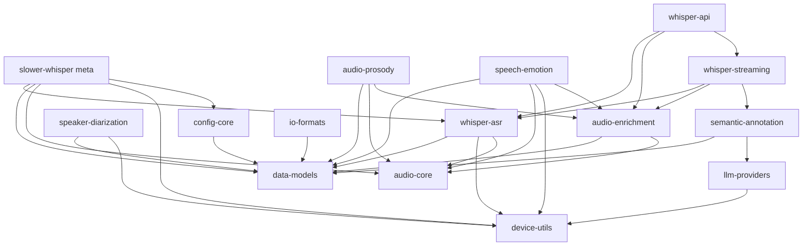

# Slower-Whisper Modularization Strategy: Microlibrary Decomposition

## Executive Summary

This document proposes a modularization strategy for the slower-whisper project, breaking it into focused microlibraries. The analysis identifies natural boundaries based on functionality, dependencies, and coupling patterns.

---

## 1. Current Architecture Analysis

### 1.1 Project Structure

```
slower-whisper/
├── slower_whisper/          # Core model wrapper (faster-whisper compatibility)
│   ├── __init__.py
│   ├── compat.py
│   └── decode.py
└── transcription/           # Main pipeline and services
    ├── __init__.py          # Public API exports
    ├── api.py               # FastAPI service
    ├── pipeline.py          # Main transcription pipeline
    ├── asr_engine.py       # ASR engine wrapper
    ├── config.py            # Configuration façade
    ├── models.py            # Data models (Transcript, Segment, etc.)
    ├── writers.py           # JSON/TXT/SRT writers
    ├── receipt.py           # Provenance tracking
    ├── device.py           # Device resolution
    └── [70+ modules]      # Various features
```

### 1.2 Public API (from `transcription/__init__.py`)

**Core Transcription:**
- `transcribe()` - Main entry point
- `TranscriptionConfig` - Configuration
- `BatchProcessingResult` - Batch results

**Enrichment:**
- `enrich_transcript()` - Audio enrichment
- `EnrichmentConfig` - Enrichment configuration

**Semantic Analysis:**
- `SemanticAdapter` - Protocol for semantic providers
- `create_adapter()` - Factory for semantic adapters
- `SemanticAnnotation` - Annotation dataclass

**Streaming:**
- `StreamingSession` - Streaming session
- `StreamingConfig` - Streaming configuration
- `EventEnvelope` - Streaming event protocol

**Diarization:**
- `Diarizer` - Speaker diarization
- `assign_speakers()` - Speaker assignment

**Audio Features:**
- `extract_prosody()` - Prosody extraction
- `extract_emotion_dimensional()` - Emotion extraction
- `extract_emotion_categorical()` - Categorical emotion

**Utilities:**
- `write_json()`, `write_txt()`, `write_srt()` - Output writers
- `build_receipt()` - Provenance receipt
- `resolve_device()` - Device resolution

### 1.3 Dependency Analysis

**External Dependencies (from pyproject.toml):**
- `faster-whisper` - Core ASR engine
- `ctranslate2` - CTranslate2 backend
- `numpy` - Numerical operations
- `pydantic` - Data validation
- `fastapi` - API service
- `uvicorn` - ASGI server
- `soundfile` - Audio I/O

**Optional Dependencies:**
- `torch` + `transformers` - Emotion, diarization, local LLM
- `pyannote.audio` - Speaker diarization
- `librosa` - Audio processing
- `parselmouth` - Prosody (pitch)
- `anthropic`, `openai` - Cloud LLM providers
- `claude-agent-sdk` - Claude integration

**Internal Coupling Patterns:**
1. **Pipeline coupling:** [`pipeline.py`](transcription/pipeline.py) orchestrates everything
2. **Config coupling:** [`config.py`](transcription/config.py) façade imports from multiple modules
3. **Model coupling:** [`models.py`](transcription/models.py) used everywhere
4. **Device coupling:** [`device.py`](transcription/device.py) used by ASR, emotion, diarization
5. **Streaming coupling:** Multiple streaming modules share [`EventEnvelope`](transcription/streaming.py) protocol

---

## 2. Natural Modular Boundaries

### 2.1 Functional Domains Identified

| Domain | Modules | Dependencies | Coupling |
|---------|----------|--------------|-----------|
| **Core ASR** | `pipeline.py`, `asr_engine.py`, `audio_io.py`, `chunking.py` | faster-whisper, ctranslate2 | Low |
| **Models** | `models.py`, `receipt.py` | numpy, dataclasses | Low |
| **Device** | `device.py` | ctranslate2, torch | Low |
| **Config** | `config.py`, `transcription_config.py`, `enrichment_config.py`, `legacy_config.py`, `config_validation.py`, `config_merge.py` | pydantic | Medium |
| **Writers** | `writers.py` | json, pathlib | Low |
| **Diarization** | `diarization.py`, `diarization_orchestrator.py`, `speaker_id.py`, `speaker_stats.py` | pyannote, torch | Low |
| **Prosody** | `prosody.py`, `prosody_extended.py` | parselmouth, librosa | Low |
| **Emotion** | `emotion.py` | torch, transformers | Low |
| **Semantic** | `semantic.py`, `semantic_adapter.py`, `semantic_providers/`, `historian/` | anthropic, openai, torch | Low |
| **Enrichment** | `audio_enrichment.py`, `enrichment_orchestrator.py`, `enrichment_config.py` | prosody, emotion, semantic | Medium |
| **Streaming** | `streaming.py`, `streaming_ws.py`, `streaming_sse.py`, `streaming_asr.py`, `streaming_callbacks.py`, `streaming_enrich.py`, `streaming_semantic.py`, `streaming_safety.py`, `streaming_client.py` | fastapi, websockets | Medium |
| **API Service** | `api.py`, `service_*.py` | fastapi, uvicorn | Medium |
| **LLM Providers** | `local_llm_provider.py`, `historian/llm_client.py` | torch, transformers, anthropic, openai | Low |
| **Benchmarks** | `benchmarks.py`, `benchmark_cli.py` | pytest, rich | Low |

### 2.2 Coupling Analysis

**Tight Coupling (High):**
- [`pipeline.py`](transcription/pipeline.py) → enrichment, diarization, semantic, prosody, emotion
- [`enrichment_orchestrator.py`](transcription/enrichment_orchestrator.py) → prosody, emotion, semantic
- [`streaming.py`](transcription/streaming.py) → streaming_asr, streaming_enrich, streaming_semantic

**Loose Coupling (Low):**
- [`models.py`](transcription/models.py) → standalone dataclasses
- [`writers.py`](transcription/writers.py) → only depends on models
- [`device.py`](transcription/device.py) → only depends on ctranslate2/torch
- [`receipt.py`](transcription/receipt.py) → only depends on models

**Circular Dependencies:**
- None detected (good sign for modularization)

---

## 3. Proposed Microlibrary Decomposition

### 3.1 Microlibrary Map

```
┌─────────────────────────────────────────────────────────────────────────┐
│                        slower-whisper (meta-package)                │
│                    (orchestrates all microlibraries)                │
└─────────────────────────────────────────────────────────────────────────┘
                              │
        ┌─────────────────────┼─────────────────────┐
        │                     │                     │
        ▼                     ▼                     ▼
┌──────────────┐    ┌──────────────┐    ┌──────────────┐
│  whisper-asr │    │  audio-core  │    │  data-models │
│              │    │              │    │              │
│ - pipeline   │    │ - audio_io   │    │ - Transcript │
│ - asr_engine │    │ - chunking   │    │ - Segment    │
│ - VAD        │    │ - rendering  │    │ - Turn       │
└──────────────┘    └──────────────┘    └──────────────┘
        │                     │                     │
        └─────────────────────┼─────────────────────┘
                              │
                              ▼
                    ┌──────────────────┐
                    │  device-utils   │
                    │                │
                    │ - resolve_device│
                    │ - compute_type  │
                    └──────────────────┘
                              │
        ┌─────────────────────┼─────────────────────┐
        │                     │                     │
        ▼                     ▼                     ▼
┌──────────────┐    ┌──────────────┐    ┌──────────────┐
│  diarization │    │   prosody    │    │   emotion    │
│              │    │              │    │              │
│ - Diarizer   │    │ - pitch      │    │ - dimensional │
│ - assign_spk  │    │ - energy     │    │ - categorical │
│ - speaker_id  │    │ - rate       │    │ - wav2vec2   │
└──────────────┘    └──────────────┘    └──────────────┘
        │                     │                     │
        └─────────────────────┼─────────────────────┘
                              │
                              ▼
                    ┌──────────────────┐
                    │  enrichment    │
                    │                │
                    │ - orchestrator │
                    │ - config      │
                    └──────────────────┘
                              │
                              ▼
                    ┌──────────────────┐
                    │  semantic      │
                    │                │
                    │ - adapters     │
                    │ - providers   │
                    │ - historian   │
                    └──────────────────┘
                              │
                              ▼
                    ┌──────────────────┐
                    │  streaming     │
                    │                │
                    │ - session     │
                    │ - websocket   │
                    │ - sse         │
                    └──────────────────┘
                              │
                              ▼
                    ┌──────────────────┐
                    │  api-service   │
                    │                │
                    │ - FastAPI     │
                    │ - endpoints   │
                    └──────────────────┘
                              │
                              ▼
                    ┌──────────────────┐
                    │  llm-providers │
                    │                │
                    │ - local       │
                    │ - cloud       │
                    │ - historian   │
                    └──────────────────┘
```

### 3.2 Detailed Microlibrary Specifications

#### Library 1: `whisper-asr`
**Purpose:** Core ASR transcription using faster-whisper

**Scope:**
- `pipeline.py` → `whisper_asr/pipeline.py`
- `asr_engine.py` → `whisper_asr/engine.py`
- `audio_io.py` → `whisper_asr/audio_io.py`
- `chunking.py` → `whisper_asr/chunking.py`
- `post_process.py` → `whisper_asr/post_process.py`

**Dependencies:**
- `data-models` (Transcript, Segment)
- `device-utils` (ResolvedDevice)
- `faster-whisper`
- `ctranslate2`

**Public API:**
```python
class WhisperASR:
    def transcribe(self, audio_path: Path, config: TranscriptionConfig) -> Transcript
    def transcribe_batch(self, files: list[Path], config: TranscriptionConfig) -> BatchProcessingResult
```

**Package:** `whisper-asr`

---

#### Library 2: `data-models`
**Purpose:** Shared data models and schemas

**Scope:**
- `models.py` → `data_models/models.py`
- `receipt.py` → `data_models/receipt.py`
- `models_speakers.py` → `data_models/speakers.py`
- `models_turns.py` → `data_models/turns.py`
- `outcomes.py` → `data_models/outcomes.py`

**Dependencies:**
- None (pure dataclasses)

**Public API:**
```python
@dataclass
class Transcript:
    file_name: str
    language: str
    segments: list[Segment]
    # ... other fields

@dataclass
class Segment:
    id: int
    start: float
    end: float
    text: str
    # ... other fields
```

**Package:** `data-models`

---

#### Library 3: `audio-core`
**Purpose:** Audio processing utilities

**Scope:**
- `audio_io.py` → `audio_core/io.py`
- `audio_rendering.py` → `audio_core/rendering.py`
- `audio_enrichment.py` → `audio_core/enrichment.py`

**Dependencies:**
- `data-models`
- `soundfile`
- `librosa` (optional)

**Public API:**
```python
def load_audio(path: Path) -> tuple[np.ndarray, int]
def normalize_audio(audio: np.ndarray) -> np.ndarray
def apply_vad(audio: np.ndarray, sr: int) -> list[tuple[float, float]]
```

**Package:** `audio-core`

---

#### Library 4: `device-utils`
**Purpose:** Device detection and resolution

**Scope:**
- `device.py` → `device_utils/resolver.py`
- `color_utils.py` → `device_utils/colors.py`

**Dependencies:**
- None (optional imports for ctranslate2, torch)

**Public API:**
```python
@dataclass
class ResolvedDevice:
    device: str
    compute_type: str
    # ...

def resolve_device(requested: str, backend: str = "ctranslate2") -> ResolvedDevice
def resolve_compute_type(requested: str, device: str) -> str
```

**Package:** `device-utils`

---

#### Library 5: `diarization`
**Purpose:** Speaker diarization

**Scope:**
- `diarization.py` → `diarization/core.py`
- `diarization_orchestrator.py` → `diarization/orchestrator.py`
- `speaker_id.py` → `diarization/speaker_id.py`
- `speaker_stats.py` → `diarization/stats.py`
- `role_inference.py` → `diarization/role_inference.py`

**Dependencies:**
- `data-models`
- `device-utils`
- `pyannote.audio` (optional)
- `torch` (optional)

**Public API:**
```python
class Diarizer:
    def run(self, audio_path: Path) -> list[SpeakerTurn]

def assign_speakers(transcript: Transcript, turns: list[SpeakerTurn]) -> Transcript
```

**Package:** `speaker-diarization`

---

#### Library 6: `prosody`
**Purpose:** Prosodic feature extraction

**Scope:**
- `prosody.py` → `prosody/extractor.py`
- `prosody_extended.py` → `prosody/extended.py`

**Dependencies:**
- `audio-core`
- `data-models`
- `parselmouth` (optional)
- `librosa` (optional)

**Public API:**
```python
def extract_prosody(audio: np.ndarray, sr: int, text: str) -> dict[str, Any]
def compute_speaker_baseline(segments: list[dict]) -> dict[str, Any]
```

**Package:** `audio-prosody`

---

#### Library 7: `emotion`
**Purpose:** Speech emotion recognition

**Scope:**
- `emotion.py` → `emotion/recognizer.py`

**Dependencies:**
- `audio-core`
- `data-models`
- `device-utils`
- `torch` (optional)
- `transformers` (optional)

**Public API:**
```python
class EmotionRecognizer:
    def extract_emotion_dimensional(self, audio: np.ndarray, sr: int) -> dict
    def extract_emotion_categorical(self, audio: np.ndarray, sr: int) -> dict

def extract_emotion_dimensional(audio: np.ndarray, sr: int) -> dict
def extract_emotion_categorical(audio: np.ndarray, sr: int) -> dict
```

**Package:** `speech-emotion`

---

#### Library 8: `enrichment`
**Purpose:** Audio enrichment orchestration

**Scope:**
- `enrichment_orchestrator.py` → `enrichment/orchestrator.py`
- `enrichment_config.py` → `enrichment/config.py`
- `enrichment_config.py` (EnrichmentConfig) → `enrichment/config.py`

**Dependencies:**
- `data-models`
- `audio-core`
- `prosody`
- `emotion`
- `semantic`

**Public API:**
```python
class EnrichmentOrchestrator:
    def enrich(self, transcript: Transcript, audio_path: Path) -> Transcript

def enrich_transcript(transcript: Transcript, audio_path: Path, config: EnrichmentConfig) -> Transcript
```

**Package:** `audio-enrichment`

---

#### Library 9: `semantic`
**Purpose:** Semantic analysis and LLM integration

**Scope:**
- `semantic.py` → `semantic/annotator.py`
- `semantic_adapter.py` → `semantic/adapter.py`
- `semantic_providers/` → `semantic/providers/`
- `historian/` → `semantic/historian/`

**Dependencies:**
- `data-models`
- `llm-providers`
- `anthropic` (optional)
- `openai` (optional)

**Public API:**
```python
class SemanticAdapter(Protocol):
    def annotate(self, transcript: Transcript) -> SemanticAnnotation

def create_adapter(provider: str, model: str) -> SemanticAdapter
```

**Package:** `semantic-annotation`

---

#### Library 10: `streaming`
**Purpose:** Real-time streaming transcription

**Scope:**
- `streaming.py` → `streaming/session.py`
- `streaming_ws.py` → `streaming/websocket.py`
- `streaming_sse.py` → `streaming/sse.py`
- `streaming_asr.py` → `streaming/asr_adapter.py`
- `streaming_enrich.py` → `streaming/enrichment.py`
- `streaming_semantic.py` → `streaming/semantic.py`
- `streaming_safety.py` → `streaming/safety.py`
- `streaming_callbacks.py` → `streaming/callbacks.py`
- `streaming_client.py` → `streaming/client.py`
- `topic_segmentation.py` → `streaming/topics.py`

**Dependencies:**
- `data-models`
- `whisper-asr`
- `enrichment`
- `semantic`
- `fastapi`
- `websockets`

**Public API:**
```python
class StreamingSession:
    def ingest_chunk(self, audio: np.ndarray) -> None
    def finalize(self) -> None

class StreamingClient:
    def connect(self) -> None
    def send_audio(self, audio: np.ndarray) -> None
```

**Package:** `whisper-streaming`

---

#### Library 11: `api-service`
**Purpose:** FastAPI REST service

**Scope:**
- `api.py` → `api_service/app.py`
- `service_transcribe.py` → `api_service/transcribe.py`
- `service_enrich.py` → `api_service/enrich.py`
- `service_*.py` → `api_service/*.py`
- `service_errors.py` → `api_service/errors.py`
- `service_validation.py` → `api_service/validation.py`
- `service_serialization.py` → `api_service/serialization.py`

**Dependencies:**
- `whisper-asr`
- `enrichment`
- `semantic`
- `streaming`
- `fastapi`
- `uvicorn`

**Public API:**
```python
def create_app() -> FastAPI
def run_server(host: str, port: int) -> None
```

**Package:** `whisper-api`

---

#### Library 12: `llm-providers`
**Purpose:** LLM provider abstraction

**Scope:**
- `local_llm_provider.py` → `llm_providers/local.py`
- `historian/llm_client.py` → `llm_providers/client.py`

**Dependencies:**
- `torch` (optional)
- `transformers` (optional)
- `anthropic` (optional)
- `openai` (optional)

**Public API:**
```python
class LLMProvider(ABC):
    async def complete(self, system: str, user: str) -> LLMResponse

def create_llm_provider(config: LLMConfig) -> LLMProvider
```

**Package:** `llm-providers`

---

#### Library 13: `io-formats`
**Purpose:** Output format writers

**Scope:**
- `writers.py` → `io_formats/writers.py`

**Dependencies:**
- `data-models`

**Public API:**
```python
def write_json(transcript: Transcript, path: Path) -> None
def write_txt(transcript: Transcript, path: Path) -> None
def write_srt(transcript: Transcript, path: Path) -> None
```

**Package:** `io-formats`

---

#### Library 14: `config-core`
**Purpose:** Configuration management

**Scope:**
- `config.py` → `config_core/config.py`
- `transcription_config.py` → `config_core/transcription.py`
- `enrichment_config.py` → `config_core/enrichment.py`
- `config_validation.py` → `config_core/validation.py`
- `config_merge.py` → `config_core/merge.py`

**Dependencies:**
- `data-models`
- `pydantic`

**Public API:**
```python
@dataclass
class TranscriptionConfig:
    model: str
    device: str
    # ...

@dataclass
class EnrichmentConfig:
    enable_prosody: bool
    enable_emotion: bool
    # ...
```

**Package:** `config-core`

---

### 3.3 Dependency Graph



---

## 4. Migration Strategy

### 4.1 Phase 1: Foundation Libraries (Low Risk)

**Goal:** Extract standalone libraries with minimal dependencies

**Libraries:**
1. `data-models` - Pure dataclasses, no external deps
2. `device-utils` - Optional deps, low coupling
3. `io-formats` - Only depends on data-models
4. `config-core` - Depends on data-models, pydantic

**Steps:**
1. Create new package structure
2. Copy files with minimal changes
3. Add `__init__.py` with public API exports
4. Create `pyproject.toml` for each package
5. Publish to PyPI (or private registry)
6. Update `slower-whisper` to import from new packages

**Timeline:** 2-3 weeks

---

### 4.2 Phase 2: Feature Libraries (Medium Risk)

**Goal:** Extract feature-specific libraries

**Libraries:**
5. `audio-core` - Audio processing utilities
6. `speaker-diarization` - Diarization (optional deps)
7. `audio-prosody` - Prosody (optional deps)
8. `speech-emotion` - Emotion (optional deps)
9. `llm-providers` - LLM abstraction

**Steps:**
1. Create package structure
2. Copy and adapt files
3. Handle optional dependencies gracefully
4. Add tests
5. Publish packages
6. Update imports

**Timeline:** 4-6 weeks

---

### 4.3 Phase 3: Orchestrator Libraries (High Risk)

**Goal:** Extract orchestration and integration libraries

**Libraries:**
10. `whisper-asr` - Core ASR pipeline
11. `audio-enrichment` - Enrichment orchestration
12. `semantic-annotation` - Semantic analysis
13. `whisper-streaming` - Streaming protocol

**Steps:**
1. Carefully extract orchestration logic
2. Maintain backward compatibility
3. Add comprehensive tests
4. Publish packages
5. Update imports

**Timeline:** 6-8 weeks

---

### 4.4 Phase 4: Service Layer (Final)

**Goal:** Extract API service

**Libraries:**
14. `whisper-api` - FastAPI service

**Steps:**
1. Extract FastAPI app
2. Create separate deployment package
3. Update documentation
4. Publish

**Timeline:** 2-3 weeks

---

### 4.5 Backward Compatibility Strategy

**Option A: Compatibility Shim (Recommended)**
```python
# transcription/__init__.py (in slower-whisper)
# Re-export from microlibraries for backward compatibility

from whisper_asr import transcribe, TranscriptionConfig
from audio_enrichment import enrich_transcript, EnrichmentConfig
from semantic_annotation import SemanticAdapter, create_adapter
from speaker_diarization import Diarizer, assign_speakers
from audio_prosody import extract_prosody
from speech_emotion import extract_emotion_dimensional, extract_emotion_categorical
from io_formats import write_json, write_txt, write_srt
from device_utils import resolve_device
from data_models import Transcript, Segment, Turn, Chunk
from receipt import build_receipt
```

**Option B: Deprecation Path**
1. Keep old imports with deprecation warnings
2. Guide users to new package imports
3. Remove in v3.0

---

## 5. Trade-offs and Considerations

### 5.1 Benefits

1. **Reduced Bundle Size**
   - Users only install what they need
   - Example: `pip install whisper-asr` vs full `slower-whisper`

2. **Independent Versioning**
   - Each library can evolve independently
   - Breaking changes isolated to affected libraries

3. **Clearer Maintenance**
   - Smaller codebases per library
   - Easier onboarding for contributors

4. **Reusability**
   - `data-models` can be used by other projects
   - `device-utils` can be reused by other ML projects

5. **Testing Isolation**
   - Each library has its own test suite
   - Faster test execution

### 5.2 Risks

1. **Dependency Hell**
   - Managing inter-library versions
   - Need for version compatibility matrix

2. **Breaking Changes**
   - Changes in `data-models` affect all dependents
   - Need coordinated releases

3. **User Confusion**
   - Which package to install?
   - Need clear documentation

4. **Release Complexity**
   - Coordinating releases across 14 packages
   - Need for monorepo tooling

5. **Development Overhead**
   - Setting up 14 separate packages
   - CI/CD for each package

### 5.3 Mitigation Strategies

1. **Monorepo Approach**
   - Use tools like `nx`, `turborepo`, or `poetry-workspace`
   - Single repository, multiple packages
   - Shared CI/CD pipeline

2. **Version Coordination**
   - Use semantic versioning with clear compatibility rules
   - Document breaking changes in CHANGELOG
   - Consider `dependabot` for dependency updates

3. **Meta-Package**
   - `slower-whisper` becomes a meta-package
   - Installs all microlibraries
   - Maintains backward compatibility

4. **Clear Documentation**
   - Installation guide for each use case
   - Migration guide from v2.x to v3.x
   - Dependency matrix

5. **Automated Testing**
   - Integration tests across libraries
   - Automated version compatibility checks
   - Pre-release testing

---

## 6. Implementation Recommendations

### 6.1 Monorepo Structure

```
slower-whisper-monorepo/
├── packages/
│   ├── data-models/
│   ├── device-utils/
│   ├── audio-core/
│   ├── io-formats/
│   ├── config-core/
│   ├── speaker-diarization/
│   ├── audio-prosody/
│   ├── speech-emotion/
│   ├── llm-providers/
│   ├── whisper-asr/
│   ├── audio-enrichment/
│   ├── semantic-annotation/
│   ├── whisper-streaming/
│   └── whisper-api/
├── slower-whisper/          # Meta-package
│   └── pyproject.toml       # Depends on all packages
├── docs/
├── scripts/
├── .github/
└── pyproject.toml           # Workspace config
```

### 6.2 Tooling Recommendations

1. **Poetry Workspaces** or **PDM Workspaces**
   - Dependency management
   - Workspace support

2. **Pre-commit Hooks**
   - Consistent formatting
   - Linting across packages

3. **CI/CD**
   - GitHub Actions
   - Test all packages on PR
   - Automated publishing

4. **Documentation**
   - MkDocs or Sphinx
   - Auto-generated API docs
   - Per-package documentation

### 6.3 Naming Conventions

| Current Name | New Package Name |
|--------------|------------------|
| `slower-whisper` | `whisper-asr` (core) + meta-package |
| `transcription/models.py` | `data-models` |
| `transcription/device.py` | `device-utils` |
| `transcription/diarization.py` | `speaker-diarization` |
| `transcription/prosody.py` | `audio-prosody` |
| `transcription/emotion.py` | `speech-emotion` |
| `transcription/semantic*.py` | `semantic-annotation` |
| `transcription/streaming*.py` | `whisper-streaming` |
| `transcription/api.py` | `whisper-api` |
| `transcription/writers.py` | `io-formats` |
| `transcription/config*.py` | `config-core` |

---

## 7. Conclusion

The proposed modularization strategy breaks slower-whisper into 14 focused microlibraries:

1. **Foundation:** `data-models`, `device-utils`, `audio-core`, `config-core`
2. **Features:** `speaker-diarization`, `audio-prosody`, `speech-emotion`, `llm-providers`
3. **Orchestration:** `whisper-asr`, `audio-enrichment`, `semantic-annotation`
4. **Services:** `whisper-streaming`, `whisper-api`
5. **Utilities:** `io-formats`

The migration should be done in 4 phases over 4-6 months, starting with low-risk foundation libraries and progressing to high-risk orchestration libraries.

**Key Success Factors:**
- Monorepo with workspace support
- Automated testing across packages
- Clear documentation and migration guides
- Backward compatibility via meta-package
- Coordinated release process
