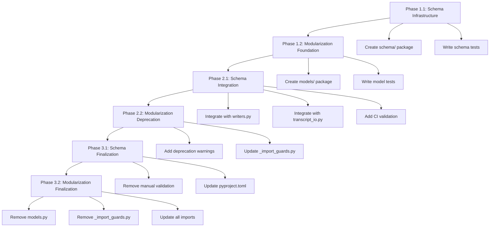

# Implementation Plan: Modularization and Schema Locking

**Project:** slower-whisper
**Version:** 1.9.2
**Date:** 2025-01-24
**Status:** Draft for Review

---

## Executive Summary

This plan addresses two critical technical debt areas:

1. **Modularization**: The `transcription/` directory has 58 files in a flat structure with monolithic components that hinder maintainability.
2. **Schema Locking**: Three JSON schemas (transcript-v2, pr-dossier-v2, semantic) lack integrity verification, CI validation, and migration tooling.

The implementation is divided into three phases to maintain backward compatibility while incrementally improving the codebase.

---

## Current State Analysis

### Modularization Issues

| Component | Current State | Issue |
|-----------|---------------|--------|
| `models.py` | 720 lines, monolithic | All dataclasses in one file |
| Audio functionality | Scattered across 4 files | `audio_io.py`, `audio_enrichment.py`, `audio_utils.py`, `audio_rendering.py` |
| Streaming subsystem | Split across 6 files | `streaming.py`, `streaming_callbacks.py`, `streaming_client.py`, `streaming_semantic.py`, `streaming_enrich.py`, `streaming_ws.py` |
| Config | Fragmented across 4 modules | `config.py` (façade), `legacy_config.py`, `transcription_config.py`, `enrichment_config.py`, `config_validation.py`, `config_merge.py` |
| Turn/speaker logic | Scattered across 5 files | `models_turns.py`, `models_speakers.py`, `turn_helpers.py`, `turns_enrich.py`, `speaker_id.py`, `speaker_stats.py` |
| Backward compatibility | Import guards in `_import_guards.py` | Maintenance burden |

### Schema Locking Gaps

| Area | Current State | Gap |
|-------|---------------|------|
| Schema files | `transcript-v2.schema.json`, `pr-dossier-v2.schema.json` | No hash verification |
| Validation | Optional via `jsonschema` package | No CI validation, no integrity checks |
| Migrations | Manual migration mentioned in README | No automated migration module |
| Change detection | None | No schema change detection mechanism |
| Backward compatibility | Manual | No automated backward compatibility tests |

---

## Phase-by-Phase Implementation

### Phase 1: Foundation (Non-Breaking)

**Goal:** Establish infrastructure without breaking existing imports or behavior.

#### 1.1 Schema Locking Infrastructure

**New Packages/Files to Create:**

```
transcription/schema/
├── __init__.py                    # Public API for schema operations
├── registry.py                    # Schema registry and hash tracking
├── validator.py                   # Schema validation wrapper
├── migration.py                   # Migration utilities
├── integrity.py                   # Schema integrity verification
└── lockfile.py                   # Schema lockfile management
```

**Files to Create:**

1. `transcription/schema/__init__.py`
   - Export public API: `get_schema()`, `validate_data()`, `get_schema_version()`
   - Re-export from submodules for backward compatibility

2. `transcription/schema/registry.py`
   - `SchemaRegistry` class for tracking loaded schemas
   - Schema hash computation (SHA256)
   - Schema version tracking
   - Schema change detection

3. `transcription/schema/validator.py`
   - `SchemaValidator` class wrapping `jsonschema`
   - Validation error formatting
   - Optional validation flag (default: enabled in CI, disabled in production for perf)

4. `transcription/schema/migration.py`
   - `MigrationPath` dataclass for version-to-version migrations
   - `MigrationRegistry` for tracking available migrations
   - `migrate_v1_to_v2()` implementation
   - `detect_schema_version()` helper

5. `transcription/schema/integrity.py`
   - `verify_schema_integrity()` function
   - Hash comparison against lockfile
   - Schema tampering detection

6. `transcription/schema/lockfile.py`
   - `SchemaLockfile` dataclass
   - `load_lockfile()`, `save_lockfile()` functions
   - Lockfile format: JSON with schema hashes and versions

**Deprecation Warnings:** None (Phase 1 is additive)

**Tests to Write:**

- `tests/test_schema_registry.py`
  - Schema loading and caching
  - Hash computation
  - Version tracking

- `tests/test_schema_validator.py`
  - Valid data validation
  - Invalid data detection
  - Error message formatting

- `tests/test_schema_migration.py`
  - v1 to v2 migration
  - Version detection
  - Migration path resolution

- `tests/test_schema_integrity.py`
  - Hash verification
  - Tampering detection
  - Lockfile loading/saving

**Documentation to Update:**

- `docs/SCHEMA_LOCKING.md` (new)
  - Schema locking overview
  - Hash verification process
  - Migration guide

- `transcription/schemas/README.md` (update)
  - Add schema locking section
  - Document hash verification
  - Migration instructions

#### 1.2 Modularization Foundation

**New Packages/Files to Create:**

```
transcription/models/
├── __init__.py                    # Re-export all models
├── core.py                        # Core models: Segment, Transcript
├── audio.py                       # Audio-related models: Word, audio_state types
├── diarization.py                 # Diarization models: DiarizationMeta, SpeakerStats
├── turns.py                       # Turn models: Turn, TurnMeta, Chunk
├── batch.py                       # Batch result models: BatchFileResult, BatchProcessingResult, EnrichmentFileResult, EnrichmentBatchResult
└── summary.py                     # Summary models: ProsodySummary, SentimentSummary
```

**Files to Create:**

1. `transcription/models/__init__.py`
   - Re-export all models from submodules
   - Maintain backward compatibility with `from transcription.models import *`
   - Import from old `models.py` location

2. `transcription/models/core.py`
   - Move `Segment`, `Transcript` from `models.py`
   - Keep all methods and properties intact

3. `transcription/models/audio.py`
   - Move `Word` from `models.py`
   - Add audio state type definitions (if any)

4. `transcription/models/diarization.py`
   - Move `DiarizationMeta`, `SpeakerStats`, `ProsodySummary`, `SentimentSummary` from `models.py`

5. `transcription/models/turns.py`
   - Move `Turn`, `TurnMeta`, `Chunk` from `models.py`

6. `transcription/models/batch.py`
   - Move `BatchFileResult`, `BatchProcessingResult`, `EnrichmentFileResult`, `EnrichmentBatchResult` from `models.py`

7. `transcription/models/summary.py`
   - Move `ProsodySummary`, `SentimentSummary` from `models.py`
   - (Note: these may stay in diarization.py - decide during implementation)

**Deprecation Warnings:** None (Phase 1 is additive)

**Tests to Write:**

- Update `tests/test_models_core.py` to import from new locations
- Add deprecation warning tests for Phase 2

**Documentation to Update:**

- `docs/MODULARIZATION.md` (new)
  - Module organization
  - Import patterns
  - Migration guide

---

### Phase 2: Deprecation (Warning Phase)

**Goal:** Begin deprecating old import paths while maintaining full backward compatibility.

#### 2.1 Schema Locking Integration

**Files to Modify:**

1. `transcription/writers.py`
   - Add schema validation before JSON output
   - Use `SchemaValidator` from new `schema` module
   - Add deprecation warning for manual validation

2. `transcription/transcript_io.py`
   - Add schema validation on load
   - Auto-migrate old schemas using `migration.py`
   - Add deprecation warning for unvalidated loads

3. `transcription/cli.py`
   - Add `--validate-schema` flag (default: True)
   - Add `--schema-lockfile` flag
   - Add schema validation to `validate` subcommand

4. `.github/workflows/ci.yml`
   - Add schema validation step
   - Add schema integrity check step
   - Fail build if schema hashes don't match

**Deprecation Warnings to Add:**

```python
import warnings

warnings.warn(
    "Direct schema validation without schema locking is deprecated. "
    "Use transcription.schema.validate_data() instead. "
    "This will be removed in v2.0.0.",
    DeprecationWarning,
    stacklevel=2
)
```

**Tests to Write:**

- `tests/test_schema_integration.py`
  - Integration with writers.py
  - Integration with transcript_io.py
  - CLI validation command

- `tests/test_schema_backward_compatibility.py`
  - Load v1 transcripts and auto-migrate
  - Verify v2 validation passes
  - Test lockfile generation

**Documentation to Update:**

- `README.md` (update)
  - Add schema validation section
  - Document CLI flags

- `CHANGELOG.md` (update)
  - Document deprecation warnings
  - Migration instructions

#### 2.2 Modularization Deprecation

**Files to Modify:**

1. `transcription/models.py` (keep as façade)
   - Change from implementation to re-export only
   - Add deprecation warnings for direct imports
   - Document new import paths

2. `transcription/_import_guards.py` (update)
   - Add warnings for deprecated import patterns
   - Suggest new import paths

**Deprecation Warnings to Add:**

```python
# In transcription/models.py
import warnings

# When importing from old location
warnings.warn(
    "Importing from 'transcription.models' is deprecated. "
    "Use 'transcription.models.core' for core models, "
    "'transcription.models.diarization' for diarization models, etc. "
    "This will be removed in v2.0.0.",
    DeprecationWarning,
    stacklevel=2
)
```

**Tests to Write:**

- `tests/test_deprecation_warnings.py`
  - Verify warnings are emitted
  - Test warning suppression
  - Verify new import paths work

**Documentation to Update:**

- `docs/MIGRATION_GUIDE.md` (new)
  - Step-by-step migration instructions
  - Before/after import examples
  - Timeline for removal

---

### Phase 3: Cleanup (Breaking Changes)

**Goal:** Remove deprecated code and finalize new structure.

#### 3.1 Schema Locking Finalization

**Files to Remove:**

- Manual schema validation code from `writers.py`
- Manual migration code from `transcript_io.py`
- Legacy schema handling

**Files to Modify:**

1. `transcription/writers.py`
   - Remove manual validation (now in schema module)
   - Use `SchemaValidator` exclusively

2. `transcription/transcript_io.py`
   - Remove manual migration (now in schema module)
   - Use `MigrationRegistry` exclusively

3. `pyproject.toml`
   - Make `jsonschema` a required dependency (was optional)
   - Update version to 2.0.0

**Tests to Update:**

- Remove tests for manual validation
- Update integration tests for new behavior

**Documentation to Update:**

- `docs/SCHEMA_LOCKING.md` (update)
  - Remove deprecation notes
  - Finalize API documentation

#### 3.2 Modularization Finalization

**Files to Remove:**

- `transcription/models.py` (the monolithic file)
- `transcription/_import_guards.py`

**Files to Modify:**

1. `transcription/__init__.py`
   - Update exports to use new module structure
   - Remove references to old `models.py`

2. All internal imports
   - Update to use new module paths
   - Remove old import patterns

3. `pyproject.toml`
   - Update version to 2.0.0
   - Update package list in `[tool.setuptools.packages]`

**Tests to Update:**

- `tests/test_models_core.py`
  - Update imports to new paths
  - Remove deprecation warning tests

- All test files
  - Update imports to use new module paths

**Documentation to Update:**

- `README.md` (update)
  - Update import examples
  - Remove deprecation notes

- `docs/MIGRATION_GUIDE.md` (update)
  - Mark as complete
  - Add v2.0.0 release notes

---

## Task Dependencies



---

## Risk Assessment

### High-Risk Items

| Risk | Impact | Probability | Mitigation |
|-------|--------|-------------|-------------|
| Breaking existing imports | High | Medium | Phase 2 deprecation warnings; Phase 3 major version bump |
| Schema validation performance impact | High | Low | Make validation optional in production; cache compiled schemas |
| Migration data loss | High | Low | Comprehensive migration tests; backup recommendations |
| CI pipeline failures | Medium | Medium | Add schema validation as non-blocking initially; make blocking after stabilization |

### Medium-Risk Items

| Risk | Impact | Probability | Mitigation |
|-------|--------|-------------|-------------|
| Test coverage gaps | Medium | Medium | Add integration tests for all new paths |
| Documentation drift | Medium | Medium | Update docs with each phase; review before release |
| Dependency conflicts | Medium | Low | Use existing `jsonschema` dependency; pin versions |

### Low-Risk Items

| Risk | Impact | Probability | Mitigation |
|-------|--------|-------------|-------------|
| Import path confusion | Low | Medium | Clear deprecation warnings; comprehensive migration guide |
| Schema hash collisions | Low | Very Low | Use SHA256; include version in hash computation |

---

## Testing Strategy

### Unit Tests

**Schema Locking Tests:**
- `tests/test_schema_registry.py` (200+ lines)
  - Schema loading and caching
  - Hash computation and verification
  - Version tracking and detection
  - Schema change detection

- `tests/test_schema_validator.py` (150+ lines)
  - Valid data validation
  - Invalid data detection
  - Error message formatting
  - Optional validation behavior

- `tests/test_schema_migration.py` (200+ lines)
  - v1 to v2 migration
  - Version detection from data
  - Migration path resolution
  - Migration error handling

- `tests/test_schema_integrity.py` (100+ lines)
  - Hash verification
  - Tampering detection
  - Lockfile operations

**Modularization Tests:**
- `tests/test_models_core.py` (existing, update imports)
- `tests/test_models_audio.py` (new, 100+ lines)
- `tests/test_models_diarization.py` (new, 150+ lines)
- `tests/test_models_turns.py` (new, 150+ lines)
- `tests/test_models_batch.py` (new, 100+ lines)
- `tests/test_deprecation_warnings.py` (new, 100+ lines)

### Integration Tests

**Schema Integration Tests:**
- `tests/test_schema_integration.py` (200+ lines)
  - Integration with `writers.py`
  - Integration with `transcript_io.py`
  - CLI validation command
  - End-to-end validation flow

**Modularization Integration Tests:**
- `tests/test_import_paths.py` (new, 150+ lines)
  - All import patterns work
  - Backward compatibility maintained
  - New import paths work

### Backward Compatibility Tests

- `tests/test_backward_compatibility.py` (new, 300+ lines)
  - Load v1 transcripts and auto-migrate
  - Old import patterns still work (Phase 2)
  - Old CLI flags still work (Phase 2)
  - Data serialization/deserialization round-trips

### CI Tests

- `.github/workflows/ci.yml` updates:
  - Add schema validation step
  - Add schema integrity check
  - Run backward compatibility tests
  - Run deprecation warning tests

### Test Coverage Targets

| Module | Target Coverage | Current | Gap |
|--------|----------------|----------|------|
| `schema/` | 90% | 0% | 90% |
| `models/` | 85% | 70% | 15% |
| `writers.py` | 80% | 60% | 20% |
| `transcript_io.py` | 80% | 50% | 30% |

---

## Migration Guide Outline

### For Users

#### Upgrading from v1.9.x to v2.0.0

1. **Update dependencies:**
   ```bash
   pip install --upgrade slower-whisper
   ```

2. **Update imports (if using direct model imports):**
   ```python
   # Old (deprecated in v1.10, removed in v2.0)
   from transcription.models import Segment, Transcript

   # New (recommended)
   from transcription.models.core import Segment, Transcript
   ```

3. **Enable schema validation (optional but recommended):**
   ```python
   from transcription.schema import validate_data
   from transcription.models.core import Transcript

   transcript = Transcript(...)
   validate_data(transcript.to_dict(), "transcript-v2")
   ```

4. **Handle deprecation warnings:**
   - Warnings will appear in v1.10-v1.99
   - Update code before v2.0.0 release

#### For Contributors

1. **New schema changes:**
   - Update schema JSON in `transcription/schemas/`
   - Run `slower-whisper validate` to update lockfile
   - Add migration if breaking change

2. **New model additions:**
   - Add to appropriate `models/` submodule
   - Add tests to corresponding test file
   - Update `models/__init__.py` exports

3. **CI integration:**
   - Schema validation runs automatically
   - Backward compatibility tests required for schema changes

---

## Timeline Estimates

**Note:** These are relative effort estimates, not time estimates.

| Phase | Tasks | Relative Effort | Dependencies |
|--------|--------|-----------------|--------------|
| Phase 1.1 | 6 files, 4 test files | Medium | None |
| Phase 1.2 | 7 files, 6 test files | Medium | None |
| Phase 2.1 | 4 files, 3 test files | Medium | Phase 1.1 |
| Phase 2.2 | 2 files, 1 test file | Low | Phase 1.2 |
| Phase 3.1 | 3 files, test updates | Low | Phase 2.1 |
| Phase 3.2 | 3+ files, test updates | High | Phase 2.2 |

**Recommended Order:**
1. Phase 1.1 and 1.2 in parallel (independent)
2. Phase 2.1 after Phase 1.1 completes
3. Phase 2.2 after Phase 1.2 completes
4. Phase 3.1 after Phase 2.1 completes
5. Phase 3.2 after Phase 2.2 completes

---

## Success Criteria

### Phase 1 Success
- [ ] All new schema infrastructure files created
- [ ] All new model submodules created
- [ ] All new tests pass
- [ ] No existing tests broken
- [ ] Backward compatibility maintained

### Phase 2 Success
- [ ] Schema validation integrated into writers/transcript_io
- [ ] CI schema validation added
- [ ] Deprecation warnings emitted for old patterns
- [ ] All tests pass (including new deprecation tests)
- [ ] Documentation updated

### Phase 3 Success
- [ ] Old `models.py` removed
- [ ] Old `_import_guards.py` removed
- [ ] All imports updated to new paths
- [ ] Version bumped to 2.0.0
- [ ] All tests pass
- [ ] Migration guide complete
- [ ] CHANGELOG updated

---

## Rollback Plan

If issues arise during implementation:

1. **Phase 1:** No rollback needed (additive changes)
2. **Phase 2:** Disable deprecation warnings via environment variable
3. **Phase 3:** Revert `models.py` and `_import_guards.py`; keep new modules as internal

**Rollback Trigger:**
- Critical bug in production
- Significant performance regression
- Breaking change for major users

---

## Open Questions

1. Should schema validation be enabled by default in production? (Recommend: Yes, with opt-out)
2. Should we support multiple schema versions simultaneously? (Recommend: No, migrate on load)
3. Should the lockfile be committed to git? (Recommend: Yes)
4. Should we add a schema version to the Transcript model? (Recommend: Already exists as `schema_version` field)

---

## References

- `transcription/schemas/README.md` - Current schema documentation
- `transcription/models.py` - Current monolithic models
- `pyproject.toml` - Dependencies and package configuration
- `tests/test_models_core.py` - Existing model tests
- `.github/workflows/ci.yml` - Current CI configuration

---

**Document Version:** 1.0
**Last Updated:** 2025-01-24
**Status:** Ready for Review
