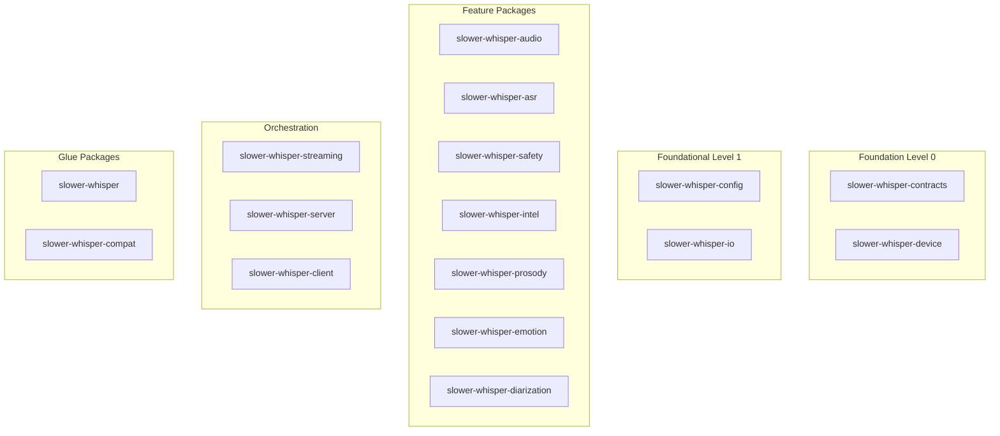
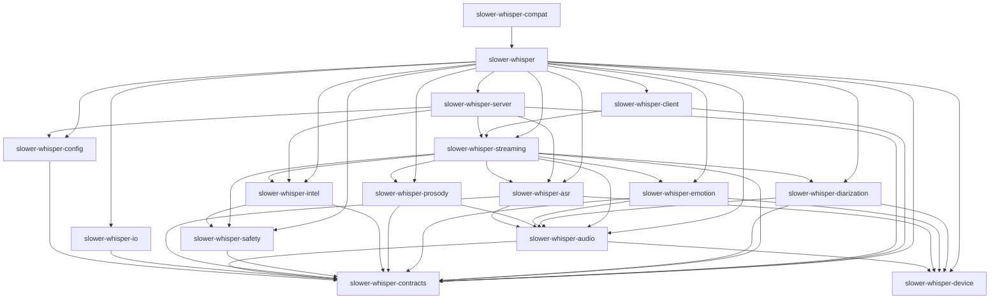

# Slower-Whisper Modularization: Master Execution Roadmap

**Version:** 1.0
**Created:** 2026-01-30
**Purpose:** Comprehensive actionable execution guide for transforming monolithic slower-whisper into a monorepo with 16+ microlibraries

---

## Table of Contents

1. [Executive Summary](#executive-summary)
2. [Prerequisites](#prerequisites)
3. [Phase-by-Phase Execution Guide](#phase-by-phase-execution-guide)
4. [Decision Points](#decision-points)
5. [Risk Register](#risk-register)
6. [Milestones and Checkpoints](#milestones-and-checkpoints)
7. [Resource Allocation](#resource-allocation)
8. [Communication Plan](#communication-plan)
9. [Success Metrics](#success-metrics)
10. [Post-Completion Activities](#post-completion-activities)
11. [Quick Reference](#quick-reference)

---

## Executive Summary

### Project Overview

The slower-whisper modularization project transforms a monolithic Python package into a well-structured monorepo with 16 independent microlibraries. This transformation enables:

- **Install Segmentation**: Users install only what they need (e.g., `slower-whisper-contracts` installs in <2 seconds without ML dependencies)
- **Stable Contracts**: Core data models and schemas are versioned independently
- **Backwards Compatibility**: Existing code continues to work via `slower-whisper-compat` shim
- **Release Sanity**: All packages move together via synchronized versioning (release train model)

### Target State

The final monorepo structure consists of:



### Key Benefits

| Benefit | Description | Impact |
|---------|-------------|---------|
| **Install Segmentation** | Users install only needed packages | Contracts install in <2s vs 30s+ for full package |
| **Stable Contracts** | Data models versioned independently | LLM integrations can pin to stable contracts |
| **Backwards Compatibility** | Compat layer maintains old import paths | Zero breaking changes for existing users |
| **Release Sanity** | All packages move together | No version conflicts between packages |
| **Clear Boundaries** | Import boundaries enforced by CI | Prevents architectural degradation |
| **Independent Testing** | Each package tested in isolation | Faster CI, clearer failure attribution |

### Timeline Estimate

| Phase | Duration | Cumulative |
|-------|-----------|------------|
| Phase 0 (Workspace Setup) | 1-2 days | 1-2 days |
| Phase 1 (Contracts) | 1 day | 2-3 days |
| Phase 2 (Config+IO+Device) | 1-2 days | 3-5 days |
| Phase 3 (Audio+ASR) | 2-3 days | 5-8 days |
| Phase 4 (Safety+Intel+Prosody) | 2-3 days | 7-11 days |
| Phase 5 (Emotion+Diarization) | 2-3 days | 9-14 days |
| Phase 6 (Streaming) | 3-5 days | 12-19 days |
| Phase 7 (Server+Client) | 3-5 days | 15-24 days |
| Phase 8 (Meta+Compat) | 3-5 days | 18-29 days |
| Phase 9 (Optional Features) | 1 day | 19-30 days |

**Total Estimated Timeline: 3-5 weeks**

---

## Prerequisites

### Tools and Dependencies

| Tool | Purpose | Installation |
|------|---------|--------------|
| **uv** | Fast Python package manager | `curl -LsSf https://astral.sh/uv/install.sh | sh` |
| **hatchling** | Build backend for packages | Included with `uv` |
| **git** | Version control | System package manager |
| **Python 3.12+** | Runtime requirement | `uv python install 3.12` |
| **pytest** | Test runner | `uv add --dev pytest` |
| **ruff** | Linter and formatter | `uv add --dev ruff` |
| **mypy** | Type checker | `uv add --dev mypy` |

### Access Requirements

| Resource | Purpose | How to Obtain |
|-----------|---------|---------------|
| **PyPI Account** | Publishing packages | Register at https://pypi.org/account/register/ |
| **Test PyPI Account** | Testing publishes | Register at https://test.pypi.org/account/register/ |
| **GitHub Write Access** | CI/CD workflows | Repository admin permissions |
| **PyPI API Token** | Automated publishing | Generate at PyPI account settings |
| **Test PyPI API Token** | Test publishes | Generate at Test PyPI account settings |
| **GitHub Actions Secrets** | Secure credential storage | Configure in repository settings |

### Team Coordination Needs

| Role | Responsibilities | Availability |
|-------|------------------|---------------|
| **Project Lead** | Overall coordination, go/no-go decisions | Full-time during phases 0, 6-8 |
| **Backend Developer** | File moves, import updates | Full-time during phases 1-8 |
| **CI/CD Engineer** | Workflow setup, verification | Part-time during phase 0, ongoing |
| **QA Engineer** | Testing, verification | Part-time during all phases |
| **Technical Writer** | Documentation updates | Part-time during phases 8-9 |
| **DevOps Engineer** | Deployment support | On-call during phase 8 (publishing) |

---

## Phase-by-Phase Execution Guide

### Phase 0: Preflight (Workspace Setup)

**Objective:** Set up monorepo workspace structure before moving files.

**Duration:** 1-2 days

**Deliverables:**
- `packages/` directory with 16 package skeletons
- Root `pyproject.toml` with workspace configuration
- `uv.lock` file for reproducible builds
- CI workflows updated for workspace testing

**Acceptance Criteria:**
- [ ] All 16 package directories created with `src/` and `tests/` subdirectories
- [ ] Each package has valid `pyproject.toml` with correct dependencies
- [ ] `uv sync` completes without errors
- [ ] `uv run pytest` runs (even with no tests yet)
- [ ] `uv run ruff check .` runs without errors
- [ ] `uv run mypy packages/*/src` runs without errors
- [ ] All packages can be built individually with `uv build`

**Verification Steps:**
1. Run Phase 0 verification checklist from [`ci-verification-plan-complete.md`](ci-verification-plan-complete.md)
2. Execute `python scripts/check_import_boundaries.py` (should pass with no violations)
3. Run `python scripts/verify_workspace.py` (to be created)
4. Verify circular dependency check passes

**Rollback Criteria:**
- Any package fails to build
- Circular dependencies detected
- Workspace sync fails
- Invalid pyproject.toml files

**Dependencies on Previous Phases:** None (this is the starting point)

**Key Files to Create:**
```
packages/
├── slower-whisper-contracts/pyproject.toml
├── slower-whisper-config/pyproject.toml
├── slower-whisper-io/pyproject.toml
├── slower-whisper-device/pyproject.toml
├── slower-whisper-audio/pyproject.toml
├── slower-whisper-asr/pyproject.toml
├── slower-whisper-safety/pyproject.toml
├── slower-whisper-intel/pyproject.toml
├── slower-whisper-prosody/pyproject.toml
├── slower-whisper-emotion/pyproject.toml
├── slower-whisper-diarization/pyproject.toml
├── slower-whisper-streaming/pyproject.toml
├── slower-whisper-server/pyproject.toml
├── slower-whisper-client/pyproject.toml
├── slower-whisper/pyproject.toml
└── slower-whisper-compat/pyproject.toml

pyproject.toml (root, updated)
scripts/
├── check_import_boundaries.py
├── bump_version.py
└── verify_workspace.py
```

**Commands to Run:**
```bash
# Create packages directory
mkdir -p packages

# Initialize workspace
uv init --workspace

# Create each package (example for contracts)
uv init --lib packages/slower-whisper-contracts
# Repeat for all 16 packages

# Update root pyproject.toml with workspace configuration
# (see phase0-workspace-specification.md for full config)

# Sync workspace
uv sync

# Verify workspace
uv run python scripts/verify_workspace.py

# Run CI checks locally
./scripts/ci-local.sh fast
```

---

### Phase 1: Extract Contracts

**Objective:** Extract core data models, exceptions, events, and schemas that have no dependencies.

**Duration:** 1 day

**Deliverables:**
- `slower-whisper-contracts` package with all contract files
- Updated imports in `transcription/__init__.py`
- Tests for contracts package

**Acceptance Criteria:**
- [ ] All 11 contract files moved to `packages/slower-whisper-contracts/src/slower_whisper_contracts/`
- [ ] `schema/` directory moved
- [ ] `schemas/` JSON files moved
- [ ] `transcription/__init__.py` updated to import from `slower_whisper_contracts`
- [ ] All files importing from moved modules updated
- [ ] `slower-whisper-contracts` builds successfully
- [ ] `slower-whisper-contracts` installs successfully
- [ ] All imports from `slower_whisper_contracts` work
- [ ] No external dependencies in pyproject.toml

**Verification Steps:**
1. Run minimal install test for `slower-whisper-contracts`
2. Run dependency hygiene test for `slower-whisper-contracts`
3. Run import boundary test (should pass with no violations)
4. Run existing tests (should all still pass)

**Rollback Criteria:**
- Any test failure
- Import errors in existing code
- Package build fails

**Dependencies on Previous Phases:** Phase 0 must be complete

**Key Files to Create/Modify:**
```
packages/slower-whisper-contracts/src/slower_whisper_contracts/
├── __init__.py
├── exceptions.py
├── models.py
├── models_speakers.py
├── models_turns.py
├── types_audio.py
├── outcomes.py
├── receipt.py
├── ids.py
├── validation.py
└── schema/

transcription/__init__.py (updated imports)
```

**Commands to Run:**
```bash
# Move files (example for contracts)
git mv transcription/exceptions.py packages/slower-whisper-contracts/src/slower_whisper_contracts/
git mv transcription/models.py packages/slower-whisper-contracts/src/slower_whisper_contracts/
# ... repeat for all contract files

# Update imports in transcription/__init__.py
# Use automated tool or manual find/replace

# Build and test
uv build ./packages/slower-whisper-contracts
uv pip install -e ./packages/slower-whisper-contracts
uv run pytest packages/slower-whisper-contracts/tests/

# Run CI checks
./scripts/ci-local.sh fast
```

---

### Phase 2: Extract Config + IO + Device

**Objective:** Extract foundational packages that depend only on contracts.

**Duration:** 1-2 days

**Deliverables:**
- `slower-whisper-config` package
- `slower-whisper-io` package
- `slower-whisper-device` package
- Updated imports across codebase

**Acceptance Criteria:**
- [ ] Config files moved to `packages/slower-whisper-config/`
- [ ] IO files moved to `packages/slower-whisper-io/`
- [ ] Device files moved to `packages/slower-whisper-device/`
- [ ] All files importing from config, io, device updated
- [ ] `transcription/__init__.py` updated
- [ ] `transcription/pipeline.py` updated
- [ ] All three packages build successfully
- [ ] All three packages install successfully
- [ ] Imports from all three packages work
- [ ] Dependencies are correct (config/io depend on contracts, device has no deps)

**Verification Steps:**
1. Run minimal install tests for all three packages
2. Run dependency hygiene tests for all three packages
3. Run import boundary tests (should pass with no violations)
4. Run existing tests (should all still pass)

**Rollback Criteria:**
- Any test failure
- Import errors in existing code
- Circular dependencies detected

**Dependencies on Previous Phases:** Phase 0-1 must be complete

**Key Files to Create/Modify:**
```
packages/slower-whisper-config/src/slower_whisper_config/
├── __init__.py
├── config.py
├── transcription_config.py
├── enrichment_config.py
├── config_validation.py
├── config_merge.py
└── legacy_config.py

packages/slower-whisper-io/src/slower_whisper_io/
├── __init__.py
├── writers.py
├── transcript_io.py
└── exporters.py

packages/slower-whisper-device/src/slower_whisper_device/
├── __init__.py
├── device.py
└── color_utils.py

transcription/__init__.py (updated imports)
transcription/pipeline.py (updated imports)
```

**Commands to Run:**
```bash
# Move files for each package
git mv transcription/config.py packages/slower-whisper-config/src/slower_whisper_config/
# ... repeat for all config, io, device files

# Update imports (use automated tool)
python scripts/update_imports.py --phase 2

# Build and test each package
uv build ./packages/slower-whisper-config
uv build ./packages/slower-whisper-io
uv build ./packages/slower-whisper-device

# Run CI checks
./scripts/ci-local.sh fast
```

---

### Phase 3: Extract Audio + ASR

**Objective:** Extract audio processing and ASR engine packages.

**Duration:** 2-3 days

**Deliverables:**
- `slower-whisper-audio` package
- `slower-whisper-asr` package
- Updated imports across codebase

**Acceptance Criteria:**
- [ ] Audio files moved to `packages/slower-whisper-audio/`
- [ ] ASR files moved to `packages/slower-whisper-asr/`
- [ ] All files importing from audio, asr updated
- [ ] `transcription/__init__.py` updated
- [ ] `transcription/pipeline.py` updated
- [ ] Both packages build successfully
- [ ] Both packages install successfully
- [ ] Imports from both packages work
- [ ] Dependencies are correct (audio depends on contracts+device, asr depends on contracts+device+audio)

**Verification Steps:**
1. Run minimal install tests for both packages
2. Run dependency hygiene tests for both packages
3. Run import boundary tests (should pass with no violations)
4. Run existing tests (should all still pass)
5. Run ASR tests (should still work with faster-whisper)

**Rollback Criteria:**
- Any test failure
- Import errors in existing code
- ASR functionality broken

**Dependencies on Previous Phases:** Phase 0-2 must be complete

**Key Files to Create/Modify:**
```
packages/slower-whisper-audio/src/slower_whisper_audio/
├── __init__.py
├── audio_io.py
├── audio_utils.py
├── audio_health.py
├── audio_rendering.py
└── chunking.py

packages/slower-whisper-asr/src/slower_whisper_asr/
├── __init__.py
├── asr_engine.py
├── cache.py
├── transcription_orchestrator.py
└── transcription_helpers.py

transcription/__init__.py (updated imports)
transcription/pipeline.py (updated imports)
```

**Commands to Run:**
```bash
# Move files
git mv transcription/audio_io.py packages/slower-whisper-audio/src/slower_whisper_audio/
# ... repeat for all audio, asr files

# Update imports
python scripts/update_imports.py --phase 3

# Build and test
uv build ./packages/slower-whisper-audio
uv build ./packages/slower-whisper-asr

# Run CI checks
./scripts/ci-local.sh fast
```

---

### Phase 4: Extract Safety + Intel + Prosody

**Objective:** Extract safety, intelligence, and prosody packages.

**Duration:** 2-3 days

**Deliverables:**
- `slower-whisper-safety` package
- `slower-whisper-intel` package
- `slower-whisper-prosody` package
- Updated imports across codebase

**Acceptance Criteria:**
- [ ] Safety files moved to `packages/slower-whisper-safety/`
- [ ] Intel files moved to `packages/slower-whisper-intel/`
- [ ] Prosody files moved to `packages/slower-whisper-prosody/`
- [ ] All files importing from safety, intel, prosody updated
- [ ] `transcription/__init__.py` updated
- [ ] All three packages build successfully
- [ ] All three packages install successfully
- [ ] Imports from all three packages work
- [ ] Dependencies are correct

**Verification Steps:**
1. Run minimal install tests for all three packages
2. Run dependency hygiene tests for all three packages
3. Run import boundary tests (should pass with no violations)
4. Run existing tests (should all still pass)
5. Verify optional dependency guards work (prosody praat)

**Rollback Criteria:**
- Any test failure
- Import errors in existing code
- Optional dependency guards broken

**Dependencies on Previous Phases:** Phase 0-3 must be complete

**Key Files to Create/Modify:**
```
packages/slower-whisper-safety/src/slower_whisper_safety/
├── __init__.py
├── smart_formatting.py
├── privacy.py
├── safety_layer.py
├── safety_config.py
├── renderer.py
└── content_moderation.py

packages/slower-whisper-intel/src/slower_whisper_intel/
├── __init__.py
├── role_inference.py
├── topic_segmentation.py
├── turn_taking_policy.py
├── turns.py
├── turns_enrich.py
├── turn_helpers.py
├── tts_style.py
└── conversation_physics.py

packages/slower-whisper-prosody/src/slower_whisper_prosody/
├── __init__.py
├── prosody.py
├── prosody_extended.py
└── environment_classifier.py

transcription/__init__.py (updated imports)
```

**Commands to Run:**
```bash
# Move files
git mv transcription/smart_formatting.py packages/slower-whisper-safety/src/slower_whisper_safety/
# ... repeat for all safety, intel, prosody files

# Update imports
python scripts/update_imports.py --phase 4

# Build and test
uv build ./packages/slower-whisper-safety
uv build ./packages/slower-whisper-intel
uv build ./packages/slower-whisper-prosody

# Run CI checks
./scripts/ci-local.sh fast
```

---

### Phase 5: Extract Emotion + Diarization

**Objective:** Extract emotion recognition and speaker diarization packages.

**Duration:** 2-3 days

**Deliverables:**
- `slower-whisper-emotion` package
- `slower-whisper-diarization` package
- Updated imports across codebase

**Acceptance Criteria:**
- [ ] Emotion files moved to `packages/slower-whisper-emotion/`
- [ ] Diarization files moved to `packages/slower-whisper-diarization/`
- [ ] All files importing from emotion, diarization updated
- [ ] `transcription/__init__.py` updated
- [ ] Both packages build successfully
- [ ] Both packages install successfully
- [ ] Imports from both packages work
- [ ] Dependencies are correct (torch/pyannote optional)

**Verification Steps:**
1. Run minimal install tests for both packages
2. Run dependency hygiene tests for both packages
3. Run import boundary tests (should pass with no violations)
4. Run existing tests (should all still pass)
5. Verify optional dependency guards work (torch, pyannote)
6. Run heavy tests for emotion and diarization

**Rollback Criteria:**
- Any test failure
- Import errors in existing code
- Optional dependency guards broken
- Heavy ML tests fail

**Dependencies on Previous Phases:** Phase 0-4 must be complete

**Key Files to Create/Modify:**
```
packages/slower-whisper-emotion/src/slower_whisper_emotion/
└── __init__.py
    └── emotion.py

packages/slower-whisper-diarization/src/slower_whisper_diarization/
├── __init__.py
├── diarization.py
├── diarization_orchestrator.py
├── speaker_id.py
├── speaker_identity.py
└── speaker_stats.py

transcription/__init__.py (updated imports)
```

**Commands to Run:**
```bash
# Move files
git mv transcription/emotion.py packages/slower-whisper-emotion/src/slower_whisper_emotion/
# ... repeat for all diarization files

# Update imports
python scripts/update_imports.py --phase 5

# Build and test
uv build ./packages/slower-whisper-emotion
uv build ./packages/slower-whisper-diarization

# Run CI checks
./scripts/ci-local.sh fast
```

---

### Phase 6: Extract Streaming Core

**Objective:** Extract streaming state machine, events, and callbacks.

**Duration:** 3-5 days

**Deliverables:**
- `slower-whisper-streaming` package
- Updated imports across codebase

**Acceptance Criteria:**
- [ ] All streaming files moved to `packages/slower-whisper-streaming/`
- [ ] All files importing from streaming updated
- [ ] `transcription/__init__.py` updated
- [ ] Package builds successfully
- [ ] Package installs successfully
- [ ] Imports from package work
- [ ] Dependencies are correct (depends on multiple feature packages)

**Verification Steps:**
1. Run minimal install tests
2. Run dependency hygiene tests
3. Run import boundary tests (should pass with no violations)
4. Run existing tests (should all still pass)
5. Run streaming tests (should still pass)
6. Verify event envelope protocol maintained

**Rollback Criteria:**
- Any test failure
- Import errors in existing code
- Streaming protocol broken
- Event envelope contract violated

**Dependencies on Previous Phases:** Phase 0-5 must be complete

**Key Files to Create/Modify:**
```
packages/slower-whisper-streaming/src/slower_whisper_streaming/
├── __init__.py
├── streaming.py
├── streaming_asr.py
├── streaming_callbacks.py
├── streaming_client.py
├── streaming_ws.py
├── streaming_enrich.py
├── streaming_semantic.py
├── streaming_safety.py
└── streaming_diarization.py

transcription/__init__.py (updated imports)
```

**Commands to Run:**
```bash
# Move files
git mv transcription/streaming.py packages/slower-whisper-streaming/src/slower_whisper_streaming/
# ... repeat for all streaming files

# Update imports
python scripts/update_imports.py --phase 6

# Build and test
uv build ./packages/slower-whisper-streaming

# Run CI checks
./scripts/ci-local.sh fast

# Run streaming-specific tests
uv run pytest tests/test_streaming.py
uv run pytest tests/test_streaming_asr.py
```

---

### Phase 7: Extract Server + Client

**Objective:** Extract FastAPI service and Python SDK.

**Duration:** 3-5 days

**Deliverables:**
- `slower-whisper-server` package
- `slower-whisper-client` package
- Updated imports across codebase

**Acceptance Criteria:**
- [ ] Server files moved to `packages/slower-whisper-server/`
- [ ] Client files moved to `packages/slower-whisper-client/`
- [ ] All files importing from server, client updated
- [ ] `transcription/__init__.py` updated
- [ ] Both packages build successfully
- [ ] Both packages install successfully
- [ ] Imports from both packages work
- [ ] Dependencies are correct

**Verification Steps:**
1. Run minimal install tests for both packages
2. Run dependency hygiene tests for both packages
3. Run import boundary tests (should pass with no violations)
4. Run existing tests (should all still pass)
5. Run API BDD tests (should still pass)
6. Run integration tests (should still pass)
7. Verify server starts and responds
8. Verify client can connect and stream

**Rollback Criteria:**
- Any test failure
- Import errors in existing code
- API contract broken
- Server fails to start
- Client cannot connect

**Dependencies on Previous Phases:** Phase 0-6 must be complete

**Key Files to Create/Modify:**
```
packages/slower-whisper-server/src/slower_whisper_server/
├── __init__.py
├── api.py
├── service.py
├── service_enrich.py
├── service_errors.py
├── service_health.py
├── service_metrics.py
├── service_middleware.py
├── service_serialization.py
├── service_settings.py
├── service_sse.py
├── service_streaming.py
├── service_transcribe.py
├── service_validation.py
└── session_registry.py

packages/slower-whisper-client/src/slower_whisper_client/
├── __init__.py
└── client.py

transcription/__init__.py (updated imports)
```

**Commands to Run:**
```bash
# Move files
git mv transcription/api.py packages/slower-whisper-server/src/slower_whisper_server/
# ... repeat for all server, client files

# Update imports
python scripts/update_imports.py --phase 7

# Build and test
uv build ./packages/slower-whisper-server
uv build ./packages/slower-whisper-client

# Run CI checks
./scripts/ci-local.sh fast

# Run API tests
uv run pytest tests/test_api_integration.py
uv run behave features/
```

---

### Phase 8: Meta + Compat Packaging

**Objective:** Create meta package that orchestrates all microlibraries and compat package for legacy imports.

**Duration:** 3-5 days

**Deliverables:**
- `slower-whisper` meta package
- `slower-whisper-compat` package
- Updated imports across codebase
- All orchestration files moved

**Acceptance Criteria:**
- [ ] Meta files moved to `packages/slower-whisper/`
- [ ] Compat package created with `packages/slower-whisper-compat/`
- [ ] Meta package builds successfully
- [ ] Meta package installs successfully
- [ ] All public APIs re-exported
- [ ] Dependencies are correct (depends on all packages)
- [ ] Compat package builds successfully
- [ ] Compat package installs successfully
- [ ] Legacy import paths work via compat
- [ ] All existing imports from `transcription.*` still work

**Verification Steps:**
1. Run minimal install tests
2. Run dependency hygiene tests
3. Run import boundary tests (should pass with no violations)
4. Run existing tests (should all still pass)
5. Run backward compatibility tests
6. Verify CLI still works
7. Run full test suite

**Rollback Criteria:**
- Any test failure
- Import errors in existing code
- Backward compatibility broken
- CLI broken

**Dependencies on Previous Phases:** Phase 0-7 must be complete

**Key Files to Create/Modify:**
```
packages/slower-whisper/src/slower_whisper/
├── __init__.py (re-exports all packages)
├── pipeline.py
├── enrich.py
├── post_process.py
├── audio_enrichment.py
├── enrichment_orchestrator.py
├── cli.py
├── cli_legacy_transcribe.py
├── semantic.py
├── semantic_adapter.py
├── semantic_providers/
├── local_llm_provider.py
├── llm_guardrails.py
├── llm_utils.py
├── meta_utils.py
├── dogfood.py
├── dogfood_utils.py
├── telemetry.py
├── benchmarks.py
├── benchmark_cli.py
├── benchmark/
├── cli_commands/
├── samples.py
├── _import_guards.py
└── py.typed

packages/slower-whisper-compat/src/slower_whisper_compat/
├── __init__.py (re-exports from meta)
└── py.typed
```

**Commands to Run:**
```bash
# Move files
git mv transcription/pipeline.py packages/slower-whisper/src/slower_whisper/
# ... repeat for all meta files

# Create compat package
mkdir -p packages/slower-whisper-compat/src/slower_whisper_compat

# Update imports
python scripts/update_imports.py --phase 8

# Build and test
uv build ./packages/slower-whisper
uv build ./packages/slower-whisper-compat

# Run CI checks
./scripts/ci-local.sh

# Test CLI
uv run slower-whisper --help

# Test backward compatibility
python -c "from transcription import Transcript, Segment"
```

---

### Phase 9: Optional Features

**Objective:** Handle optional features that are not part of core modularization.

**Duration:** 1 day

**Deliverables:**
- Optional features documented
- Optional features remain functional

**Acceptance Criteria:**
- [ ] `historian/` remains in `transcription/` or moved to `optional-features/`
- [ ] `integrations/` remains in `transcription/` or moved to `optional-features/`
- [ ] `store/` remains in `transcription/` or moved to `optional-features/`
- [ ] Documentation updated to reflect optional status

**Verification Steps:**
1. Run existing tests (should all still pass)
2. Verify optional features can still be used
3. Verify no impact on core packages

**Rollback Criteria:**
- Any test failure
- Optional features broken

**Dependencies on Previous Phases:** Phase 0-8 must be complete

**Key Files to Create/Modify:**
```
transcription/historian/ (remains or moves)
transcription/integrations/ (remains or moves)
transcription/store/ (remains or moves)

docs/optional-features.md (new)
README.md (updated)
```

**Commands to Run:**
```bash
# Optional: move to separate directory
mkdir -p optional-features
git mv transcription/historian/ optional-features/
git mv transcription/integrations/ optional-features/
git mv transcription/store/ optional-features/

# Update documentation
# Document optional features in README.md

# Run CI checks
./scripts/ci-local.sh fast
```

---

## Decision Points

### Decision 1: Package Manager Selection

**Context:** Choosing between `uv`, `poetry`, or `pip` for workspace management.

**Options:**

| Option | Pros | Cons |
|--------|------|------|
| **uv** | Fast, modern, excellent workspace support | Newer, less mature ecosystem |
| **poetry** | Mature, good workspace support | Slower than uv |
| **pip** | Standard, ubiquitous | No native workspace support |

**Recommended Approach:** Use `uv`

**Rationale:**
- 10-100x faster than pip/poetry for dependency resolution
- Native workspace support matches our monorepo needs
- Actively maintained by Astral (same team as Ruff)
- Excellent caching reduces CI times

**Impact:**
- Faster development iteration
- Reduced CI costs
- Modern tooling for long-term maintainability

---

### Decision 2: Versioning Strategy

**Context:** Choosing between synchronized versioning (release train) or independent versioning.

**Options:**

| Option | Pros | Cons |
|--------|------|------|
| **Synchronized** | Guaranteed compatibility, simple releases | Slower release cadence for individual packages |
| **Independent** | Faster iteration per package | Complex compatibility matrix |

**Recommended Approach:** Start with synchronized versioning, transition to independent versioning later

**Rationale:**
- Synchronized versioning ensures no compatibility issues during transition
- All packages move together via `scripts/bump_version.py`
- Can transition to independent versioning once ecosystem stabilizes

**Impact:**
- Simplified initial release process
- Guaranteed compatibility across all packages
- Future flexibility for independent package releases

---

### Decision 3: Optional Features Handling

**Context:** Deciding how to handle `historian/`, `integrations/`, and `store/` directories.

**Options:**

| Option | Pros | Cons |
|--------|------|------|
| **Keep in transcription/** | No changes needed | Blurs modularization boundaries |
| **Move to optional-features/** | Clear separation | Additional directory |
| **Exclude entirely** | Cleanest separation | May break existing users |

**Recommended Approach:** Move to `optional-features/` directory

**Rationale:**
- Maintains clear separation from core packages
- Preserves functionality for existing users
- Documented as optional/experimental

**Impact:**
- Clearer package boundaries
- Preserved functionality
- Minimal disruption to users

---

### Decision 4: Compat Package Deprecation Timeline

**Context:** Deciding when to deprecate `slower-whisper-compat` package.

**Options:**

| Option | Pros | Cons |
|--------|------|------|
| **Immediate deprecation** | Forces migration | Breaking change for users |
| **6-month deprecation** | Gives users time | Maintains compat code longer |
| **12-month deprecation** | Maximum time | Long maintenance burden |

**Recommended Approach:** 12-month deprecation with clear warnings

**Rationale:**
- Gives users ample time to migrate
- Clear deprecation warnings in compat package
- Aligns with typical Python deprecation timelines

**Impact:**
- Smooth migration path for users
- Clear communication timeline
- Manageable maintenance burden

---

### Decision 5: CI/CD Platform

**Context:** Choosing between GitHub Actions, GitLab CI, or other platforms.

**Options:**

| Option | Pros | Cons |
|--------|------|------|
| **GitHub Actions** | Native to GitHub, good free tier | GitHub-specific |
| **GitLab CI** | More flexible, self-hosted options | Not native to GitHub |
| **CircleCI** | Mature, good UX | Additional cost |

**Recommended Approach:** GitHub Actions

**Rationale:**
- Native integration with GitHub (where repo is hosted)
- Generous free tier for open source
- Good community support and examples

**Impact:**
- Seamless GitHub integration
- No additional platform setup
- Familiar workflow for contributors

---

## Risk Register

### Risk 1: Import Boundary Violations

**Description:** Packages import from forbidden dependencies, creating circular dependencies or architectural degradation.

**Probability:** Medium
**Impact:** High

**Mitigation Strategies:**
1. Automated import boundary checking in CI
2. Pre-commit hooks to catch violations locally
3. Clear documentation of allowed imports
4. Regular architectural reviews

**Early Warning Signs:**
- Import boundary tests failing in CI
- Developers reporting import errors
- Circular dependency warnings from linters

**Contingency Plans:**
1. Immediate rollback to previous phase
2. Redesign package boundaries if violations are systemic
3. Add more granular packages if needed

---

### Risk 2: Breaking Changes to Public API

**Description:** Changes during modularization break existing user code.

**Probability:** Medium
**Impact:** High

**Mitigation Strategies:**
1. Maintain compat package for legacy imports
2. Comprehensive backward compatibility tests
3. Version pinning for inter-package dependencies
4. Clear deprecation warnings for any changes

**Early Warning Signs:**
- Backward compatibility tests failing
- User reports of import errors
- Unexpected behavior in existing code

**Contingency Plans:**
1. Fix compat package to restore compatibility
2. Add missing re-exports to meta package
3. Document breaking changes clearly in release notes

---

### Risk 3: Performance Regression

**Description:** Modularization introduces overhead that slows down core workflows.

**Probability:** Low
**Impact:** Medium

**Mitigation Strategies:**
1. Benchmark before and after each phase
2. Performance targets defined in success metrics
3. Profile critical paths during migration
4. Optimize import patterns

**Early Warning Signs:**
- Benchmark tests failing (>20% regression)
- User reports of slower performance
- CI timing increasing significantly

**Contingency Plans:**
1. Rollback to previous phase
2. Optimize import patterns
3. Consider lazy loading for heavy packages

---

### Risk 4: Optional Dependency Failures

**Description:** Optional dependencies (torch, pyannote, etc.) fail to import gracefully.

**Probability:** Medium
**Impact:** Medium

**Mitigation Strategies:**
1. Runtime import guards with try/except
2. Clear error messages for missing dependencies
3. Dependency hygiene tests verify guards
4. Documentation of optional features

**Early Warning Signs:**
- Optional dependency tests failing
- Import errors when optional deps missing
- Users reporting crashes on missing deps

**Contingency Plans:**
1. Add missing import guards
2. Improve error messages
3. Document optional features more clearly

---

### Risk 5: CI Pipeline Bottlenecks

**Description:** CI pipeline becomes too slow, blocking development.

**Probability:** Medium
**Impact:** Medium

**Mitigation Strategies:**
1. Parallelize jobs where possible
2. Use caching aggressively (uv, Python, models)
3. Separate quick checks from full tests
4. Run heavy tests on schedule only

**Early Warning Signs:**
- PR pipelines taking >60 minutes
- Developer complaints about slow feedback
- CI costs increasing significantly

**Contingency Plans:**
1. Move heavy tests to scheduled runs
2. Add more parallelization
3. Optimize caching strategy

---

### Risk 6: Package Publishing Failures

**Description:** Packages fail to publish to PyPI due to configuration or credential issues.

**Probability:** Low
**Impact:** High

**Mitigation Strategies:**
1. Test publish to Test PyPI first
2. Automated publishing via GitHub Actions
3. Secure credential management via secrets
4. Pre-publish validation scripts

**Early Warning Signs:**
- Test PyPI publishes failing
- Authentication errors in CI
- Build failures before publish

**Contingency Plans:**
1. Manual publish as fallback
2. Fix credential configuration
3. Debug build issues locally

---

### Risk 7: Developer Confusion

**Description:** Developers struggle to understand new package structure and import patterns.

**Probability:** Medium
**Impact:** Medium

**Mitigation Strategies:**
1. Comprehensive documentation
2. Clear migration guide
3. Examples of common patterns
4. Onboarding sessions for team

**Early Warning Signs:**
- Developers asking repeated questions
- Incorrect import patterns in PRs
- Confusion about which package to modify

**Contingency Plans:**
1. Improve documentation
2. Add more examples
3. Hold team training sessions

---

### Risk 8: Version Skew Issues

**Description:** Packages get out of sync, causing compatibility issues.

**Probability:** Low (with synchronized versioning)
**Impact:** High

**Mitigation Strategies:**
1. Synchronized versioning via release train
2. Automated version bumping script
3. CI checks for version consistency
4. Inter-package dependency pinning

**Early Warning Signs:**
- Version mismatch warnings in CI
- Dependency resolution errors
- Tests failing due to version conflicts

**Contingency Plans:**
1. Run version bump script to sync versions
2. Update inter-package dependency pins
3. Revert to consistent version state

---

## Milestones and Checkpoints

### Milestone 1: Workspace Ready (Phase 0 Complete)

**Date:** End of Week 1
**Criteria:**
- [ ] All 16 package skeletons created
- [ ] Workspace configuration complete
- [ ] CI workflows updated
- [ ] All packages build successfully

**Go/No-Go Decision:**
- **Go:** Proceed to Phase 1 if all criteria met
- **No-Go:** Investigate and fix issues before proceeding

---

### Milestone 2: Foundation Packages (Phase 1-3 Complete)

**Date:** End of Week 2
**Criteria:**
- [ ] Contracts package extracted and tested
- [ ] Config, IO, Device packages extracted and tested
- [ ] Audio, ASR packages extracted and tested
- [ ] All imports updated correctly
- [ ] CI tests passing

**Go/No-Go Decision:**
- **Go:** Proceed to Phase 4 if all criteria met
- **No-Go:** Investigate and fix issues before proceeding

---

### Milestone 3: Feature Packages (Phase 4-5 Complete)

**Date:** End of Week 3
**Criteria:**
- [ ] Safety, Intel, Prosody packages extracted and tested
- [ ] Emotion, Diarization packages extracted and tested
- [ ] Optional dependency guards working
- [ ] Heavy ML tests passing
- [ ] CI tests passing

**Go/No-Go Decision:**
- **Go:** Proceed to Phase 6 if all criteria met
- **No-Go:** Investigate and fix issues before proceeding

---

### Milestone 4: Orchestration Packages (Phase 6-7 Complete)

**Date:** End of Week 4
**Criteria:**
- [ ] Streaming package extracted and tested
- [ ] Server, Client packages extracted and tested
- [ ] API tests passing
- [ ] Integration tests passing
- [ ] CI tests passing

**Go/No-Go Decision:**
- **Go:** Proceed to Phase 8 if all criteria met
- **No-Go:** Investigate and fix issues before proceeding

---

### Milestone 5: Meta Package Ready (Phase 8 Complete)

**Date:** End of Week 5
**Criteria:**
- [ ] Meta package created and tested
- [ ] Compat package created and tested
- [ ] All public APIs re-exported
- [ ] Backward compatibility verified
- [ ] CLI working correctly
- [ ] Full test suite passing

**Go/No-Go Decision:**
- **Go:** Proceed to Phase 9 and publishing if all criteria met
- **No-Go:** Investigate and fix issues before proceeding

---

### Milestone 6: First Release (All Phases Complete)

**Date:** End of Week 5-6
**Criteria:**
- [ ] All 16 packages published to Test PyPI
- [ ] All 16 packages published to PyPI
- [ ] Documentation updated
- [ ] Migration guide published
- [ ] Release notes published

**Go/No-Go Decision:**
- **Go:** Announce release to community
- **No-Go:** Fix publishing issues and retry

---

### Stakeholder Review Checkpoints

| Checkpoint | Participants | Purpose |
|------------|---------------|---------|
| **Phase 0 Review** | Project Lead, CI/CD Engineer | Approve workspace setup |
| **Phase 3 Review** | Project Lead, Backend Developer | Approve foundation packages |
| **Phase 5 Review** | Project Lead, QA Engineer | Approve feature packages |
| **Phase 7 Review** | Project Lead, Backend Developer | Approve orchestration packages |
| **Phase 8 Review** | All stakeholders | Approve meta package and release |

---

## Resource Allocation

### Estimated Person-Hours per Phase

| Phase | Backend Dev | CI/CD Engineer | QA Engineer | Tech Writer | Total Hours |
|-------|--------------|-----------------|--------------|--------------|-------------|
| Phase 0 | 8 | 16 | 4 | 0 | 28 |
| Phase 1 | 8 | 2 | 4 | 0 | 14 |
| Phase 2 | 16 | 2 | 8 | 0 | 26 |
| Phase 3 | 24 | 4 | 12 | 0 | 40 |
| Phase 4 | 24 | 4 | 12 | 0 | 40 |
| Phase 5 | 24 | 4 | 12 | 0 | 40 |
| Phase 6 | 40 | 8 | 20 | 0 | 68 |
| Phase 7 | 40 | 8 | 20 | 0 | 68 |
| Phase 8 | 40 | 8 | 20 | 16 | 84 |
| Phase 9 | 8 | 2 | 4 | 8 | 22 |
| **Total** | **232** | **58** | **116** | **24** | **430** |

### Skills Needed per Phase

| Phase | Required Skills |
|-------|----------------|
| Phase 0 | Python packaging, CI/CD, workspace configuration |
| Phase 1 | Python, data modeling, testing |
| Phase 2 | Python, configuration management, I/O operations |
| Phase 3 | Python, audio processing, ASR, faster-whisper |
| Phase 4 | Python, NLP, prosody, emotion recognition |
| Phase 5 | Python, ML, torch, pyannote |
| Phase 6 | Python, async programming, websockets, streaming |
| Phase 7 | Python, FastAPI, REST APIs, websockets |
| Phase 8 | Python, package orchestration, backward compatibility |
| Phase 9 | Python, documentation |

### Parallelization Opportunities

| Phase | Parallelizable Tasks |
|-------|---------------------|
| Phase 0 | Create package skeletons in parallel |
| Phase 2 | Extract config, io, device in parallel |
| Phase 4 | Extract safety, intel, prosody in parallel |
| Phase 5 | Extract emotion, diarization in parallel |
| Phase 7 | Extract server, client in parallel |

---

## Communication Plan

### Stakeholder Notifications

| Audience | Timing | Channel | Content |
|-----------|---------|----------|---------|
| **Internal Team** | Start of project | All-hands meeting | Project overview, timeline, roles |
| **Internal Team** | Each phase completion | Slack/Email | Phase summary, next steps |
| **Internal Team** | Go/No-Go decisions | Slack/Email | Decision rationale, next actions |
| **Users** | 2 weeks before release | Blog post | Preview of changes, benefits |
| **Users** | Release day | GitHub Release | Release notes, migration guide |
| **Users** | 1 month after release | Blog post | Adoption metrics, feedback request |

### Documentation Updates Needed

| Document | Phase | Updates Required |
|----------|--------|------------------|
| README.md | Phase 8 | New package structure, installation instructions |
| INSTALL.md | Phase 8 | Install segmentation options |
| MIGRATION.md | Phase 8 | Migration guide for existing users |
| API docs | Phase 8 | Updated import paths |
| CONTRIBUTING.md | Phase 8 | Development workflow with monorepo |
| CHANGELOG.md | Phase 8 | Release notes for v2.0.0 |
| DEPRECATION.md | Phase 8 | Compat package deprecation timeline |

### Migration Guide for Users

**Key Sections:**
1. **Overview of Changes**
   - New package structure
   - Benefits of modularization
   - Backward compatibility via compat package

2. **Installation Options**
   - Install full package (same as before)
   - Install specific packages (new)
   - Install with extras (enrich-basic, enrich-full)

3. **Import Path Changes**
   - Old paths still work via compat
   - New paths for direct imports
   - Recommended patterns

4. **Migration Examples**
   - Before/after code examples
   - Common migration scenarios
   - Troubleshooting

5. **Deprecation Timeline**
   - Compat package deprecation schedule
   - Recommended migration timeline
   - Breaking changes in future versions

### Deprecation Timeline for Compat Package

| Version | Date | Action |
|----------|--------|--------|
| 2.0.0 | Release | Compat package introduced, no warnings |
| 2.1.0 | 3 months post-release | Deprecation warnings added |
| 2.2.0 | 6 months post-release | Warnings more prominent |
| 3.0.0 | 12 months post-release | Compat package removed |

---

## Success Metrics

### How to Measure Success

| Metric | Target | Measurement Method |
|---------|---------|-------------------|
| **Install Time** | Contracts < 2s, Client < 5s | Automated benchmark tests |
| **Test Coverage** | > 80% across all packages | Coverage reports |
| **CI Pass Rate** | > 95% on main branch | CI dashboard |
| **Bug Count** | No regressions vs v1.x | Issue tracker comparison |
| **User Adoption** | > 50% using new imports within 6 months | Analytics/telemetry |
| **Documentation Completeness** | All sections updated | Documentation review |

### Performance Targets

| Metric | Target | Measurement Method |
|---------|---------|-------------------|
| **Package Install Time** | < 2s for contracts, < 5s for client | Benchmark tests |
| **Import Time** | < 100ms for first import | Profiling |
| **CI Pipeline Duration** | < 45 min for PR, < 90 min for full | CI logs |
| **Test Suite Duration** | < 15 min for quick, < 30 min for full | Test runner |

### Quality Targets

| Metric | Target | Measurement Method |
|---------|---------|-------------------|
| **Test Coverage** | > 80% across all packages | Coverage reports |
| **Type Coverage** | > 90% across all packages | MyPy reports |
| **Lint Clean** | 0 lint errors | Ruff reports |
| **Import Boundaries** | 0 violations | Boundary checker |
| **Backward Compatibility** | 100% of old imports work | Compatibility tests |

### Release Sanity Targets

| Metric | Target | Measurement Method |
|---------|---------|-------------------|
| **Version Consistency** | All packages same version | Version checker |
| **Inter-package Deps** | All pinned to exact version | Dependency audit |
| **Publish Success** | All 16 packages published | PyPI verification |
| **Documentation** | All docs updated | Documentation review |

---

## Post-Completion Activities

### Documentation Updates

**Immediate (Week 1 post-release):**
- [ ] Update README.md with new package structure
- [ ] Publish migration guide (MIGRATION.md)
- [ ] Update API documentation
- [ ] Update CONTRIBUTING.md
- [ ] Publish release notes (CHANGELOG.md)

**Short-term (Weeks 2-4 post-release):**
- [ ] Create package-specific README files
- [ ] Add examples for each package
- [ ] Update tutorials and examples
- [ ] Create architecture diagrams

**Long-term (Months 2-6 post-release):**
- [ ] Create video tutorials
- [ ] Write blog posts about modularization
- [ ] Update best practices guide
- [ ] Create FAQ for common questions

### Release Notes

**Structure:**
1. **Overview**
   - Summary of changes
   - Major benefits

2. **New Features**
   - Package segmentation
   - Install options
   - New import paths

3. **Breaking Changes**
   - None (via compat package)
   - Future deprecations

4. **Migration Guide**
   - Quick start
   - Detailed steps
   - Examples

5. **Known Issues**
   - Any known limitations
   - Workarounds

6. **Contributors**
   - Acknowledgments

### Community Outreach

**Channels:**
- GitHub Release
- Blog post
- Twitter/X
- Reddit (r/Python, r/MachineLearning)
- Discord/Slack communities
- Conference talks (future)

**Key Messages:**
- Install segmentation benefits
- Backward compatibility maintained
- Migration guide available
- Community feedback welcome

### Monitoring and Feedback Collection

**Metrics to Track:**
- Package download counts (PyPI stats)
- Issue reports (GitHub issues)
- Adoption of new imports (telemetry if available)
- User feedback (surveys, discussions)
- CI pass rates (GitHub Actions)

**Feedback Channels:**
- GitHub Issues
- GitHub Discussions
- Email (git@effortlesssteven.com)
- Social media

**Review Schedule:**
- Weekly for first month
- Monthly for months 2-6
- Quarterly after month 6

---

## Quick Reference

### One-Page Summary

```mermaid
graph LR
    A[Phase 0: Workspace Setup<br/>1-2 days] --> B[Phase 1: Contracts<br/>1 day]
    B --> C[Phase 2: Config+IO+Device<br/>1-2 days]
    C --> D[Phase 3: Audio+ASR<br/>2-3 days]
    D --> E[Phase 4: Safety+Intel+Prosody<br/>2-3 days]
    E --> F[Phase 5: Emotion+Diarization<br/>2-3 days]
    F --> G[Phase 6: Streaming<br/>3-5 days]
    G --> H[Phase 7: Server+Client<br/>3-5 days]
    H --> I[Phase 8: Meta+Compat<br/>3-5 days]
    I --> J[Phase 9: Optional Features<br/>1 day]
    J --> K[Release v2.0.0]
```



**Key Commands:**
```bash
# Workspace setup
uv sync
uv run pytest
uv run ruff check .
uv run mypy packages/*/src

# Build packages
uv build ./packages/slower-whisper-contracts

# Check import boundaries
uv run python scripts/check_import_boundaries.py

# Bump version
python scripts/bump_version.py minor

# Run CI locally
./scripts/ci-local.sh fast
```

### File Locations of Planning Documents

| Document | Location |
|----------|----------|
| File Move Plan | [`plans/modularization-file-move-plan.md`](modularization-file-move-plan.md) |
| Workspace Specification | [`plans/phase0-workspace-specification.md`](phase0-workspace-specification.md) |
| CI Verification Plan | [`plans/ci-verification-plan-complete.md`](ci-verification-plan-complete.md) |
| Execution Roadmap | [`plans/modularization-execution-roadmap.md`](modularization-execution-roadmap.md) |

### Contact Information

| Role | Contact |
|-------|----------|
| Project Lead | git@effortlesssteven.com |
| GitHub Issues | https://github.com/EffortlessMetrics/slower-whisper/issues |
| Documentation | https://github.com/EffortlessMetrics/slower-whisper#readme |

### Package Quick Reference

| Package | Purpose | Install Time |
|----------|---------|--------------|
| `slower-whisper-contracts` | Core data models, exceptions | < 2s |
| `slower-whisper-config` | Configuration management | < 3s |
| `slower-whisper-io` | Writers, readers, persistence | < 2s |
| `slower-whisper-device` | Device resolution | < 2s |
| `slower-whisper-audio` | Audio processing | < 5s |
| `slower-whisper-asr` | Whisper ASR engine | < 10s |
| `slower-whisper-safety` | Formatting, moderation, PII | < 2s |
| `slower-whisper-intel` | Role inference, topics | < 2s |
| `slower-whisper-prosody` | Prosody extraction | < 5s |
| `slower-whisper-emotion` | Emotion recognition | < 10s |
| `slower-whisper-diarization` | Speaker diarization | < 10s |
| `slower-whisper-streaming` | Streaming state machine | < 5s |
| `slower-whisper-server` | FastAPI service | < 10s |
| `slower-whisper-client` | Python SDK | < 5s |
| `slower-whisper` | Meta package (all features) | < 30s |
| `slower-whisper-compat` | Legacy compatibility | < 30s |

---

## Appendix

### Dependency Graph



### Phase Timeline Summary

| Phase | Name | Duration | Risk Level | Key Deliverables |
|-------|-------|-----------|-----------------|
| 0 | Workspace Setup | 1-2 days | Low | Monorepo structure |
| 1 | Contracts | 1 day | Low | Core data models |
| 2 | Config+IO+Device | 1-2 days | Low-Medium | Foundation packages |
| 3 | Audio+ASR | 2-3 days | Medium | Core ASR functionality |
| 4 | Safety+Intel+Prosody | 2-3 days | Medium | Feature packages |
| 5 | Emotion+Diarization | 2-3 days | Medium | ML feature packages |
| 6 | Streaming | 3-5 days | High | Streaming orchestration |
| 7 | Server+Client | 3-5 days | High | API and SDK |
| 8 | Meta+Compat | 3-5 days | High | Orchestration and compatibility |
| 9 | Optional Features | 1 day | None | Optional features handling |

---

**Document Version:** 1.0
**Last Updated:** 2026-01-30
**Status:** Ready for Execution
