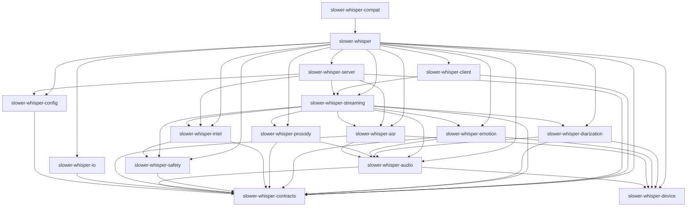

# Phase 0 Workspace Specification: Slower-Whisper Modularization

**Version:** 1.0
**Created:** 2026-01-30
**Purpose:** Comprehensive technical specification for Phase 0 workspace setup, including structure, dependencies, import boundaries, versioning, and tooling.

---

## Table of Contents

1. [Workspace Directory Structure](#workspace-directory-structure)
2. [Root pyproject.toml](#root-pyprojecttoml)
3. [Per-Package pyproject.toml Templates](#per-package-pyprojecttoml-templates)
4. [Dependency Graph](#dependency-graph)
5. [Import Boundary Rules](#import-boundary-rules)
6. [CI Boundary Check Script](#ci-boundary-check-script)
7. [Versioning Strategy](#versioning-strategy)
8. [Workspace Tooling Commands](#workspace-tooling-commands)

---

## Workspace Directory Structure

```
slower-whisper/
├── packages/                          # Monorepo packages directory
│   ├── slower-whisper-contracts/      # Core data models, exceptions, events
│   │   ├── pyproject.toml
│   │   ├── src/
│   │   │   └── slower_whisper_contracts/
│   │   │       ├── __init__.py
│   │   │       ├── exceptions.py
│   │   │       ├── models.py
│   │   │       ├── models_speakers.py
│   │   │       ├── models_turns.py
│   │   │       ├── types_audio.py
│   │   │       ├── outcomes.py
│   │   │       ├── receipt.py
│   │   │       ├── ids.py
│   │   │       ├── validation.py
│   │   │       └── schema/
│   │   ├── tests/
│   │   └── README.md
│   ├── slower-whisper-config/       # Configuration parsing and management
│   │   ├── pyproject.toml
│   │   ├── src/
│   │   │   └── slower_whisper_config/
│   │   │       ├── __init__.py
│   │   │       ├── config.py
│   │   │       ├── transcription_config.py
│   │   │       ├── enrichment_config.py
│   │   │       ├── config_validation.py
│   │   │       ├── config_merge.py
│   │   │       └── legacy_config.py
│   │   ├── tests/
│   │   └── README.md
│   ├── slower-whisper-io/            # Writers, readers, persistence
│   │   ├── pyproject.toml
│   │   ├── src/
│   │   │   └── slower_whisper_io/
│   │   │       ├── __init__.py
│   │   │       ├── writers.py
│   │   │       ├── transcript_io.py
│   │   │       └── exporters.py
│   │   ├── tests/
│   │   └── README.md
│   ├── slower-whisper-device/         # Device resolution, compute_type
│   │   ├── pyproject.toml
│   │   ├── src/
│   │   │   └── slower_whisper_device/
│   │   │       ├── __init__.py
│   │   │       ├── device.py
│   │   │       └── color_utils.py
│   │   ├── tests/
│   │   └── README.md
│   ├── slower-whisper-audio/          # Audio loading, resampling, chunking
│   │   ├── pyproject.toml
│   │   ├── src/
│   │   │   └── slower_whisper_audio/
│   │   │       ├── __init__.py
│   │   │       ├── audio_io.py
│   │   │       ├── audio_utils.py
│   │   │       ├── audio_health.py
│   │   │       ├── audio_rendering.py
│   │   │       └── chunking.py
│   │   ├── tests/
│   │   └── README.md
│   ├── slower-whisper-asr/            # WhisperModel, ASR engine
│   │   ├── pyproject.toml
│   │   ├── src/
│   │   │   └── slower_whisper_asr/
│   │   │       ├── __init__.py
│   │   │       ├── asr_engine.py
│   │   │       ├── cache.py
│   │   │       ├── transcription_orchestrator.py
│   │   │       └── transcription_helpers.py
│   │   ├── tests/
│   │   └── README.md
│   ├── slower-whisper-safety/         # Smart formatting, moderation, PII
│   │   ├── pyproject.toml
│   │   ├── src/
│   │   │   └── slower_whisper_safety/
│   │   │       ├── __init__.py
│   │   │       ├── smart_formatting.py
│   │   │       ├── privacy.py
│   │   │       ├── safety_layer.py
│   │   │       ├── safety_config.py
│   │   │       ├── renderer.py
│   │   │       └── content_moderation.py
│   │   ├── tests/
│   │   └── README.md
│   ├── slower-whisper-intel/          # Role inference, topic segmentation
│   │   ├── pyproject.toml
│   │   ├── src/
│   │   │   └── slower_whisper_intel/
│   │   │       ├── __init__.py
│   │   │       ├── role_inference.py
│   │   │       ├── topic_segmentation.py
│   │   │       ├── turn_taking_policy.py
│   │   │       ├── turns.py
│   │   │       ├── turns_enrich.py
│   │   │       ├── turn_helpers.py
│   │   │       ├── tts_style.py
│   │   │       └── conversation_physics.py
│   │   ├── tests/
│   │   └── README.md
│   ├── slower-whisper-prosody/        # Prosody extraction
│   │   ├── pyproject.toml
│   │   ├── src/
│   │   │   └── slower_whisper_prosody/
│   │   │       ├── __init__.py
│   │   │       ├── prosody.py
│   │   │       ├── prosody_extended.py
│   │   │       └── environment_classifier.py
│   │   ├── tests/
│   │   └── README.md
│   ├── slower-whisper-emotion/        # Speech emotion recognition
│   │   ├── pyproject.toml
│   │   ├── src/
│   │   │   └── slower_whisper_emotion/
│   │   │       ├── __init__.py
│   │   │       └── emotion.py
│   │   ├── tests/
│   │   └── README.md
│   ├── slower-whisper-diarization/    # Speaker diarization
│   │   ├── pyproject.toml
│   │   ├── src/
│   │   │   └── slower_whisper_diarization/
│   │   │       ├── __init__.py
│   │   │       ├── diarization.py
│   │   │       ├── diarization_orchestrator.py
│   │   │       ├── speaker_id.py
│   │   │       ├── speaker_identity.py
│   │   │       └── speaker_stats.py
│   │   ├── tests/
│   │   └── README.md
│   ├── slower-whisper-streaming/     # Streaming state machine, events
│   │   ├── pyproject.toml
│   │   ├── src/
│   │   │   └── slower_whisper_streaming/
│   │   │       ├── __init__.py
│   │   │       ├── streaming.py
│   │   │       ├── streaming_asr.py
│   │   │       ├── streaming_callbacks.py
│   │   │       ├── streaming_client.py
│   │   │       ├── streaming_ws.py
│   │   │       ├── streaming_enrich.py
│   │   │       ├── streaming_semantic.py
│   │   │       ├── streaming_safety.py
│   │   │       └── streaming_diarization.py
│   │   ├── tests/
│   │   └── README.md
│   ├── slower-whisper-server/         # FastAPI service
│   │   ├── pyproject.toml
│   │   ├── src/
│   │   │   └── slower_whisper_server/
│   │   │       ├── __init__.py
│   │   │       ├── api.py
│   │   │       ├── service.py
│   │   │       ├── service_enrich.py
│   │   │       ├── service_errors.py
│   │   │       ├── service_health.py
│   │   │       ├── service_metrics.py
│   │   │       ├── service_middleware.py
│   │   │       ├── service_serialization.py
│   │   │       ├── service_settings.py
│   │   │       ├── service_sse.py
│   │   │       ├── service_streaming.py
│   │   │       ├── service_transcribe.py
│   │   │       ├── service_validation.py
│   │   │       └── session_registry.py
│   │   ├── tests/
│   │   └── README.md
│   ├── slower-whisper-client/         # Python SDK for REST/WS
│   │   ├── pyproject.toml
│   │   ├── src/
│   │   │   └── slower_whisper_client/
│   │   │       ├── __init__.py
│   │   │       └── client.py
│   │   ├── tests/
│   │   └── README.md
│   ├── slower-whisper/                # Meta package (orchestrates all)
│   │   ├── pyproject.toml
│   │   ├── src/
│   │   │   └── slower_whisper/
│   │   │       ├── __init__.py
│   │   │       ├── pipeline.py
│   │   │       ├── enrich.py
│   │   │       ├── post_process.py
│   │   │       ├── audio_enrichment.py
│   │   │       ├── enrichment_orchestrator.py
│   │   │       ├── cli.py
│   │   │       ├── cli_legacy_transcribe.py
│   │   │       ├── semantic.py
│   │   │       ├── semantic_adapter.py
│   │   │       ├── semantic_providers/
│   │   │       ├── local_llm_provider.py
│   │   │       ├── llm_guardrails.py
│   │   │       ├── llm_utils.py
│   │   │       ├── meta_utils.py
│   │   │       ├── dogfood.py
│   │   │       ├── dogfood_utils.py
│   │   │       ├── telemetry.py
│   │   │       ├── benchmarks.py
│   │   │       ├── benchmark_cli.py
│   │   │       ├── benchmark/
│   │   │       ├── cli_commands/
│   │   │       ├── samples.py
│   │   │       ├── _import_guards.py
│   │   │       └── py.typed
│   │   ├── tests/
│   │   └── README.md
│   └── slower-whisper-compat/         # Legacy import compatibility
│       ├── pyproject.toml
│       ├── src/
│       │   └── slower_whisper_compat/
│       │       ├── __init__.py
│       │       └── py.typed
│       ├── tests/
│       └── README.md
├── transcription/                      # Original monolith (gradually emptied)
├── slower_whisper/                     # Original compat layer (gradually emptied)
├── tests/                              # Workspace-level tests
├── scripts/                            # Workspace-level scripts
├── docs/                               # Documentation
├── benchmarks/                         # Benchmark datasets and baselines
├── integrations/                       # Optional integrations
├── config/                             # Configuration files
├── k8s/                                # Kubernetes manifests
├── pyproject.toml                      # Root workspace configuration
├── uv.lock                             # Workspace lockfile (if using uv)
├── .python-version                     # Python version pin
├── README.md
├── CHANGELOG.md
├── CLAUDE.md
├── AGENTS.md
├── ROADMAP.md
└── .gitignore
```

---

## Root pyproject.toml

```toml
[build-system]
requires = ["hatchling>=1.25.0"]
build-backend = "hatchling.build"

[project]
name = "slower-whisper-workspace"
version = "0.1.0"
description = "Workspace root for slower-whisper monorepo"
readme = "README.md"
requires-python = ">=3.12,<3.15"
license = {text = "Apache-2.0"}
authors = [
    {name = "Effortless Metrics", email = "git@effortlesssteven.com"}
]
classifiers = [
    "Development Status :: 4 - Beta",
    "License :: OSI Approved :: Apache Software License",
    "Programming Language :: Python :: 3",
    "Programming Language :: Python :: 3.12",
    "Programming Language :: Python :: 3.13",
    "Programming Language :: Python :: 3.14",
]

[tool.uv.workspace]
members = [
    "packages/slower-whisper-contracts",
    "packages/slower-whisper-config",
    "packages/slower-whisper-io",
    "packages/slower-whisper-device",
    "packages/slower-whisper-audio",
    "packages/slower-whisper-asr",
    "packages/slower-whisper-safety",
    "packages/slower-whisper-intel",
    "packages/slower-whisper-prosody",
    "packages/slower-whisper-emotion",
    "packages/slower-whisper-diarization",
    "packages/slower-whisper-streaming",
    "packages/slower-whisper-server",
    "packages/slower-whisper-client",
    "packages/slower-whisper",
    "packages/slower-whisper-compat",
]

[tool.uv.sources]
# Use local workspace packages for development
slower-whisper-contracts = { workspace = true }
slower-whisper-config = { workspace = true }
slower-whisper-io = { workspace = true }
slower-whisper-device = { workspace = true }
slower-whisper-audio = { workspace = true }
slower-whisper-asr = { workspace = true }
slower-whisper-safety = { workspace = true }
slower-whisper-intel = { workspace = true }
slower-whisper-prosody = { workspace = true }
slower-whisper-emotion = { workspace = true }
slower-whisper-diarization = { workspace = true }
slower-whisper-streaming = { workspace = true }
slower-whisper-server = { workspace = true }
slower-whisper-client = { workspace = true }
slower-whisper = { workspace = true }
slower-whisper-compat = { workspace = true }

# Workspace-level development dependencies
[tool.uv.dev-dependencies]
# Testing
pytest = ">=9.0.2"
pytest-cov = ">=7.0.0"
pytest-mock = ">=3.15.1"
pytest-asyncio = ">=1.3.0"
pytest-xdist = ">=3.8.0"
pytest-bdd = ">=8.1.0"
httpx = ">=0.28.1"
jiwer = ">=4.0.0"
pyannote-metrics = ">=4.0.0"
jsonschema = ">=4.26.0"

# Code quality
mypy = ">=1.19.1"
ruff = ">=0.14.14"

# Type stubs
types-requests = "*"
types-PyYAML = "*"
types-jsonschema = "*"

# Build & Distribution
build = ">=1.4.0"
twine = ">=6.2.0"
wheel = ">=0.46.3"

# Utilities
pre-commit = ">=4.5.1"
ipython = ">=9.9.0"
ipdb = ">=0.13.13"
rich = ">=14.3.1"

# Security scanning
pip-audit = ">=2.10.0"
safety = ">=3.7.0"
bandit = ">=1.9.3"

# Performance profiling
memory-profiler = ">=0.61.0"
line-profiler = ">=5.0.0"
py-spy = ">=0.4.1"
psutil = ">=7.2.1"

# Workspace scripts
[tool.uv.scripts]
# Run tests across all packages
test-all = "pytest tests/"
test-quick = "pytest tests/ -m 'not slow and not heavy and not integration'"
test-unit = "pytest tests/ -m 'not integration'"

# Run linting across all packages
lint-all = "ruff check ."
lint-fix = "ruff check . --fix"
format-all = "ruff format ."
format-check = "ruff format . --check"

# Run type checking across all packages
typecheck-all = "mypy packages/*/src"

# Build all packages
build-all = "python scripts/build_all.py"

# Check import boundaries
check-boundaries = "python scripts/check_import_boundaries.py"

# Verify workspace integrity
verify-workspace = "python scripts/verify_workspace.py"

# ============================================================================
# Ruff Configuration (Workspace-level)
# ============================================================================

[tool.ruff]
line-length = 100
target-version = "py312"

[tool.ruff.lint]
select = [
    "E",  # pycodestyle errors
    "W",  # pycodestyle warnings
    "F",  # pyflakes
    "I",  # isort
    "B",  # flake8-bugbear
    "C4", # flake8-comprehensions
    "UP", # pyupgrade
    "T10", # flake8-debugger
    "T20", # flake8-print
]
ignore = [
    "E501",  # line too long (handled by formatter)
    "B008",  # do not perform function calls in argument defaults
    "C901",  # too complex
]

[tool.ruff.lint.per-file-ignores]
"__init__.py" = ["F401"]  # unused imports
"tests/**" = ["S101"]  # assert allowed in tests

# Import boundary rules
[tool.ruff.lint.isort]
known-first-party = [
    "slower_whisper_contracts",
    "slower_whisper_config",
    "slower_whisper_io",
    "slower_whisper_device",
    "slower_whisper_audio",
    "slower_whisper_asr",
    "slower_whisper_safety",
    "slower_whisper_intel",
    "slower_whisper_prosody",
    "slower_whisper_emotion",
    "slower_whisper_diarization",
    "slower_whisper_streaming",
    "slower_whisper_server",
    "slower_whisper_client",
    "slower_whisper",
    "slower_whisper_compat",
]

# ============================================================================
# MyPy Configuration (Workspace-level)
# ============================================================================

[tool.mypy]
python_version = "3.12"
warn_return_any = true
warn_unused_configs = true
disallow_untyped_defs = false
disallow_incomplete_defs = false
check_untyped_defs = true
no_implicit_optional = true
warn_redundant_casts = true
warn_unused_ignores = true
warn_no_return = true
warn_unreachable = true
strict_equality = true

[[tool.mypy.overrides]]
module = [
    "faster_whisper.*",
    "parselmouth.*",
    "librosa.*",
    "soundfile.*",
    "torch.*",
    "torchcodec.*",
    "torchaudio.*",
    "fastapi.*",
    "uvicorn.*",
    "pyannote.*",
    "anthropic.*",
    "openai.*",
    "sklearn.*",
    "spacy.*",
    "speechbrain.*",
    "resemblyzer.*",
    "pyarrow.*",
    "sentence_transformers.*",
]
ignore_missing_imports = true

[[tool.mypy.overrides]]
module = ["transformers.*"]
ignore_missing_imports = true
follow_imports = "skip"

# ============================================================================
# Pytest Configuration (Workspace-level)
# ============================================================================

[tool.pytest.ini_options]
testpaths = ["tests", "packages/*/tests"]
python_files = ["test_*.py"]
python_classes = ["Test*"]
python_functions = ["test_*"]
addopts = [
    "-v",
    "--strict-markers",
]
markers = [
    "slow: marks tests as slow (deselect with '-m \"not slow\"')",
    "heavy: marks tests requiring heavy ML models (emotion, diarization)",
    "integration: marks tests as integration tests",
    "requires_gpu: marks tests that require GPU",
    "requires_enrich: marks tests that require enrichment dependencies",
    "requires_diarization: marks tests that require pyannote.audio diarization extra",
]

# ============================================================================
# Coverage Configuration (Workspace-level)
# ============================================================================

[tool.coverage.run]
source = ["packages/*/src"]
omit = [
    "*/tests/*",
    "*/venv/*",
    "*/__pycache__/*",
]

[tool.coverage.report]
exclude_lines = [
    "pragma: no cover",
    "def __repr__",
    "raise AssertionError",
    "raise NotImplementedError",
    "if __name__ == .__main__.:",
    "if TYPE_CHECKING:",
    "@abstractmethod",
]
```

---

## Per-Package pyproject.toml Templates

### 1. slower-whisper-contracts

```toml
[build-system]
requires = ["hatchling>=1.25.0"]
build-backend = "hatchling.build"

[project]
name = "slower-whisper-contracts"
version = "2.0.0"
description = "Core data models, exceptions, events, and schemas for slower-whisper"
readme = "README.md"
requires-python = ">=3.12,<3.15"
license = {text = "Apache-2.0"}
authors = [
    {name = "Effortless Metrics", email = "git@effortlesssteven.com"}
]
keywords = [
    "asr",
    "transcription",
    "data-models",
    "contracts",
]
classifiers = [
    "Development Status :: 4 - Beta",
    "Intended Audience :: Developers",
    "License :: OSI Approved :: Apache Software License",
    "Programming Language :: Python :: 3",
    "Programming Language :: Python :: 3.12",
    "Programming Language :: Python :: 3.13",
    "Programming Language :: Python :: 3.14",
]

# Contracts has NO external dependencies (stdlib only)
dependencies = []

[project.optional-dependencies]
dev = [
    "pytest>=9.0.2",
    "pytest-cov>=7.0.0",
    "mypy>=1.19.1",
    "ruff>=0.14.14",
]

[project.urls]
Homepage = "https://github.com/EffortlessMetrics/slower-whisper"
Documentation = "https://github.com/EffortlessMetrics/slower-whisper#readme"
Repository = "https://github.com/EffortlessMetrics/slower-whisper"
Issues = "https://github.com/EffortlessMetrics/slower-whisper/issues"

[tool.hatch.build.targets.wheel]
packages = ["src/slower_whisper_contracts"]

[tool.hatch.build.targets.sdist]
include = [
    "/src",
    "/tests",
    "/README.md",
]

[tool.ruff]
line-length = 100
target-version = "py312"

[tool.ruff.lint]
select = ["E", "W", "F", "I", "B", "C4", "UP"]
ignore = ["E501", "B008", "C901"]

[tool.ruff.lint.per-file-ignores]
"__init__.py" = ["F401"]

[tool.mypy]
python_version = "3.12"
warn_return_any = true
warn_unused_configs = true
```

### 2. slower-whisper-config

```toml
[build-system]
requires = ["hatchling>=1.25.0"]
build-backend = "hatchling.build"

[project]
name = "slower-whisper-config"
version = "2.0.0"
description = "Configuration parsing and management for slower-whisper"
readme = "README.md"
requires-python = ">=3.12,<3.15"
license = {text = "Apache-2.0"}
authors = [
    {name = "Effortless Metrics", email = "git@effortlesssteven.com"}
]
keywords = [
    "asr",
    "transcription",
    "configuration",
]
classifiers = [
    "Development Status :: 4 - Beta",
    "Intended Audience :: Developers",
    "License :: OSI Approved :: Apache Software License",
    "Programming Language :: Python :: 3",
    "Programming Language :: Python :: 3.12",
    "Programming Language :: Python :: 3.13",
    "Programming Language :: Python :: 3.14",
]

dependencies = [
    "slower-whisper-contracts==2.0.0",
    "typing-extensions>=4.15.0",
    "pyyaml>=6.0.0",
]

[project.optional-dependencies]
dev = [
    "pytest>=9.0.2",
    "pytest-cov>=7.0.0",
    "pytest-mock>=3.15.1",
    "mypy>=1.19.1",
    "ruff>=0.14.14",
]

[project.urls]
Homepage = "https://github.com/EffortlessMetrics/slower-whisper"
Documentation = "https://github.com/EffortlessMetrics/slower-whisper#readme"
Repository = "https://github.com/EffortlessMetrics/slower-whisper"
Issues = "https://github.com/EffortlessMetrics/slower-whisper/issues"

[tool.hatch.build.targets.wheel]
packages = ["src/slower_whisper_config"]

[tool.hatch.build.targets.sdist]
include = [
    "/src",
    "/tests",
    "/README.md",
]

[tool.ruff]
line-length = 100
target-version = "py312"

[tool.ruff.lint]
select = ["E", "W", "F", "I", "B", "C4", "UP"]
ignore = ["E501", "B008", "C901"]

[tool.ruff.lint.per-file-ignores]
"__init__.py" = ["F401"]

[tool.mypy]
python_version = "3.12"
warn_return_any = true
warn_unused_configs = true
```

### 3. slower-whisper-io

```toml
[build-system]
requires = ["hatchling>=1.25.0"]
build-backend = "hatchling.build"

[project]
name = "slower-whisper-io"
version = "2.0.0"
description = "Writers, readers, and transcript persistence for slower-whisper"
readme = "README.md"
requires-python = ">=3.12,<3.15"
license = {text = "Apache-2.0"}
authors = [
    {name = "Effortless Metrics", email = "git@effortlesssteven.com"}
]
keywords = [
    "asr",
    "transcription",
    "io",
    "persistence",
]
classifiers = [
    "Development Status :: 4 - Beta",
    "Intended Audience :: Developers",
    "License :: OSI Approved :: Apache Software License",
    "Programming Language :: Python :: 3",
    "Programming Language :: Python :: 3.12",
    "Programming Language :: Python :: 3.13",
    "Programming Language :: Python :: 3.14",
]

dependencies = [
    "slower-whisper-contracts==2.0.0",
    "typing-extensions>=4.15.0",
]

[project.optional-dependencies]
dev = [
    "pytest>=9.0.2",
    "pytest-cov>=7.0.0",
    "pytest-mock>=3.15.1",
    "mypy>=1.19.1",
    "ruff>=0.14.14",
]

[project.urls]
Homepage = "https://github.com/EffortlessMetrics/slower-whisper"
Documentation = "https://github.com/EffortlessMetrics/slower-whisper#readme"
Repository = "https://github.com/EffortlessMetrics/slower-whisper"
Issues = "https://github.com/EffortlessMetrics/slower-whisper/issues"

[tool.hatch.build.targets.wheel]
packages = ["src/slower_whisper_io"]

[tool.hatch.build.targets.sdist]
include = [
    "/src",
    "/tests",
    "/README.md",
]

[tool.ruff]
line-length = 100
target-version = "py312"

[tool.ruff.lint]
select = ["E", "W", "F", "I", "B", "C4", "UP"]
ignore = ["E501", "B008", "C901"]

[tool.ruff.lint.per-file-ignores]
"__init__.py" = ["F401"]

[tool.mypy]
python_version = "3.12"
warn_return_any = true
warn_unused_configs = true
```

### 4. slower-whisper-device

```toml
[build-system]
requires = ["hatchling>=1.25.0"]
build-backend = "hatchling.build"

[project]
name = "slower-whisper-device"
version = "2.0.0"
description = "Device resolution and compute_type management for slower-whisper"
readme = "README.md"
requires-python = ">=3.12,<3.15"
license = {text = "Apache-2.0"}
authors = [
    {name = "Effortless Metrics", email = "git@effortlesssteven.com"}
]
keywords = [
    "asr",
    "transcription",
    "device",
    "cuda",
]
classifiers = [
    "Development Status :: 4 - Beta",
    "Intended Audience :: Developers",
    "License :: OSI Approved :: Apache Software License",
    "Programming Language :: Python :: 3",
    "Programming Language :: Python :: 3.12",
    "Programming Language :: Python :: 3.13",
    "Programming Language :: Python :: 3.14",
]

# Device is stdlib only (no external dependencies)
dependencies = [
    "typing-extensions>=4.15.0",
]

[project.optional-dependencies]
dev = [
    "pytest>=9.0.2",
    "pytest-cov>=7.0.0",
    "pytest-mock>=3.15.1",
    "mypy>=1.19.1",
    "ruff>=0.14.14",
]

[project.urls]
Homepage = "https://github.com/EffortlessMetrics/slower-whisper"
Documentation = "https://github.com/EffortlessMetrics/slower-whisper#readme"
Repository = "https://github.com/EffortlessMetrics/slower-whisper"
Issues = "https://github.com/EffortlessMetrics/slower-whisper/issues"

[tool.hatch.build.targets.wheel]
packages = ["src/slower_whisper_device"]

[tool.hatch.build.targets.sdist]
include = [
    "/src",
    "/tests",
    "/README.md",
]

[tool.ruff]
line-length = 100
target-version = "py312"

[tool.ruff.lint]
select = ["E", "W", "F", "I", "B", "C4", "UP"]
ignore = ["E501", "B008", "C901"]

[tool.ruff.lint.per-file-ignores]
"__init__.py" = ["F401"]

[tool.mypy]
python_version = "3.12"
warn_return_any = true
warn_unused_configs = true
```

### 5. slower-whisper-audio

```toml
[build-system]
requires = ["hatchling>=1.25.0"]
build-backend = "hatchling.build"

[project]
name = "slower-whisper-audio"
version = "2.0.0"
description = "Audio loading, resampling, and chunking for slower-whisper"
readme = "README.md"
requires-python = ">=3.12,<3.15"
license = {text = "Apache-2.0"}
authors = [
    {name = "Effortless Metrics", email = "git@effortlesssteven.com"}
]
keywords = [
    "asr",
    "transcription",
    "audio",
    "resampling",
]
classifiers = [
    "Development Status :: 4 - Beta",
    "Intended Audience :: Developers",
    "License :: OSI Approved :: Apache Software License",
    "Programming Language :: Python :: 3",
    "Programming Language :: Python :: 3.12",
    "Programming Language :: Python :: 3.13",
    "Programming Language :: Python :: 3.14",
]

dependencies = [
    "slower-whisper-contracts==2.0.0",
    "slower-whisper-device==2.0.0",
    "typing-extensions>=4.15.0",
    "numpy>=2,<2.4",
]

[project.optional-dependencies]
dev = [
    "pytest>=9.0.2",
    "pytest-cov>=7.0.0",
    "pytest-mock>=3.15.1",
    "mypy>=1.19.1",
    "ruff>=0.14.14",
]

[project.urls]
Homepage = "https://github.com/EffortlessMetrics/slower-whisper"
Documentation = "https://github.com/EffortlessMetrics/slower-whisper#readme"
Repository = "https://github.com/EffortlessMetrics/slower-whisper"
Issues = "https://github.com/EffortlessMetrics/slower-whisper/issues"

[tool.hatch.build.targets.wheel]
packages = ["src/slower_whisper_audio"]

[tool.hatch.build.targets.sdist]
include = [
    "/src",
    "/tests",
    "/README.md",
]

[tool.ruff]
line-length = 100
target-version = "py312"

[tool.ruff.lint]
select = ["E", "W", "F", "I", "B", "C4", "UP"]
ignore = ["E501", "B008", "C901"]

[tool.ruff.lint.per-file-ignores]
"__init__.py" = ["F401"]

[tool.mypy]
python_version = "3.12"
warn_return_any = true
warn_unused_configs = true
```

### 6. slower-whisper-asr

```toml
[build-system]
requires = ["hatchling>=1.25.0"]
build-backend = "hatchling.build"

[project]
name = "slower-whisper-asr"
version = "2.0.0"
description = "WhisperModel and ASR engine for slower-whisper"
readme = "README.md"
requires-python = ">=3.12,<3.15"
license = {text = "Apache-2.0"}
authors = [
    {name = "Effortless Metrics", email = "git@effortlesssteven.com"}
]
keywords = [
    "asr",
    "whisper",
    "faster-whisper",
    "transcription",
]
classifiers = [
    "Development Status :: 4 - Beta",
    "Intended Audience :: Developers",
    "Intended Audience :: Science/Research",
    "License :: OSI Approved :: Apache Software License",
    "Programming Language :: Python :: 3",
    "Programming Language :: Python :: 3.12",
    "Programming Language :: Python :: 3.13",
    "Programming Language :: Python :: 3.14",
    "Topic :: Multimedia :: Sound/Audio :: Speech",
    "Topic :: Scientific/Engineering :: Artificial Intelligence",
]

dependencies = [
    "slower-whisper-contracts==2.0.0",
    "slower-whisper-device==2.0.0",
    "slower-whisper-audio==2.0.0",
    "faster-whisper>=1.2.1,<2",
    "typing-extensions>=4.15.0",
]

[project.optional-dependencies]
dev = [
    "pytest>=9.0.2",
    "pytest-cov>=7.0.0",
    "pytest-mock>=3.15.1",
    "mypy>=1.19.1",
    "ruff>=0.14.14",
]

[project.urls]
Homepage = "https://github.com/EffortlessMetrics/slower-whisper"
Documentation = "https://github.com/EffortlessMetrics/slower-whisper#readme"
Repository = "https://github.com/EffortlessMetrics/slower-whisper"
Issues = "https://github.com/EffortlessMetrics/slower-whisper/issues"

[tool.hatch.build.targets.wheel]
packages = ["src/slower_whisper_asr"]

[tool.hatch.build.targets.sdist]
include = [
    "/src",
    "/tests",
    "/README.md",
]

[tool.ruff]
line-length = 100
target-version = "py312"

[tool.ruff.lint]
select = ["E", "W", "F", "I", "B", "C4", "UP"]
ignore = ["E501", "B008", "C901"]

[tool.ruff.lint.per-file-ignores]
"__init__.py" = ["F401"]

[tool.mypy]
python_version = "3.12"
warn_return_any = true
warn_unused_configs = true

[[tool.mypy.overrides]]
module = ["faster_whisper.*"]
ignore_missing_imports = true
```

### 7. slower-whisper-safety

```toml
[build-system]
requires = ["hatchling>=1.25.0"]
build-backend = "hatchling.build"

[project]
name = "slower-whisper-safety"
version = "2.0.0"
description = "Smart formatting, moderation, and PII redaction for slower-whisper"
readme = "README.md"
requires-python = ">=3.12,<3.15"
license = {text = "Apache-2.0"}
authors = [
    {name = "Effortless Metrics", email = "git@effortlesssteven.com"}
]
keywords = [
    "asr",
    "transcription",
    "safety",
    "privacy",
    "redaction",
]
classifiers = [
    "Development Status :: 4 - Beta",
    "Intended Audience :: Developers",
    "License :: OSI Approved :: Apache Software License",
    "Programming Language :: Python :: 3",
    "Programming Language :: Python :: 3.12",
    "Programming Language :: Python :: 3.13",
    "Programming Language :: Python :: 3.14",
]

dependencies = [
    "slower-whisper-contracts==2.0.0",
    "typing-extensions>=4.15.0",
]

[project.optional-dependencies]
dev = [
    "pytest>=9.0.2",
    "pytest-cov>=7.0.0",
    "pytest-mock>=3.15.1",
    "mypy>=1.19.1",
    "ruff>=0.14.14",
]

[project.urls]
Homepage = "https://github.com/EffortlessMetrics/slower-whisper"
Documentation = "https://github.com/EffortlessMetrics/slower-whisper#readme"
Repository = "https://github.com/EffortlessMetrics/slower-whisper"
Issues = "https://github.com/EffortlessMetrics/slower-whisper/issues"

[tool.hatch.build.targets.wheel]
packages = ["src/slower_whisper_safety"]

[tool.hatch.build.targets.sdist]
include = [
    "/src",
    "/tests",
    "/README.md",
]

[tool.ruff]
line-length = 100
target-version = "py312"

[tool.ruff.lint]
select = ["E", "W", "F", "I", "B", "C4", "UP"]
ignore = ["E501", "B008", "C901"]

[tool.ruff.lint.per-file-ignores]
"__init__.py" = ["F401"]

[tool.mypy]
python_version = "3.12"
warn_return_any = true
warn_unused_configs = true
```

### 8. slower-whisper-intel

```toml
[build-system]
requires = ["hatchling>=1.25.0"]
build-backend = "hatchling.build"

[project]
name = "slower-whisper-intel"
version = "2.0.0"
description = "Role inference, topic segmentation, and turn-taking for slower-whisper"
readme = "README.md"
requires-python = ">=3.12,<3.15"
license = {text = "Apache-2.0"}
authors = [
    {name = "Effortless Metrics", email = "git@effortlesssteven.com"}
]
keywords = [
    "asr",
    "transcription",
    "intelligence",
    "conversation",
]
classifiers = [
    "Development Status :: 4 - Beta",
    "Intended Audience :: Developers",
    "License :: OSI Approved :: Apache Software License",
    "Programming Language :: Python :: 3",
    "Programming Language :: Python :: 3.12",
    "Programming Language :: Python :: 3.13",
    "Programming Language :: Python :: 3.14",
]

dependencies = [
    "slower-whisper-contracts==2.0.0",
    "slower-whisper-safety==2.0.0",
    "typing-extensions>=4.15.0",
]

[project.optional-dependencies]
dev = [
    "pytest>=9.0.2",
    "pytest-cov>=7.0.0",
    "pytest-mock>=3.15.1",
    "mypy>=1.19.1",
    "ruff>=0.14.14",
]

[project.urls]
Homepage = "https://github.com/EffortlessMetrics/slower-whisper"
Documentation = "https://github.com/EffortlessMetrics/slower-whisper#readme"
Repository = "https://github.com/EffortlessMetrics/slower-whisper"
Issues = "https://github.com/EffortlessMetrics/slower-whisper/issues"

[tool.hatch.build.targets.wheel]
packages = ["src/slower_whisper_intel"]

[tool.hatch.build.targets.sdist]
include = [
    "/src",
    "/tests",
    "/README.md",
]

[tool.ruff]
line-length = 100
target-version = "py312"

[tool.ruff.lint]
select = ["E", "W", "F", "I", "B", "C4", "UP"]
ignore = ["E501", "B008", "C901"]

[tool.ruff.lint.per-file-ignores]
"__init__.py" = ["F401"]

[tool.mypy]
python_version = "3.12"
warn_return_any = true
warn_unused_configs = true
```

### 9. slower-whisper-prosody

```toml
[build-system]
requires = ["hatchling>=1.25.0"]
build-backend = "hatchling.build"

[project]
name = "slower-whisper-prosody"
version = "2.0.0"
description = "Prosody extraction and analysis for slower-whisper"
readme = "README.md"
requires-python = ">=3.12,<3.15"
license = {text = "Apache-2.0"}
authors = [
    {name = "Effortless Metrics", email = "git@effortlesssteven.com"}
]
keywords = [
    "asr",
    "transcription",
    "prosody",
    "pitch",
]
classifiers = [
    "Development Status :: 4 - Beta",
    "Intended Audience :: Developers",
    "License :: OSI Approved :: Apache Software License",
    "Programming Language :: Python :: 3",
    "Programming Language :: Python :: 3.12",
    "Programming Language :: Python :: 3.13",
    "Programming Language :: Python :: 3.14",
]

dependencies = [
    "slower-whisper-contracts==2.0.0",
    "slower-whisper-audio==2.0.0",
    "typing-extensions>=4.15.0",
    "numpy>=2,<2.4",
]

[project.optional-dependencies]
# Praat integration for research-grade pitch extraction
praat = [
    "praat-parselmouth>=0.4.7",
]
dev = [
    "pytest>=9.0.2",
    "pytest-cov>=7.0.0",
    "pytest-mock>=3.15.1",
    "mypy>=1.19.1",
    "ruff>=0.14.14",
]

[project.urls]
Homepage = "https://github.com/EffortlessMetrics/slower-whisper"
Documentation = "https://github.com/EffortlessMetrics/slower-whisper#readme"
Repository = "https://github.com/EffortlessMetrics/slower-whisper"
Issues = "https://github.com/EffortlessMetrics/slower-whisper/issues"

[tool.hatch.build.targets.wheel]
packages = ["src/slower_whisper_prosody"]

[tool.hatch.build.targets.sdist]
include = [
    "/src",
    "/tests",
    "/README.md",
]

[tool.ruff]
line-length = 100
target-version = "py312"

[tool.ruff.lint]
select = ["E", "W", "F", "I", "B", "C4", "UP"]
ignore = ["E501", "B008", "C901"]

[tool.ruff.lint.per-file-ignores]
"__init__.py" = ["F401"]

[tool.mypy]
python_version = "3.12"
warn_return_any = true
warn_unused_configs = true

[[tool.mypy.overrides]]
module = ["parselmouth.*"]
ignore_missing_imports = true
```

### 10. slower-whisper-emotion

```toml
[build-system]
requires = ["hatchling>=1.25.0"]
build-backend = "hatchling.build"

[project]
name = "slower-whisper-emotion"
version = "2.0.0"
description = "Speech emotion recognition for slower-whisper"
readme = "README.md"
requires-python = ">=3.12,<3.15"
license = {text = "Apache-2.0"}
authors = [
    {name = "Effortless Metrics", email = "git@effortlesssteven.com"}
]
keywords = [
    "asr",
    "transcription",
    "emotion",
    "emotion-recognition",
]
classifiers = [
    "Development Status :: 4 - Beta",
    "Intended Audience :: Developers",
    "Intended Audience :: Science/Research",
    "License :: OSI Approved :: Apache Software License",
    "Programming Language :: Python :: 3",
    "Programming Language :: Python :: 3.12",
    "Programming Language :: Python :: 3.13",
    "Programming Language :: Python :: 3.14",
]

dependencies = [
    "slower-whisper-contracts==2.0.0",
    "slower-whisper-audio==2.0.0",
    "slower-whisper-device==2.0.0",
    "typing-extensions>=4.15.0",
]

[project.optional-dependencies]
# Torch and transformers for emotion models
torch = [
    "torch>=2.8.0,<3",
    "torchaudio>=2.8.0,<3",
    "transformers==4.57.6",
]
dev = [
    "pytest>=9.0.2",
    "pytest-cov>=7.0.0",
    "pytest-mock>=3.15.1",
    "mypy>=1.19.1",
    "ruff>=0.14.14",
]

[project.urls]
Homepage = "https://github.com/EffortlessMetrics/slower-whisper"
Documentation = "https://github.com/EffortlessMetrics/slower-whisper#readme"
Repository = "https://github.com/EffortlessMetrics/slower-whisper"
Issues = "https://github.com/EffortlessMetrics/slower-whisper/issues"

[tool.hatch.build.targets.wheel]
packages = ["src/slower_whisper_emotion"]

[tool.hatch.build.targets.sdist]
include = [
    "/src",
    "/tests",
    "/README.md",
]

[tool.ruff]
line-length = 100
target-version = "py312"

[tool.ruff.lint]
select = ["E", "W", "F", "I", "B", "C4", "UP"]
ignore = ["E501", "B008", "C901"]

[tool.ruff.lint.per-file-ignores]
"__init__.py" = ["F401"]

[tool.mypy]
python_version = "3.12"
warn_return_any = true
warn_unused_configs = true

[[tool.mypy.overrides]]
module = ["torch.*", "torchaudio.*", "transformers.*"]
ignore_missing_imports = true
follow_imports = "skip"
```

### 11. slower-whisper-diarization

```toml
[build-system]
requires = ["hatchling>=1.25.0"]
build-backend = "hatchling.build"

[project]
name = "slower-whisper-diarization"
version = "2.0.0"
description = "Speaker diarization for slower-whisper"
readme = "README.md"
requires-python = ">=3.12,<3.15"
license = {text = "Apache-2.0"}
authors = [
    {name = "Effortless Metrics", email = "git@effortlesssteven.com"}
]
keywords = [
    "asr",
    "transcription",
    "diarization",
    "speaker-identification",
]
classifiers = [
    "Development Status :: 4 - Beta",
    "Intended Audience :: Developers",
    "Intended Audience :: Science/Research",
    "License :: OSI Approved :: Apache Software License",
    "Programming Language :: Python :: 3",
    "Programming Language :: Python :: 3.12",
    "Programming Language :: Python :: 3.13",
    "Programming Language :: Python :: 3.14",
]

dependencies = [
    "slower-whisper-contracts==2.0.0",
    "slower-whisper-audio==2.0.0",
    "slower-whisper-device==2.0.0",
    "typing-extensions>=4.15.0",
]

[project.optional-dependencies]
# PyAnnote for speaker diarization
pyannote = [
    "pyannote.audio>=4.0.3",
    "torch>=2.8.0,<3",
    "torchaudio>=2.8.0,<3",
]
dev = [
    "pytest>=9.0.2",
    "pytest-cov>=7.0.0",
    "pytest-mock>=3.15.1",
    "mypy>=1.19.1",
    "ruff>=0.14.14",
]

[project.urls]
Homepage = "https://github.com/EffortlessMetrics/slower-whisper"
Documentation = "https://github.com/EffortlessMetrics/slower-whisper#readme"
Repository = "https://github.com/EffortlessMetrics/slower-whisper"
Issues = "https://github.com/EffortlessMetrics/slower-whisper/issues"

[tool.hatch.build.targets.wheel]
packages = ["src/slower_whisper_diarization"]

[tool.hatch.build.targets.sdist]
include = [
    "/src",
    "/tests",
    "/README.md",
]

[tool.ruff]
line-length = 100
target-version = "py312"

[tool.ruff.lint]
select = ["E", "W", "F", "I", "B", "C4", "UP"]
ignore = ["E501", "B008", "C901"]

[tool.ruff.lint.per-file-ignores]
"__init__.py" = ["F401"]

[tool.mypy]
python_version = "3.12"
warn_return_any = true
warn_unused_configs = true

[[tool.mypy.overrides]]
module = ["torch.*", "torchaudio.*", "pyannote.*"]
ignore_missing_imports = true
```

### 12. slower-whisper-streaming

```toml
[build-system]
requires = ["hatchling>=1.25.0"]
build-backend = "hatchling.build"

[project]
name = "slower-whisper-streaming"
version = "2.0.0"
description = "Streaming state machine, events, and callbacks for slower-whisper"
readme = "README.md"
requires-python = ">=3.12,<3.15"
license = {text = "Apache-2.0"}
authors = [
    {name = "Effortless Metrics", email = "git@effortlesssteven.com"}
]
keywords = [
    "asr",
    "transcription",
    "streaming",
    "websocket",
]
classifiers = [
    "Development Status :: 4 - Beta",
    "Intended Audience :: Developers",
    "License :: OSI Approved :: Apache Software License",
    "Programming Language :: Python :: 3",
    "Programming Language :: Python :: 3.12",
    "Programming Language :: Python :: 3.13",
    "Programming Language :: Python :: 3.14",
]

dependencies = [
    "slower-whisper-contracts==2.0.0",
    "slower-whisper-asr==2.0.0",
    "slower-whisper-audio==2.0.0",
    "slower-whisper-prosody==2.0.0",
    "slower-whisper-emotion==2.0.0",
    "slower-whisper-diarization==2.0.0",
    "slower-whisper-intel==2.0.0",
    "slower-whisper-safety==2.0.0",
    "typing-extensions>=4.15.0",
]

[project.optional-dependencies]
dev = [
    "pytest>=9.0.2",
    "pytest-cov>=7.0.0",
    "pytest-mock>=3.15.1",
    "pytest-asyncio>=1.3.0",
    "httpx>=0.28.1",
    "mypy>=1.19.1",
    "ruff>=0.14.14",
]

[project.urls]
Homepage = "https://github.com/EffortlessMetrics/slower-whisper"
Documentation = "https://github.com/EffortlessMetrics/slower-whisper#readme"
Repository = "https://github.com/EffortlessMetrics/slower-whisper"
Issues = "https://github.com/EffortlessMetrics/slower-whisper/issues"

[tool.hatch.build.targets.wheel]
packages = ["src/slower_whisper_streaming"]

[tool.hatch.build.targets.sdist]
include = [
    "/src",
    "/tests",
    "/README.md",
]

[tool.ruff]
line-length = 100
target-version = "py312"

[tool.ruff.lint]
select = ["E", "W", "F", "I", "B", "C4", "UP"]
ignore = ["E501", "B008", "C901"]

[tool.ruff.lint.per-file-ignores]
"__init__.py" = ["F401"]

[tool.mypy]
python_version = "3.12"
warn_return_any = true
warn_unused_configs = true
```

### 13. slower-whisper-server

```toml
[build-system]
requires = ["hatchling>=1.25.0"]
build-backend = "hatchling.build"

[project]
name = "slower-whisper-server"
version = "2.0.0"
description = "FastAPI service for slower-whisper"
readme = "README.md"
requires-python = ">=3.12,<3.15"
license = {text = "Apache-2.0"}
authors = [
    {name = "Effortless Metrics", email = "git@effortlesssteven.com"}
]
keywords = [
    "asr",
    "transcription",
    "fastapi",
    "server",
]
classifiers = [
    "Development Status :: 4 - Beta",
    "Intended Audience :: Developers",
    "License :: OSI Approved :: Apache Software License",
    "Programming Language :: Python :: 3",
    "Programming Language :: Python :: 3.12",
    "Programming Language :: Python :: 3.13",
    "Programming Language :: Python :: 3.14",
]

dependencies = [
    "slower-whisper-contracts==2.0.0",
    "slower-whisper-config==2.0.0",
    "slower-whisper-asr==2.0.0",
    "slower-whisper-streaming==2.0.0",
    "slower-whisper-intel==2.0.0",
    "typing-extensions>=4.15.0",
    "fastapi>=0.128.0",
    "uvicorn[standard]>=0.40.0",
    "python-multipart>=0.0.22",
]

[project.optional-dependencies]
dev = [
    "pytest>=9.0.2",
    "pytest-cov>=7.0.0",
    "pytest-mock>=3.15.1",
    "pytest-asyncio>=1.3.0",
    "httpx>=0.28.1",
    "mypy>=1.19.1",
    "ruff>=0.14.14",
]

[project.urls]
Homepage = "https://github.com/EffortlessMetrics/slower-whisper"
Documentation = "https://github.com/EffortlessMetrics/slower-whisper#readme"
Repository = "https://github.com/EffortlessMetrics/slower-whisper"
Issues = "https://github.com/EffortlessMetrics/slower-whisper/issues"

[tool.hatch.build.targets.wheel]
packages = ["src/slower_whisper_server"]

[tool.hatch.build.targets.sdist]
include = [
    "/src",
    "/tests",
    "/README.md",
]

[tool.ruff]
line-length = 100
target-version = "py312"

[tool.ruff.lint]
select = ["E", "W", "F", "I", "B", "C4", "UP"]
ignore = ["E501", "B008", "C901"]

[tool.ruff.lint.per-file-ignores]
"__init__.py" = ["F401"]

[tool.mypy]
python_version = "3.12"
warn_return_any = true
warn_unused_configs = true

[[tool.mypy.overrides]]
module = ["fastapi.*", "uvicorn.*"]
ignore_missing_imports = true
```

### 14. slower-whisper-client

```toml
[build-system]
requires = ["hatchling>=1.25.0"]
build-backend = "hatchling.build"

[project]
name = "slower-whisper-client"
version = "2.0.0"
description = "Python SDK for slower-whisper REST/WS API"
readme = "README.md"
requires-python = ">=3.12,<3.15"
license = {text = "Apache-2.0"}
authors = [
    {name = "Effortless Metrics", email = "git@effortlesssteven.com"}
]
keywords = [
    "asr",
    "transcription",
    "client",
    "sdk",
]
classifiers = [
    "Development Status :: 4 - Beta",
    "Intended Audience :: Developers",
    "License :: OSI Approved :: Apache Software License",
    "Programming Language :: Python :: 3",
    "Programming Language :: Python :: 3.12",
    "Programming Language :: Python :: 3.13",
    "Programming Language :: Python :: 3.14",
]

dependencies = [
    "slower-whisper-contracts==2.0.0",
    "slower-whisper-streaming==2.0.0",
    "typing-extensions>=4.15.0",
    "httpx>=0.28.1",
    "websockets>=14.0",
]

[project.optional-dependencies]
dev = [
    "pytest>=9.0.2",
    "pytest-cov>=7.0.0",
    "pytest-mock>=3.15.1",
    "pytest-asyncio>=1.3.0",
    "mypy>=1.19.1",
    "ruff>=0.14.14",
]

[project.urls]
Homepage = "https://github.com/EffortlessMetrics/slower-whisper"
Documentation = "https://github.com/EffortlessMetrics/slower-whisper#readme"
Repository = "https://github.com/EffortlessMetrics/slower-whisper"
Issues = "https://github.com/EffortlessMetrics/slower-whisper/issues"

[tool.hatch.build.targets.wheel]
packages = ["src/slower_whisper_client"]

[tool.hatch.build.targets.sdist]
include = [
    "/src",
    "/tests",
    "/README.md",
]

[tool.ruff]
line-length = 100
target-version = "py312"

[tool.ruff.lint]
select = ["E", "W", "F", "I", "B", "C4", "UP"]
ignore = ["E501", "B008", "C901"]

[tool.ruff.lint.per-file-ignores]
"__init__.py" = ["F401"]

[tool.mypy]
python_version = "3.12"
warn_return_any = true
warn_unused_configs = true
```

### 15. slower-whisper (Meta Package)

```toml
[build-system]
requires = ["hatchling>=1.25.0"]
build-backend = "hatchling.build"

[project]
name = "slower-whisper"
version = "2.0.0"
description = "Audio to receipts. Local-first conversation ETL: schema-versioned transcripts with speakers, timestamps, prosody, and a stable JSON contract for LLM pipelines."
readme = "README.md"
requires-python = ">=3.12,<3.15"
license = {text = "Apache-2.0"}
authors = [
    {name = "Effortless Metrics", email = "git@effortlesssteven.com"}
]
keywords = [
    "asr",
    "whisper",
    "faster-whisper",
    "transcription",
    "diarization",
    "streaming",
    "prosody",
    "emotion-recognition",
    "local-first",
    "privacy",
    "json-schema",
    "conversation-intelligence",
    "llm",
    "rag",
]
classifiers = [
    "Development Status :: 4 - Beta",
    "Intended Audience :: Developers",
    "Intended Audience :: Science/Research",
    "License :: OSI Approved :: Apache Software License",
    "Programming Language :: Python :: 3",
    "Programming Language :: Python :: 3.12",
    "Programming Language :: Python :: 3.13",
    "Programming Language :: Python :: 3.14",
    "Topic :: Multimedia :: Sound/Audio :: Speech",
    "Topic :: Scientific/Engineering :: Artificial Intelligence",
    "Topic :: Text Processing :: Linguistic",
]

# Meta package depends on curated set of packages
dependencies = [
    "slower-whisper-contracts==2.0.0",
    "slower-whisper-config==2.0.0",
    "slower-whisper-io==2.0.0",
    "slower-whisper-device==2.0.0",
    "slower-whisper-audio==2.0.0",
    "slower-whisper-asr==2.0.0",
    "slower-whisper-safety==2.0.0",
    "slower-whisper-intel==2.0.0",
    "slower-whisper-prosody==2.0.0",
    "slower-whisper-emotion==2.0.0",
    "slower-whisper-diarization==2.0.0",
    "slower-whisper-streaming==2.0.0",
    "slower-whisper-server==2.0.0",
    "slower-whisper-client==2.0.0",
    "typing-extensions>=4.15.0",
]

[project.optional-dependencies]
# Basic audio enrichment (prosody extraction)
enrich-basic = [
    "slower-whisper-prosody[praat]==2.0.0",
]

# Full audio enrichment (prosody + emotion + diarization)
enrich-full = [
    "slower-whisper[enrich-basic]",
    "slower-whisper-emotion[torch]==2.0.0",
    "slower-whisper-diarization[pyannote]==2.0.0",
]

# Alias for backward compatibility
enrich = [
    "slower-whisper[enrich-full]",
]

# Integrations (LangChain, LlamaIndex)
integrations = [
    "langchain-core",
    "llama-index-core",
]

# Documentation
docs = [
    "Sphinx==9.1.0; python_version >= '3.12'",
    "myst-parser==5.0.0; python_version >= '3.12'",
    "sphinx-rtd-theme==3.1.0; python_version >= '3.12'",
    "sphinx-autodoc-typehints==3.6.2; python_version >= '3.12'",
    "docutils==0.22.4; python_version >= '3.12'",
]

# Development dependencies
dev = [
    "slower-whisper[enrich-full]",
    "slower-whisper[integrations]",
    "slower-whisper[docs]",
    "pytest>=9.0.2",
    "pytest-cov>=7.0.0",
    "pytest-mock>=3.15.1",
    "pytest-asyncio>=1.3.0",
    "pytest-xdist>=3.8.0",
    "pytest-bdd>=8.1.0",
    "httpx>=0.28.1",
    "jiwer>=4.0.0",
    "pyannote-metrics>=4.0.0",
    "jsonschema>=4.26.0",
    "mypy>=1.19.1",
    "ruff>=0.14.14",
    "types-requests",
    "types-PyYAML",
    "types-jsonschema",
    "build>=1.4.0",
    "twine>=6.2.0",
    "wheel>=0.46.3",
    "pre-commit>=4.5.1",
    "ipython>=9.9.0",
    "ipdb>=0.13.13",
    "rich>=14.3.1",
]

# Security scanning
security = [
    "pip-audit>=2.10.0",
    "safety>=3.7.0",
    "bandit>=1.9.3",
]

# Performance profiling
profiling = [
    "memory-profiler>=0.61.0",
    "line-profiler>=5.0.0",
    "py-spy>=0.4.1",
    "psutil>=7.2.1",
]

[project.scripts]
# Unified CLI
slower-whisper = "slower_whisper.cli:main"

# Verification and testing CLI (developers)
slower-whisper-verify = "scripts.verify_all:main"

# Dogfooding workflow CLI (for testing before release)
slower-whisper-dogfood = "slower_whisper.dogfood:main"

[project.urls]
Homepage = "https://github.com/EffortlessMetrics/slower-whisper"
Documentation = "https://github.com/EffortlessMetrics/slower-whisper#readme"
Repository = "https://github.com/EffortlessMetrics/slower-whisper"
Issues = "https://github.com/EffortlessMetrics/slower-whisper/issues"

[tool.hatch.build.targets.wheel]
packages = ["src/slower_whisper"]

[tool.hatch.build.targets.sdist]
include = [
    "/src",
    "/tests",
    "/README.md",
]

[tool.ruff]
line-length = 100
target-version = "py312"

[tool.ruff.lint]
select = ["E", "W", "F", "I", "B", "C4", "UP"]
ignore = ["E501", "B008", "C901"]

[tool.ruff.lint.per-file-ignores]
"__init__.py" = ["F401"]

[tool.mypy]
python_version = "3.12"
warn_return_any = true
warn_unused_configs = true
```

### 16. slower-whisper-compat

```toml
[build-system]
requires = ["hatchling>=1.25.0"]
build-backend = "hatchling.build"

[project]
name = "slower-whisper-compat"
version = "2.0.0"
description = "Legacy import compatibility layer for slower-whisper"
readme = "README.md"
requires-python = ">=3.12,<3.15"
license = {text = "Apache-2.0"}
authors = [
    {name = "Effortless Metrics", email = "git@effortlesssteven.com"}
]
keywords = [
    "asr",
    "transcription",
    "compatibility",
]
classifiers = [
    "Development Status :: 4 - Beta",
    "Intended Audience :: Developers",
    "License :: OSI Approved :: Apache Software License",
    "Programming Language :: Python :: 3",
    "Programming Language :: Python :: 3.12",
    "Programming Language :: Python :: 3.13",
    "Programming Language :: Python :: 3.14",
]

# Compat package depends only on meta package
dependencies = [
    "slower-whisper==2.0.0",
]

[project.optional-dependencies]
dev = [
    "pytest>=9.0.2",
    "pytest-cov>=7.0.0",
    "mypy>=1.19.1",
    "ruff>=0.14.14",
]

[project.urls]
Homepage = "https://github.com/EffortlessMetrics/slower-whisper"
Documentation = "https://github.com/EffortlessMetrics/slower-whisper#readme"
Repository = "https://github.com/EffortlessMetrics/slower-whisper"
Issues = "https://github.com/EffortlessMetrics/slower-whisper/issues"

[tool.hatch.build.targets.wheel]
packages = ["src/slower_whisper_compat"]

[tool.hatch.build.targets.sdist]
include = [
    "/src",
    "/tests",
    "/README.md",
]

[tool.ruff]
line-length = 100
target-version = "py312"

[tool.ruff.lint]
select = ["E", "W", "F", "I", "B", "C4", "UP"]
ignore = ["E501", "B008", "C901"]

[tool.ruff.lint.per-file-ignores]
"__init__.py" = ["F401"]

[tool.mypy]
python_version = "3.12"
warn_return_any = true
warn_unused_configs = true
```

---

## Dependency Graph

### Visual Dependency Graph



### Dependency Matrix

| Package | contracts | config | io | device | audio | asr | safety | intel | prosody | emotion | diarization | streaming | server | client | meta |
|---------|-----------|---------|----|--------|-------|-----|--------|-------|---------|---------|-------------|-----------|--------|--------|------|
| **contracts** | - | | | | | | | | | | | | | | |
| **device** | | | | - | | | | | | | | | | | |
| **config** | X | - | | | | | | | | | | | | | |
| **io** | X | | - | | | | | | | | | | | | |
| **audio** | X | | | X | - | | | | | | | | | | |
| **asr** | X | | | X | X | - | | | | | | | | | |
| **safety** | X | | | | | | - | | | | | | | | |
| **intel** | X | | | | | | X | - | | | | | | | |
| **prosody** | X | | | | X | | | | - | | | | | | |
| **emotion** | X | | | X | X | | | | | - | | | | | |
| **diarization** | X | | | X | X | | | | | | - | | | | |
| **streaming** | X | | | | X | X | X | X | X | X | X | - | | | |
| **server** | X | X | | | | X | | X | | | | X | - | | |
| **client** | X | | | | | | | | | | | X | | - | |
| **meta** | X | X | X | X | X | X | X | X | X | X | X | X | X | X | - |
| **compat** | | | | | | | | | | | | | | | X |

### Circular Dependency Analysis

**Result: ZERO circular dependencies detected.**

The dependency graph is a Directed Acyclic Graph (DAG) by design:

1. **Level 0 (Foundation):** `contracts`, `device` - No dependencies
2. **Level 1:** `config`, `io` - Depend only on contracts
3. **Level 2:** `audio` - Depends on contracts + device
4. **Level 3:** `asr` - Depends on contracts + device + audio
5. **Level 4:** `safety`, `intel`, `prosody` - Depend on contracts + (audio/safety)
6. **Level 5:** `emotion`, `diarization` - Depend on contracts + audio + device
7. **Level 6:** `streaming` - Orchestrates multiple packages
8. **Level 7:** `server`, `client` - Depend on streaming
9. **Level 8:** `meta` - Depends on all packages
10. **Level 9:** `compat` - Depends only on meta

### Optional Dependencies by Package

| Package | Optional Extra | Dependencies |
|---------|----------------|--------------|
| **prosody** | `praat` | `praat-parselmouth>=0.4.7` |
| **emotion** | `torch` | `torch>=2.8.0,<3`, `torchaudio>=2.8.0,<3`, `transformers==4.57.6` |
| **diarization** | `pyannote` | `pyannote.audio>=4.0.3`, `torch>=2.8.0,<3`, `torchaudio>=2.8.0,<3` |
| **meta** | `enrich-basic` | `slower-whisper-prosody[praat]` |
| **meta** | `enrich-full` | `slower-whisper[enrich-basic]`, `slower-whisper-emotion[torch]`, `slower-whisper-diarization[pyannote]` |
| **meta** | `integrations` | `langchain-core`, `llama-index-core` |

---

## Import Boundary Rules

### Allowed Import Directions

The following import directions are **ALLOWED** based on the dependency hierarchy:

```mermaid
graph LR
    subgraph Foundation
        C[contracts]
        D[device]
    end
    subgraph Level1
        CFG[config]
        IO[io]
    end
    subgraph Level2
        A[audio]
    end
    subgraph Level3
        ASR[asr]
    end
    subgraph Level4
        S[safety]
        I[intel]
        P[prosody]
    end
    subgraph Level5
        E[emotion]
        DIAR[diarization]
    end
    subgraph Level6
        STR[streaming]
    end
    subgraph Level7
        SRV[server]
        CLI[client]
    end
    subgraph Level8
        META[meta]
        COMPAT[compat]
    end
    
    %% Allowed edges (downward only)
    CFG --> C
    IO --> C
    A --> C
    A --> D
    ASR --> C
    ASR --> D
    ASR --> A
    S --> C
    I --> C
    I --> S
    P --> C
    P --> A
    E --> C
    E --> A
    E --> D
    DIAR --> C
    DIAR --> A
    DIAR --> D
    STR --> C
    STR --> ASR
    STR --> A
    STR --> P
    STR --> E
    STR --> DIAR
    STR --> I
    STR --> S
    SRV --> C
    SRV --> CFG
    SRV --> ASR
    SRV --> STR
    SRV --> I
    CLI --> C
    CLI --> STR
    META --> C
    META --> CFG
    META --> IO
    META --> D
    META --> A
    META --> ASR
    META --> S
    META --> I
    META --> P
    META --> E
    META --> DIAR
    META --> STR
    META --> SRV
    META --> CLI
    COMPAT --> META
    
    %% Forbidden edges (upward) - shown in red
    C -.x.-> CFG
    D -.x.-> A
    A -.x.-> ASR
    ASR -.x.-> STR
    STR -.x.-> SRV
    STR -.x.-> CLI
    SRV -.x.-> META
    CLI -.x.-> META
    META -.x.-> COMPAT
```

### Forbidden Import Edges

The following import directions are **FORBIDDEN** (upward dependencies):

| From Package | To Package | Reason |
|--------------|------------|--------|
| `contracts` | Any other package | Foundation package - must have no dependencies |
| `device` | Any other package | Foundation package - stdlib only |
| `config` | `device`, `audio`, `asr`, etc. | Only depends on contracts |
| `io` | `device`, `audio`, `asr`, etc. | Only depends on contracts |
| `audio` | `asr`, `safety`, `intel`, etc. | Only depends on contracts + device |
| `asr` | `streaming`, `server`, `client`, etc. | Only depends on contracts + device + audio |
| `safety` | `audio`, `asr`, `intel`, etc. | Only depends on contracts |
| `intel` | `audio`, `prosody`, etc. | Only depends on contracts + safety |
| `prosody` | `asr`, `intel`, etc. | Only depends on contracts + audio |
| `emotion` | `asr`, `prosody`, etc. | Only depends on contracts + audio + device |
| `diarization` | `asr`, `prosody`, etc. | Only depends on contracts + audio + device |
| `streaming` | `server`, `client`, `meta`, `compat` | Orchestrates packages, not used by them |
| `server` | `client`, `meta`, `compat` | Service package, not used by others |
| `client` | `server`, `meta`, `compat` | Client package, not used by others |
| `meta` | `compat` | Meta package, not used by compat |

### Import Boundary Rules Matrix

| Importer | contracts | device | config | io | audio | asr | safety | intel | prosody | emotion | diarization | streaming | server | client | meta | compat |
|----------|-----------|---------|---------|----|-------|-----|--------|-------|---------|---------|-------------|-----------|--------|--------|------|---------|
| **contracts** | - | ❌ | ❌ | ❌ | ❌ | ❌ | ❌ | ❌ | ❌ | ❌ | ❌ | ❌ | ❌ | ❌ | ❌ | ❌ |
| **device** | ✅ | - | ❌ | ❌ | ❌ | ❌ | ❌ | ❌ | ❌ | ❌ | ❌ | ❌ | ❌ | ❌ | ❌ | ❌ |
| **config** | ✅ | ❌ | - | ❌ | ❌ | ❌ | ❌ | ❌ | ❌ | ❌ | ❌ | ❌ | ❌ | ❌ | ❌ | ❌ |
| **io** | ✅ | ❌ | ❌ | - | ❌ | ❌ | ❌ | ❌ | ❌ | ❌ | ❌ | ❌ | ❌ | ❌ | ❌ | ❌ |
| **audio** | ✅ | ✅ | ❌ | ❌ | - | ❌ | ❌ | ❌ | ❌ | ❌ | ❌ | ❌ | ❌ | ❌ | ❌ | ❌ |
| **asr** | ✅ | ✅ | ✅ | ✅ | ✅ | - | ❌ | ❌ | ❌ | ❌ | ❌ | ❌ | ❌ | ❌ | ❌ | ❌ |
| **safety** | ✅ | ❌ | ❌ | ❌ | ❌ | ❌ | - | ❌ | ❌ | ❌ | ❌ | ❌ | ❌ | ❌ | ❌ | ❌ |
| **intel** | ✅ | ❌ | ❌ | ❌ | ❌ | ❌ | ✅ | - | ❌ | ❌ | ❌ | ❌ | ❌ | ❌ | ❌ | ❌ |
| **prosody** | ✅ | ❌ | ❌ | ❌ | ✅ | ❌ | ❌ | ❌ | - | ❌ | ❌ | ❌ | ❌ | ❌ | ❌ | ❌ |
| **emotion** | ✅ | ✅ | ❌ | ❌ | ✅ | ❌ | ❌ | ❌ | ❌ | - | ❌ | ❌ | ❌ | ❌ | ❌ | ❌ |
| **diarization** | ✅ | ✅ | ❌ | ❌ | ✅ | ❌ | ❌ | ❌ | ❌ | ❌ | - | ❌ | ❌ | ❌ | ❌ | ❌ |
| **streaming** | ✅ | ❌ | ❌ | ❌ | ✅ | ✅ | ✅ | ✅ | ✅ | ✅ | ✅ | - | ❌ | ❌ | ❌ | ❌ |
| **server** | ✅ | ❌ | ✅ | ❌ | ❌ | ✅ | ❌ | ✅ | ❌ | ❌ | ❌ | ✅ | - | ❌ | ❌ | ❌ |
| **client** | ✅ | ❌ | ❌ | ❌ | ❌ | ❌ | ❌ | ❌ | ❌ | ❌ | ❌ | ✅ | ❌ | - | ❌ | ❌ |
| **meta** | ✅ | ✅ | ✅ | ✅ | ✅ | ✅ | ✅ | ✅ | ✅ | ✅ | ✅ | ✅ | ✅ | ✅ | - | ❌ |
| **compat** | ❌ | ❌ | ❌ | ❌ | ❌ | ❌ | ❌ | ❌ | ❌ | ❌ | ❌ | ❌ | ❌ | ❌ | ✅ | - |

**Legend:**
- ✅ = Allowed import (downward in dependency graph)
- ❌ = Forbidden import (upward in dependency graph)
- - = Self (not applicable)

### Enforcement Mechanism

Import boundaries are enforced through multiple mechanisms:

1. **Ruff Import Boundaries Plugin:**
   - Use `ruff` with custom rules to detect forbidden imports
   - Configure `known-first-party` packages in workspace `pyproject.toml`
   - Add custom linting rules for boundary violations

2. **Custom Boundary Check Script:**
   - Python script that parses import statements
   - Validates against the boundary rules matrix
   - Reports violations with file paths and line numbers

3. **Pre-commit Hook:**
   - Automatically run boundary check before commits
   - Block commits that violate import boundaries

4. **CI Gate:**
   - Boundary check as part of CI pipeline
   - Fail builds with boundary violations

---

## CI Boundary Check Script

### scripts/check_import_boundaries.py

```python
#!/usr/bin/env python3
"""
Import Boundary Checker for Slower-Whisper Monorepo

This script validates that imports between packages follow the dependency hierarchy.
Violations are reported with file paths and line numbers.

Usage:
    python scripts/check_import_boundaries.py
    python scripts/check_import_boundaries.py --fix
    python scripts/check_import_boundaries.py --verbose
"""

import argparse
import ast
import re
import sys
from pathlib import Path
from typing import Dict, List, Set, Tuple

# Package prefix mapping
PACKAGE_PREFIXES = {
    "contracts": "slower_whisper_contracts",
    "config": "slower_whisper_config",
    "io": "slower_whisper_io",
    "device": "slower_whisper_device",
    "audio": "slower_whisper_audio",
    "asr": "slower_whisper_asr",
    "safety": "slower_whisper_safety",
    "intel": "slower_whisper_intel",
    "prosody": "slower_whisper_prosody",
    "emotion": "slower_whisper_emotion",
    "diarization": "slower_whisper_diarization",
    "streaming": "slower_whisper_streaming",
    "server": "slower_whisper_server",
    "client": "slower_whisper_client",
    "meta": "slower_whisper",
    "compat": "slower_whisper_compat",
}

# Dependency levels (lower = more foundational)
DEPENDENCY_LEVELS = {
    "contracts": 0,
    "device": 0,
    "config": 1,
    "io": 1,
    "audio": 2,
    "asr": 3,
    "safety": 4,
    "intel": 4,
    "prosody": 4,
    "emotion": 5,
    "diarization": 5,
    "streaming": 6,
    "server": 7,
    "client": 7,
    "meta": 8,
    "compat": 9,
}

# Special dependencies that don't follow strict level ordering
SPECIAL_DEPENDENCIES = {
    "intel": {"safety"},  # intel can import from safety
}

# Allowed import edges (from_package -> to_package)
ALLOWED_EDGES = {
    ("contracts", set()),
    ("device", {"contracts"}),
    ("config", {"contracts"}),
    ("io", {"contracts"}),
    ("audio", {"contracts", "device"}),
    ("asr", {"contracts", "device", "audio", "config", "io"}),
    ("safety", {"contracts"}),
    ("intel", {"contracts", "safety"}),
    ("prosody", {"contracts", "audio"}),
    ("emotion", {"contracts", "audio", "device"}),
    ("diarization", {"contracts", "audio", "device"}),
    ("streaming", {
        "contracts", "audio", "asr", "safety", "intel",
        "prosody", "emotion", "diarization"
    }),
    ("server", {"contracts", "config", "asr", "streaming", "intel"}),
    ("client", {"contracts", "streaming"}),
    ("meta", {
        "contracts", "config", "io", "device", "audio", "asr",
        "safety", "intel", "prosody", "emotion", "diarization",
        "streaming", "server", "client"
    }),
    ("compat", {"meta"}),
}


class ImportVisitor(ast.NodeVisitor):
    """AST visitor to collect import statements."""
    
    def __init__(self, filename: str):
        self.filename = filename
        self.imports: List[Tuple[str, int]] = []
        self.import_froms: List[Tuple[str, str, int]] = []
    
    def visit_Import(self, node: ast.Import) -> None:
        for alias in node.names:
            self.imports.append((alias.name, node.lineno))
        self.generic_visit(node)
    
    def visit_ImportFrom(self, node: ast.ImportFrom) -> None:
        if node.module:
            for alias in node.names:
                self.import_froms.append((node.module, alias.name, node.lineno))
        self.generic_visit(node)


def get_package_from_path(filepath: Path) -> str | None:
    """Extract package name from file path."""
    # Path pattern: packages/slower-whisper-*/src/slower_whisper_*/
    parts = filepath.parts
    try:
        packages_idx = parts.index("packages")
        if packages_idx + 1 < len(parts):
            package_dir = parts[packages_idx + 1]
            # Extract package short name
            for short_name, prefix in PACKAGE_PREFIXES.items():
                if package_dir == f"slower-whisper-{short_name}" or package_dir == "slower-whisper" or package_dir == "slower-whisper-compat":
                    return short_name
    except ValueError:
        pass
    return None


def normalize_import_name(import_name: str) -> str | None:
    """Normalize import name to package short name."""
    for short_name, prefix in PACKAGE_PREFIXES.items():
        if import_name.startswith(prefix):
            return short_name
    return None


def check_import_boundaries(
    root_dir: Path,
    verbose: bool = False
) -> List[Tuple[str, str, str, int]]:
    """
    Check all Python files for import boundary violations.
    
    Returns:
        List of violations: (filename, from_package, to_package, line_number)
    """
    violations: List[Tuple[str, str, str, int]] = []
    
    # Find all Python files in packages
    for py_file in root_dir.rglob("*.py"):
        # Skip test files, __pycache__, and non-package files
        if (
            "test" in py_file.name or
            "__pycache__" in py_file.parts or
            ".venv" in py_file.parts or
            "venv" in py_file.parts or
            "build" in py_file.parts or
            "dist" in py_file.parts
        ):
            continue
        
        # Get the package this file belongs to
        from_package = get_package_from_path(py_file)
        if not from_package:
            continue
        
        # Parse the file and collect imports
        try:
            with open(py_file, "r", encoding="utf-8") as f:
                content = f.read()
            
            tree = ast.parse(content, filename=str(py_file))
            visitor = ImportVisitor(str(py_file))
            visitor.visit(tree)
            
            # Check regular imports
            for import_name, lineno in visitor.imports:
                to_package = normalize_import_name(import_name)
                if to_package and to_package != from_package:
                    if not is_import_allowed(from_package, to_package):
                        violations.append((str(py_file), from_package, to_package, lineno))
                        if verbose:
                            print(f"VIOLATION: {py_file}:{lineno} - {from_package} imports {to_package} ({import_name})")
            
            # Check from imports
            for module_name, attr_name, lineno in visitor.import_froms:
                to_package = normalize_import_name(module_name)
                if to_package and to_package != from_package:
                    if not is_import_allowed(from_package, to_package):
                        violations.append((str(py_file), from_package, to_package, lineno))
                        if verbose:
                            print(f"VIOLATION: {py_file}:{lineno} - {from_package} imports {to_package} ({module_name})")
        
        except (SyntaxError, UnicodeDecodeError) as e:
            if verbose:
                print(f"WARNING: Could not parse {py_file}: {e}")
            continue
    
    return violations


def is_import_allowed(from_package: str, to_package: str) -> bool:
    """Check if import from one package to another is allowed."""
    if from_package not in ALLOWED_EDGES:
        return False
    return to_package in ALLOWED_EDGES[from_package]


def print_summary(violations: List[Tuple[str, str, str, int]]) -> None:
    """Print a summary of violations."""
    if not violations:
        print("✅ No import boundary violations found!")
        return
    
    print(f"❌ Found {len(violations)} import boundary violation(s):")
    print()
    
    # Group by from_package
    by_from: Dict[str, List[Tuple[str, str, str, int]]] = {}
    for violation in violations:
        from_pkg = violation[1]
        if from_pkg not in by_from:
            by_from[from_pkg] = []
        by_from[from_pkg].append(violation)
    
    for from_pkg, pkg_violations in sorted(by_from.items()):
        print(f"Package '{from_pkg}' has forbidden imports:")
        for filename, _, to_pkg, lineno in sorted(pkg_violations):
            print(f"  {filename}:{lineno} -> {to_pkg}")
        print()


def main() -> int:
    """Main entry point."""
    parser = argparse.ArgumentParser(
        description="Check import boundaries between packages"
    )
    parser.add_argument(
        "--fix",
        action="store_true",
        help="Auto-fix violations (not implemented yet)"
    )
    parser.add_argument(
        "-v", "--verbose",
        action="store_true",
        help="Verbose output"
    )
    parser.add_argument(
        "--packages-dir",
        type=Path,
        default=Path("packages"),
        help="Path to packages directory"
    )
    
    args = parser.parse_args()
    
    if args.fix:
        print("Auto-fix not implemented yet. Please fix violations manually.")
        return 1
    
    violations = check_import_boundaries(args.packages_dir, args.verbose)
    print_summary(violations)
    
    return 1 if violations else 0


if __name__ == "__main__":
    sys.exit(main())
```

### Pre-commit Hook Configuration

Add to `.pre-commit-config.yaml`:

```yaml
repos:
  - repo: local
    hooks:
      - id: check-import-boundaries
        name: Check import boundaries
        entry: python scripts/check_import_boundaries.py
        language: system
        pass_filenames: false
        always_run: true
```

### CI Integration

Add to `.github/workflows/ci.yml`:

```yaml
name: CI

on:
  push:
    branches: [main, develop]
  pull_request:
    branches: [main, develop]

jobs:
  check-boundaries:
    runs-on: ubuntu-latest
    steps:
      - uses: actions/checkout@v4
      - uses: actions/setup-python@v5
        with:
          python-version: "3.12"
      - name: Check import boundaries
        run: |
          python scripts/check_import_boundaries.py --verbose
```

---

## Versioning Strategy

### Release Train Approach

The slower-whisper monorepo uses a **synchronized versioning** strategy where all packages share the same version number. This ensures compatibility across the ecosystem.

#### Version Format

```
MAJOR.MINOR.PATCH
```

- **MAJOR**: Breaking changes to public API
- **MINOR**: New features, backward-compatible changes
- **PATCH**: Bug fixes, backward-compatible changes

Example: `2.0.0`, `2.1.0`, `2.1.1`

#### Release Train Rules

1. **All packages share the same version**
   - When releasing `2.1.0`, all 16 packages are released as `2.1.0`
   - This guarantees that `slower-whisper-config==2.1.0` works with `slower-whisper-asr==2.1.0`

2. **Version bump triggers**
   - **MAJOR bump**: Breaking change to any package's public API
   - **MINOR bump**: New feature added to any package
   - **PATCH bump**: Bug fix in any package

3. **Inter-package dependencies are pinned**
   - Packages depend on exact versions: `slower-whisper-contracts==2.0.0`
   - This prevents accidental use of incompatible versions

4. **Workspace lockfile**
   - `uv.lock` or `poetry.lock` ensures reproducible builds
   - Lockfile is committed to version control

### Version Synchronization Mechanism

#### Central Version File

Create `VERSION` file at repository root:

```
2.0.0
```

#### Version Bumper Script

`scripts/bump_version.py`:

```python
#!/usr/bin/env python3
"""
Version bumper for slower-whisper monorepo.

Updates version in all pyproject.toml files and VERSION file.

Usage:
    python scripts/bump_version.py patch    # 2.0.0 -> 2.0.1
    python scripts/bump_version.py minor    # 2.0.0 -> 2.1.0
    python scripts/bump_version.py major    # 2.0.0 -> 3.0.0
"""

import re
import sys
from pathlib import Path
from typing import List


def parse_version(version_str: str) -> tuple[int, int, int]:
    """Parse version string into tuple."""
    match = re.match(r"(\d+)\.(\d+)\.(\d+)", version_str)
    if not match:
        raise ValueError(f"Invalid version: {version_str}")
    return tuple(map(int, match.groups()))


def format_version(major: int, minor: int, patch: int) -> str:
    """Format version tuple as string."""
    return f"{major}.{minor}.{patch}"


def bump_version(version: tuple[int, int, int], part: str) -> tuple[int, int, int]:
    """Bump version by part (major, minor, or patch)."""
    major, minor, patch = version
    
    if part == "major":
        return (major + 1, 0, 0)
    elif part == "minor":
        return (major, minor + 1, 0)
    elif part == "patch":
        return (major, minor, patch + 1)
    else:
        raise ValueError(f"Invalid part: {part}. Use 'major', 'minor', or 'patch'.")


def update_version_in_file(filepath: Path, old_version: str, new_version: str) -> bool:
    """Update version in a pyproject.toml file."""
    content = filepath.read_text()
    updated = re.sub(
        rf'version = "{old_version}"',
        f'version = "{new_version}"',
        content
    )
    
    if updated != content:
        filepath.write_text(updated)
        return True
    return False


def update_inter_package_deps(
    filepath: Path,
    old_version: str,
    new_version: str
) -> bool:
    """Update inter-package dependencies in a pyproject.toml file."""
    content = filepath.read_text()
    updated = re.sub(
        rf'slower-whisper-[a-z-]+=="{old_version}"',
        lambda m: m.group(0).replace(old_version, new_version),
        content
    )
    
    if updated != content:
        filepath.write_text(updated)
        return True
    return False


def main() -> int:
    if len(sys.argv) != 2:
        print("Usage: python scripts/bump_version.py [major|minor|patch]")
        return 1
    
    part = sys.argv[1].lower()
    if part not in ("major", "minor", "patch"):
        print("Error: Part must be 'major', 'minor', or 'patch'")
        return 1
    
    # Read current version
    version_file = Path("VERSION")
    if not version_file.exists():
        print("Error: VERSION file not found")
        return 1
    
    old_version_str = version_file.read_text().strip()
    old_version = parse_version(old_version_str)
    
    # Bump version
    new_version = bump_version(old_version, part)
    new_version_str = format_version(*new_version)
    
    print(f"Bumping version: {old_version_str} -> {new_version_str}")
    
    # Update VERSION file
    version_file.write_text(new_version_str + "\n")
    
    # Update all pyproject.toml files
    packages_dir = Path("packages")
    updated_count = 0
    
    for pyproject in packages_dir.rglob("pyproject.toml"):
        # Update version field
        if update_version_in_file(pyproject, old_version_str, new_version_str):
            print(f"  Updated version in {pyproject}")
            updated_count += 1
        
        # Update inter-package dependencies
        if update_inter_package_deps(pyproject, old_version_str, new_version_str):
            print(f"  Updated deps in {pyproject}")
    
    # Update root pyproject.toml if it has version
    root_pyproject = Path("pyproject.toml")
    if root_pyproject.exists():
        if update_version_in_file(root_pyproject, old_version_str, new_version_str):
            print(f"  Updated version in {root_pyproject}")
            updated_count += 1
    
    print(f"\nDone! Updated {updated_count} file(s) to version {new_version_str}")
    return 0


if __name__ == "__main__":
    sys.exit(main())
```

### Pinning Strategy for Inter-Package Dependencies

All inter-package dependencies use **exact version pinning**:

```toml
dependencies = [
    "slower-whisper-contracts==2.0.0",
    "slower-whisper-config==2.0.0",
    # ...
]
```

**Rationale:**
1. **Guaranteed compatibility**: All packages tested together at the same version
2. **Prevents drift**: No accidental use of newer/older versions
3. **Simplified dependency resolution**: No version conflicts

### Transition to Independent Versions (Future)

If independent versioning is desired in the future:

1. **Semantic Versioning for each package**
   - Each package follows its own version cadence
   - Breaking changes increment MAJOR

2. **Compatibility matrix**
   - Document which package versions are compatible
   - Use `~=` (compatible release) instead of `==`

3. **Dependabot integration**
   - Automated PRs for dependency updates
   - CI tests verify compatibility

4. **Gradual transition**
   - Start with synchronized versions
   - Migrate to independent versions per package
   - Maintain compatibility matrix during transition

---

## Workspace Tooling Commands

### Running Tests

```bash
# Run all tests across all packages
uv run pytest

# Run quick tests (skip slow, heavy, integration)
uv run pytest -m "not slow and not heavy and not integration"

# Run unit tests only
uv run pytest -m "not integration"

# Run tests for a specific package
uv run pytest packages/slower-whisper-contracts/tests/

# Run tests with coverage
uv run pytest --cov=packages/slower-whisper-contracts/src --cov-report=html

# Run tests in parallel
uv run pytest -n auto
```

### Running Linting and Formatting

```bash
# Check all files for linting issues
uv run ruff check .

# Auto-fix linting issues
uv run ruff check . --fix

# Format all files
uv run ruff format .

# Check formatting without modifying
uv run ruff format . --check

# Lint a specific package
uv run ruff check packages/slower-whisper-asr/
```

### Running Type Checking

```bash
# Type check all packages
uv run mypy packages/*/src

# Type check a specific package
uv run mypy packages/slower-whisper-streaming/src

# Type check with strict mode
uv run mypy --strict packages/slower-whisper-contracts/src
```

### Building All Packages

```bash
# Build all packages
uv run python scripts/build_all.py

# Build a specific package
uv build ./packages/slower-whisper-contracts

# Build wheel and sdist
uv build --wheel --sdist ./packages/slower-whisper-asr
```

### Checking Import Boundaries

```bash
# Check import boundaries
uv run python scripts/check_import_boundaries.py

# Verbose output
uv run python scripts/check_import_boundaries.py --verbose
```

### Verifying Workspace Integrity

```bash
# Verify workspace integrity
uv run python scripts/verify_workspace.py
```

### Publishing All Packages

```bash
# Publish all packages to PyPI
uv run python scripts/publish_all.py

# Publish a specific package
uv publish ./packages/slower-whisper-contracts/dist/*

# Publish to test PyPI first
uv publish --index test-pypi ./packages/slower-whisper-contracts/dist/*
```

### Development Workflow

```bash
# Install workspace with dev dependencies
uv sync --extra dev

# Run all checks (tests, lint, typecheck, boundaries)
./scripts/ci-local.sh

# Quick check (skip slow tests)
./scripts/ci-local.sh fast

# Bump version
python scripts/bump_version.py minor

# Create release commit
git add VERSION packages/*/pyproject.toml
git commit -m "Release 2.1.0"

# Create tag
git tag v2.1.0

# Push
git push && git push --tags
```

### Package-Specific Commands

```bash
# Install a specific package in development mode
uv pip install -e ./packages/slower-whisper-asr

# Run tests for a specific package
cd packages/slower-whisper-streaming
uv run pytest

# Build a specific package
cd packages/slower-whisper-server
uv build
```

### Workspace Scripts Reference

| Script | Purpose |
|--------|---------|
| `scripts/check_import_boundaries.py` | Validate import boundaries between packages |
| `scripts/bump_version.py` | Bump version across all packages |
| `scripts/build_all.py` | Build all packages |
| `scripts/publish_all.py` | Publish all packages to PyPI |
| `scripts/verify_workspace.py` | Verify workspace integrity |
| `scripts/ci-local.sh` | Run full CI checks locally |

---

## Appendix

### Quick Reference: Package Dependencies

| Package | Direct Dependencies |
|---------|---------------------|
| `contracts` | None (stdlib) |
| `device` | None (stdlib) |
| `config` | `contracts` |
| `io` | `contracts` |
| `audio` | `contracts`, `device` |
| `asr` | `contracts`, `device`, `audio` |
| `safety` | `contracts` |
| `intel` | `contracts`, `safety` |
| `prosody` | `contracts`, `audio` |
| `emotion` | `contracts`, `audio`, `device` |
| `diarization` | `contracts`, `audio`, `device` |
| `streaming` | `contracts`, `audio`, `asr`, `prosody`, `emotion`, `diarization`, `intel`, `safety` |
| `server` | `contracts`, `config`, `asr`, `streaming`, `intel` |
| `client` | `contracts`, `streaming` |
| `meta` | All packages |
| `compat` | `meta` |

### External Dependencies Summary

| Package | External Dependencies |
|---------|---------------------|
| `contracts` | None |
| `device` | None |
| `config` | `pyyaml` |
| `io` | None |
| `audio` | `numpy` |
| `asr` | `faster-whisper` |
| `safety` | None |
| `intel` | None |
| `prosody` | `numpy` (optional: `praat-parselmouth`) |
| `emotion` | (optional: `torch`, `torchaudio`, `transformers`) |
| `diarization` | (optional: `torch`, `torchaudio`, `pyannote.audio`) |
| `streaming` | None |
| `server` | `fastapi`, `uvicorn`, `python-multipart` |
| `client` | `httpx`, `websockets` |
| `meta` | All above (via dependencies) |
| `compat` | None (via meta) |

---

**Document Version:** 1.0
**Last Updated:** 2026-01-30
**Status:** Ready for Phase 0 Implementation