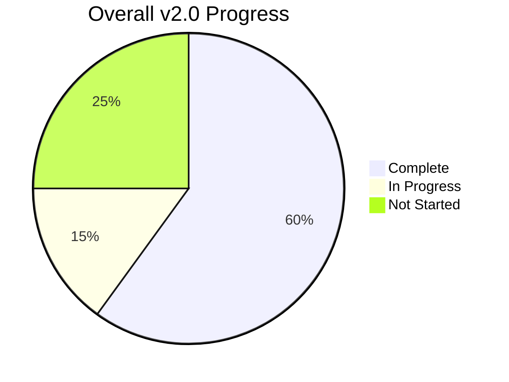
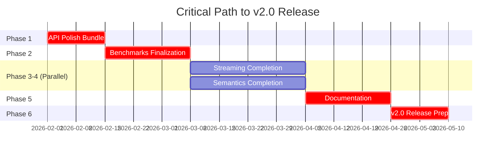
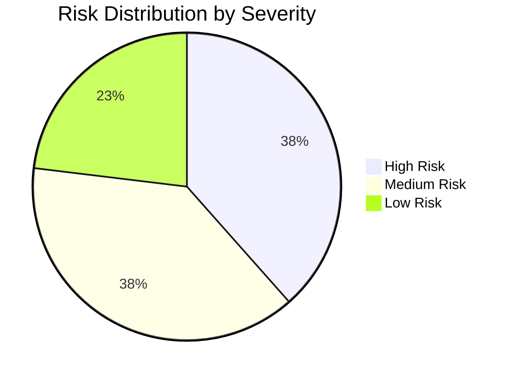
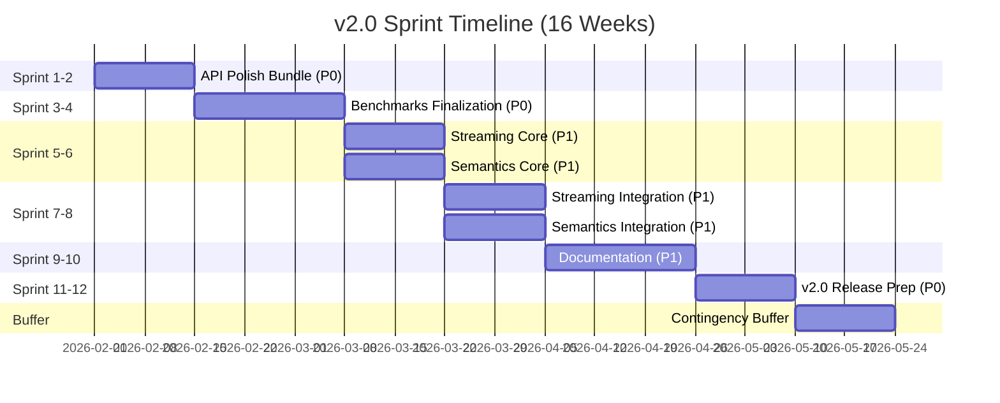
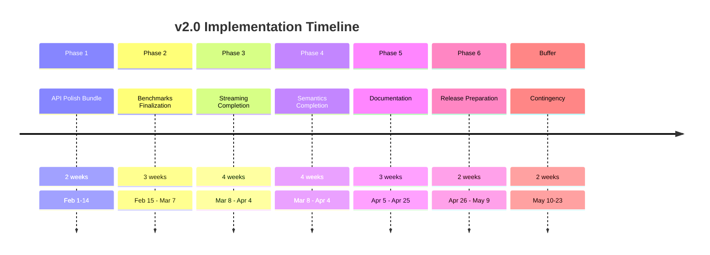
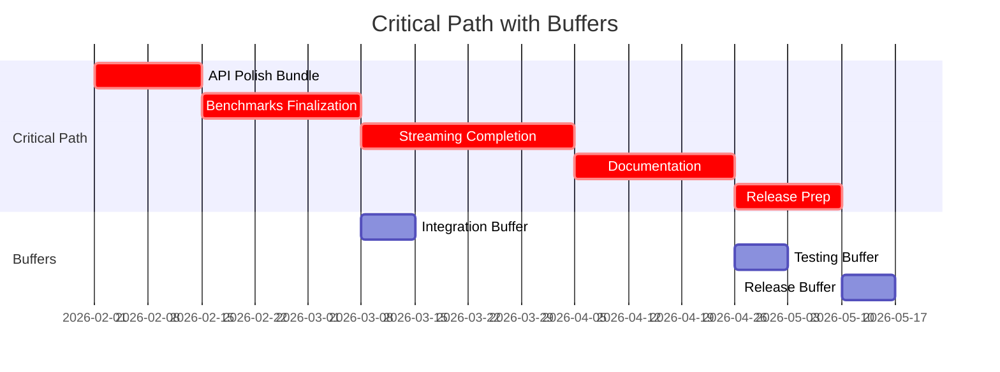

# v2.0 Executive Summary and Recommendations

**Version:** 1.0
**Created:** 2026-01-25
**Purpose:** Executive summary synthesizing current state, path to v2.0, and actionable recommendations

---

## Executive Summary

The slower-whisper project is currently at v1.9.2 with core transcription and enrichment features (v1.x) fully complete and production-ready. The v2.0 infrastructure for streaming and semantic annotation is partially implemented with protocols defined but core functionality not yet wired. The project is approximately **60% complete** toward full v2.0 implementation, with a clear path forward requiring approximately **18-24 weeks** of focused development work across 6 phases organized into 12 two-week sprints.

The critical path to v2.0 release begins with the **API Polish Bundle** (Phase 1), which unblocks all downstream work by establishing a stable API surface. This is followed by **Benchmark Finalization** (Phase 2) to establish quality gates, after which **Streaming** (Phase 3) and **Semantics** (Phase 4) tracks can proceed in parallel. The final phases focus on **Documentation** (Phase 5) and **Release Preparation** (Phase 6). The recommended team structure requires **6-8 developers** organized into specialized teams (Core API, Models & Data, Client & REST, Testing & Quality, Documentation, Release & Operations) to execute the 48 prioritized tasks efficiently.

Key risks include the complexity of WebSocket protocol implementation (ordering guarantees, backpressure), the manual effort required for golden file creation for semantic evaluation, and potential performance target misalignment. Mitigation strategies include strict contract testing, incremental implementation with validation at each step, and establishing realistic baselines before setting targets. The project has strong foundations with comprehensive documentation, existing test infrastructure, and clear success criteria defined for each component.

---

## Current State vs. Target State

### Overall Progress: 60% Complete

```mermaid
gantt
    title Overall Progress to v2.0
    dateFormat  YYYY-MM-DD
    section Complete
    Core Transcription (v1.x)       :done, comp1, 2025-01-01, 365d
    Enrichment (v1.x)              :done, comp2, 2025-01-01, 365d
    REST API (Basic)                :done, comp3, 2025-01-01, 365d
    section In Progress
    Benchmarks (Runners Complete)   :active, prog1, 2025-01-01, 365d
    Semantics (Protocol Complete)   :active, prog2, 2025-01-01, 365d
    section Not Started
    WebSocket Streaming              :todo, not1, 2026-02-01, 112d
    Semantic Integration            :todo, not2, 2026-02-01, 112d
    Documentation (v2.0 Features)    :todo, not3, 2026-02-01, 112d
```

### Component Status Comparison

| Component | Current State | Target State | Gap | Priority |
|-----------|---------------|--------------|-----|----------|
| **Core Transcription** | ✅ Complete (ASR, Diarization, Audio I/O, Chunking, Models, Exporters, CLI) | ✅ Complete | None | N/A |
| **Enrichment** | ✅ Complete (Prosody, Emotion, Speaker Analytics, Audio Rendering) | ✅ Complete | None | N/A |
| **REST API** | ⚠️ Partial - Basic endpoints exist, streaming missing | ✅ Complete with SSE streaming | SSE endpoints, session lifecycle | P1 |
| **WebSocket Streaming** | ❌ Not Implemented - Protocol designed only | ✅ Complete with all event types | Full server implementation, client, tests | P0 |
| **Semantics** | ⚠️ Partial - Protocol complete, adapters exist, wiring missing | ✅ Complete with guardrails, golden files, benchmark | Cloud/local LLM wiring, guardrails integration, golden files | P0 |
| **Benchmarks** | ⚠️ Partial - Runners complete, CI integration partial | ✅ Complete with gate mode, full datasets | CI gate mode, full dataset staging | P0 |
| **Documentation** | ⚠️ Partial - Core guides exist, v2.0 docs missing | ✅ Complete with streaming/semantic guides | Streaming API docs, semantic docs, examples | P1 |
| **Testing** | ⚠️ Partial - 191 tests passing, 57% coverage | ✅ Complete with 75%+ coverage | Coverage gaps in 15 modules, golden file tests | P1 |

### Progress Thermometer



**Progress Breakdown:**
- **Core v1.x Features:** 100% complete (ASR, Diarization, Enrichment, CLI, Exporters)
- **v2.0 Infrastructure:** 40% complete (protocols defined, implementation pending)
- **Streaming Track:** 20% complete (spec exists, server/client not implemented)
- **Semantics Track:** 50% complete (adapters exist, wiring and evaluation pending)
- **Benchmarks:** 70% complete (runners done, CI gate and datasets pending)
- **Documentation:** 60% complete (core guides done, v2.0 features pending)
- **Testing:** 60% complete (191 tests passing, coverage gaps remain)

---

## Critical Path to v2.0

### Critical Path Visualization



**Critical Path Duration:** 18 weeks (4.5 months) minimum
**With Parallel Execution:** 24 weeks (6 months) recommended

### Critical Path Tasks (P0 - Must Complete)

| Phase | Task | Duration | Dependencies | Risk |
|-------|------|----------|--------------|------|
| **Phase 1** | API Polish Bundle (6 tasks) | 2 weeks | None | Low |
| | - transcribe_bytes() API | | | |
| | - word_timestamps REST parameter | | | |
| | - Transcript convenience methods | | | |
| | - CLI word_timestamps support | | | |
| | - Word timestamps example | | | |
| | - Integration testing | | | |
| **Phase 2** | Benchmarks Finalization (7 tasks) | 3 weeks | Phase 1 | Medium |
| | - CLI subcommand wiring | | | |
| | - Dataset staging (AMI, IEMOCAP, LibriCSS) | | | |
| | - CI gate mode implementation | | | |
| | - Baseline regression detection | | | |
| | - Performance targets validation | | | |
| | - Comparison tooling | | | |
| | - Benchmark documentation | | | |
| **Phase 3** | Streaming Completion (12 tasks) | 4 weeks | Phase 1, 2 | High |
| | - WebSocket endpoint `/stream` | | | |
| | - Reference Python client | | | |
| | - Contract tests | | | |
| | - REST SSE endpoints | | | |
| | - Incremental diarization hook | | | |
| | - Session lifecycle endpoints | | | |
| | - Event ordering guarantees | | | |
| | - Backpressure contract | | | |
| | - Resume protocol | | | |
| | - FastAPI integration | | | |
| | - Integration testing | | | |
| | - Performance testing | | | |
| **Phase 4** | Semantics Completion (9 tasks) | 4 weeks | Phase 1 | High |
| | - Cloud LLM wiring to streaming | | | |
| | - Local LLM wiring to streaming | | | |
| | - Guardrails implementation | | | |
| | - Golden files creation | | | |
| | - Golden file validation tests | | | |
| | - Semantic quality benchmark | | | |
| | - Semantic CLI integration | | | |
| | - Adapter factory update | | | |
| | - Integration testing | | | |
| **Phase 5** | Documentation (9 tasks) | 3 weeks | Phases 3, 4 | Low |
| | - Streaming API documentation | | | |
| | - Schema documentation for v2.0 events | | | |
| | - Semantic adapter documentation | | | |
| | - Streaming client examples | | | |
| | - Semantic adapter examples | | | |
| | - API reference update | | | |
| | - Migration guide | | | |
| | - Quickstart guide update | | | |
| | - Example verification | | | |
| **Phase 6** | Release Preparation (8 tasks) | 2 weeks | Phase 5 | Low |
| | - CHANGELOG update | | | |
| | - Version constants update | | | |
| | - Release notes creation | | | |
| | - Test coverage validation | | | |
| | - Full test suite execution | | | |
| | - Benchmark validation | | | |
| | - Git tag and release creation | | | |
| | - Post-release verification | | | |

### Parallel Work Opportunities

| Phase | Parallel Tracks | Time Savings |
|-------|----------------|--------------|
| **Phase 1** | All 6 API polish tasks can run in parallel | 1 week |
| **Phase 2** | Dataset staging can run parallel to CLI wiring | 1 week |
| **Phase 3-4** | Streaming and Semantics can run fully in parallel | 4 weeks |
| **Phase 5** | All documentation tasks can run in parallel | 1-2 weeks |
| **Phase 6** | Release artifacts and validation can run in parallel | 1 week |

---

## Resource Requirements

### Team Structure

| Team | Focus | Size | Primary Responsibilities |
|------|-------|------|------------------------|
| **Team A** | Core API & Infrastructure | 2-3 developers | API polish, WebSocket endpoint, FastAPI integration, LLM wiring |
| **Team B** | Models & Data | 2 developers | Transcript methods, dataset staging, golden files, semantic benchmark |
| **Team C** | Client & REST | 1-2 developers | Reference client, REST SSE endpoints, session lifecycle, examples |
| **Team D** | Testing & Quality | 1-2 developers | Contract tests, integration tests, performance testing, coverage validation |
| **Team E** | Documentation | 1 developer | All documentation, examples, migration guide |
| **Team F** | Release & Operations | 1 developer | Release artifacts, CI/CD, deployment configs, post-release verification |

**Total Team Size:** 6-8 developers recommended for optimal velocity

### Timeline Summary

| Phase | Duration | Start | End | Parallel Tracks |
|-------|----------|-------|-----|-----------------|
| **Phase 1: API Polish Bundle** | 2 weeks | Week 1 | Week 2 | None (all tasks parallel) |
| **Phase 2: Benchmarks** | 3 weeks | Week 3 | Week 5 | Datasets parallel to CLI |
| **Phase 3: Streaming** | 4 weeks | Week 6 | Week 9 | Parallel with Phase 4 |
| **Phase 4: Semantics** | 4 weeks | Week 6 | Week 9 | Parallel with Phase 3 |
| **Phase 5: Documentation** | 3 weeks | Week 10 | Week 12 | All tasks parallel |
| **Phase 6: Release Prep** | 2 weeks | Week 13 | Week 14 | Artifacts parallel to validation |

**Total Duration:** 14 weeks (3.5 months) with optimal parallelization
**Recommended Buffer:** 2 weeks for contingencies
**Total Recommended Timeline:** 16 weeks (4 months)

### Resource Allocation by Sprint

| Sprint | Primary Focus | Team Allocation | Key Deliverables |
|--------|---------------|----------------|------------------|
| **Sprint 1-2** | API Polish Bundle | Teams A, B, C, E | transcribe_bytes, word_timestamps, Transcript methods, example |
| **Sprint 3-4** | Benchmarks | Teams A, B, C, D, E | CLI wiring, datasets, CI gate, comparison tooling |
| **Sprint 5-6** | Streaming Core | Teams A, C, D | WebSocket endpoint, reference client, contract tests |
| **Sprint 7-8** | Streaming + Semantics | Teams A, B, C, D, E | REST SSE, diarization, LLM wiring, golden files |
| **Sprint 9-10** | Documentation | Teams C, D, E | Streaming docs, semantic docs, examples, migration guide |
| **Sprint 11-12** | Release Prep | Teams D, F | CHANGELOG, validation, benchmarks, release |

---

## Risk Assessment and Mitigation

### High Risk Items

| Risk | Impact | Probability | Mitigation Strategy | Owner |
|------|--------|-------------|---------------------|-------|
| **WebSocket Protocol Complexity** | Could delay streaming by 2-4 weeks | Medium | Strict contract tests; incremental implementation with validation at each step; reference client developed against spec first | Team A |
| **Golden File Creation Effort** | Manual labeling could take 4-6 weeks | High | Start with small sample set (20-30%); use LLM-assisted labeling; expand incrementally; validate as files are created | Team B |
| **Semantic Benchmark Accuracy** | Metric calculations may be complex or incorrect | Medium | Leverage existing benchmark infrastructure; validate with known-good samples first; peer review calculations | Team B |
| **Performance Target Misalignment** | Targets may not be achievable, requiring adjustment | Medium | Establish realistic baselines before setting targets; measure early and adjust; document rationale for targets | Team D |
| **Cross-Track Integration Issues** | Streaming + Semantics integration may have edge cases | Medium | Early integration testing; mock dependencies; graceful degradation on errors; comprehensive error handling | Teams A, B |

### Medium Risk Items

| Risk | Impact | Probability | Mitigation Strategy | Owner |
|------|--------|-------------|---------------------|-------|
| **Dataset Staging Delays** | External dependencies, download failures | Medium | Use smoke sets for CI; document manual staging process; have backup datasets available | Team B |
| **CI Gate Blocking Legitimate Changes** | May slow development velocity | Low | Configurable thresholds; manual override with `--force` flag; clear escalation process | Team D |
| **Documentation Lagging Implementation** | Docs may not be ready for release | Medium | Write docs in parallel with implementation; doc-driven development; dedicated documentation sprint | Team E |
| **Test Coverage Gaps** | May not reach 75% overall target | Medium | Focus on critical paths first; defer non-critical module tests; use coverage tools to identify gaps | Team D |
| **Team Availability Changes** | Developer turnover or unavailability | Low | Cross-train team members; maintain clear documentation; pair programming for knowledge transfer | All Teams |

### Low Risk Items

| Risk | Impact | Probability | Mitigation Strategy | Owner |
|------|--------|-------------|---------------------|-------|
| **API Polish Complexity** | May uncover inconsistencies across interfaces | Low | Start integration testing early; fix issues immediately; maintain consistency across CLI, REST, Python API | Team A |
| **Example Script Failures** | Examples may not run without errors | Low | Verify examples as they are created; automated example testing; clear error messages | Team E |
| **Release Process Issues** | PyPI publishing, git tagging may fail | Low | Document release process; test release process on beta; have rollback plan | Team F |

### Risk Heatmap



---

## Success Metrics

### Functional Completeness Metrics

| Component | Success Criteria | Target | Measurement Method |
|-----------|------------------|--------|-------------------|
| **Core Transcription** | All v1.x features work as documented | 100% | Manual verification, test suite |
| **Enrichment** | All v1.x features work as documented | 100% | Manual verification, test suite |
| **REST API** | All endpoints functional, SSE streaming works | 100% | API tests, integration tests |
| **WebSocket Streaming** | All event types emitted, ordering guarantees met | 100% | Contract tests, integration tests |
| **Semantics** | All adapters work, guardrails enforced, benchmark functional | 100% | Golden file tests, semantic benchmark |
| **Benchmarks** | All tracks produce valid metrics, CI gate functional | 100% | Benchmark CLI, CI workflow |
| **Documentation** | All guides exist and are accurate | 100% | Manual review, example verification |
| **Testing** | Overall coverage > 75%, core > 85% | >75% | Coverage report |

### Quality Metrics

| Metric | Target | Measurement Method |
|--------|--------|-------------------|
| **ASR WER (LibriSpeech test-clean)** | < 5% | `slower-whisper benchmark run --track asr --dataset librispeech --split test-clean` |
| **Diarization DER (AMI test)** | < 15% | `slower-whisper benchmark run --track diarization --dataset ami --split test` |
| **Streaming P95 Latency** | < 500ms | `slower-whisper benchmark run --track streaming` |
| **Streaming P50 Latency** | < 50ms | Streaming benchmark runner |
| **Concurrent Streams/GPU** | > 10 | Load test with multiple WebSocket clients |
| **Semantic Topic F1** | > 0.80 | `slower-whisper benchmark run --track semantic --mode tags` |
| **Semantic Risk F1** | > 0.75 | Semantic benchmark runner |
| **Semantic Action Accuracy** | > 0.70 | Semantic benchmark runner |
| **Cloud LLM Latency P95** | < 1000ms | Semantic benchmark with cloud adapter |
| **Local LLM Latency P95** | < 500ms | Semantic benchmark with local adapter |
| **Test Coverage (Overall)** | > 75% | `pytest --cov=transcription --cov-report=term-missing` |
| **Test Coverage (Core Modules)** | > 85% | Coverage report |
| **CI Success Rate** | > 95% | GitHub Actions history |
| **Example Execution Success** | 100% | Example verification script |

### Release Readiness Checklist

| Category | Item | Status |
|----------|------|--------|
| **Core Transcription** | ASR WER < 5% on LibriSpeech | ⬜ Not Validated |
| | Diarization DER < 15% on AMI | ⬜ Not Validated |
| | RTF < 0.3x on GPU | ⬜ Not Validated |
| | Test coverage > 85% on core modules | ⬜ Not Met |
| **Enrichment** | Prosody P95 < 30ms | ⬜ Not Validated |
| | Emotion P95 < 200ms | ⬜ Not Validated |
| | Test coverage > 75% on enrichment modules | ⬜ Not Met |
| **REST API** | `/transcribe` P95 < 5s | ⬜ Not Validated |
| | `/enrich` P95 < 3s | ⬜ Not Validated |
| | API polish bundle merged | ⬜ Not Complete |
| | Test coverage > 75% on API modules | ⬜ Not Met |
| **WebSocket Streaming** | WebSocket endpoint functional | ⬜ Not Complete |
| | Event ordering guarantees verified | ⬜ Not Complete |
| | Backpressure contract implemented | ⬜ Not Complete |
| | Reference client passes tests | ⬜ Not Complete |
| | Test coverage > 80% on streaming modules | ⬜ Not Met |
| **Semantics** | Cloud LLM interface wired | ⬜ Not Complete |
| | Guardrails implemented | ⬜ Not Complete |
| | Golden files exist with > 90% coverage | ⬜ Not Complete |
| | Semantic benchmark functional | ⬜ Not Complete |
| | Local LLM backend wired | ⬜ Not Complete |
| | Test coverage > 75% on semantic modules | ⬜ Not Met |
| **Benchmarks** | CI gate mode functional | ⬜ Not Complete |
| | CLI subcommand complete | ⬜ Not Complete |
| | Baseline infrastructure stable | ⬜ Complete |
| | Test coverage > 70% on benchmark modules | ⬜ Not Met |
| **Documentation** | Streaming API docs complete | ⬜ Not Complete |
| | Word timestamps example exists | ⬜ Not Complete |
| | Schema docs updated for v2.0 | ⬜ Not Complete |
| | All examples run without errors | ⬜ Complete |
| **Testing** | Overall coverage > 75% | ⬜ Not Met |
| | Golden file tests exist | ⬜ Not Complete |
| | Pipeline unit tests exist | ⬜ Not Complete |
| | Models unit tests exist | ⬜ Not Complete |
| | Exceptions unit tests exist | ⬜ Not Complete |
| | CI success rate > 95% | ⬜ Complete |
| **Release Process** | CHANGELOG updated | ⬜ Not Complete |
| | Migration guide exists | ⬜ Complete |
| | Version tag created | ⬜ Not Complete |
| | Release notes published | ⬜ Not Complete |

---

## Next Immediate Steps (This Week)

### Week 1 Priorities

| Priority | Task | Owner | Effort | Dependencies | Deliverable |
|----------|------|-------|--------|--------------|-------------|
| **P0** | Kick off Phase 1: API Polish Bundle | Team Lead | 1 day | None | Sprint planning complete |
| **P0** | Implement `transcribe_bytes()` API | Team A | 4 days | None | Function accepts bytes, returns Transcript |
| **P0** | Add `word_timestamps` REST parameter | Team A | 2 days | None | `/transcribe` accepts `word_timestamps=true/false` |
| **P0** | Implement `Transcript` convenience methods | Team B | 4 days | None | `get_segments_by_speaker()`, `get_words_by_time_range()`, `get_turns()`, `filter_by_confidence()` |
| **P1** | Update CLI for `word_timestamps` support | Team C | 1 day | word_timestamps REST param | `--word-timestamps` flag added |
| **P1** | Start word timestamps example script | Team E | 2 days | transcribe_bytes, word_timestamps | Example demonstrates word-level alignment |

### Week 1-2 Sprint Goals

**Primary Goal:** Complete API Polish Bundle to unblock all downstream work

**Success Criteria:**
- [ ] `transcribe_bytes()` function works with bytes input
- [ ] Word timestamps parameter functional in REST API
- [ ] Example script demonstrates word-level alignment
- [ ] Transcript convenience methods implemented and tested
- [ ] CLI word_timestamps flag works
- [ ] Integration tests pass across CLI, REST, and Python API
- [ ] Local gate passes (`./scripts/ci-local.sh`)
- [ ] Test coverage maintained > 75% on affected modules

### What Can Be Done in Parallel

| Task | Can Parallel With | Rationale |
|------|------------------|-----------|
| `transcribe_bytes()` implementation | `word_timestamps` REST parameter, `Transcript` convenience methods | All API polish tasks are independent |
| `word_timestamps` REST parameter | `transcribe_bytes()`, `Transcript` methods | Independent API changes |
| `Transcript` convenience methods | `transcribe_bytes()`, `word_timestamps` REST parameter | Independent model changes |
| Word timestamps example | All API implementation tasks | Can be written against API spec |
| CLI word_timestamps support | word_timestamps REST parameter | Depends only on REST parameter |

### What Should Be Deferred

| Task | Defer Until | Rationale |
|------|-------------|-----------|
| WebSocket endpoint implementation | After Phase 1 complete | Blocked on API polish completion |
| Semantic LLM wiring | After Phase 1 complete | Blocked on API polish completion |
| Golden file creation | After Phase 2 complete | Blocked on benchmark infrastructure |
| Full documentation | After Phases 3-4 complete | Features not yet implemented |
| Performance optimization | After all features complete | Optimize based on real usage |

### How to Measure Progress This Week

| Metric | Target | Measurement Method |
|--------|--------|-------------------|
| Tasks completed | 4-5 tasks | Sprint board |
| Test coverage | Maintain > 75% | Coverage report |
| CI pass rate | 100% | GitHub Actions |
| Integration tests | All passing | Test suite |
| Code review turnaround | < 24 hours | GitHub PR review time |
| Local gate passes | 100% | `./scripts/ci-local.sh` |

---

## Key Milestones

### Milestone 1: API Surface Complete
**Target:** End of Week 2 (Sprint 1-2)

**Completion Criteria:**
- [ ] All 4 API polish issues (#70, #71, #72, #78) closed
- [ ] `transcribe_bytes()` function works with bytes input
- [ ] Word timestamps parameter functional in REST API
- [ ] Example script demonstrates word-level alignment
- [ ] Transcript convenience methods implemented and tested
- [ ] Local gate passes

**Success Metrics:**
- API adoption improved (measured by example usage)
- Developer experience enhanced (measured by convenience method usage)
- Unblocks downstream work (Phases 2-4 can start)

### Milestone 2: Benchmark Infrastructure Complete
**Target:** End of Week 5 (Sprint 3-4)

**Completion Criteria:**
- [ ] All benchmark tracks work via CLI
- [ ] Full datasets staged for all tracks
- [ ] CI gate mode functional with `--gate` flag
- [ ] Regression detection blocks failing PRs
- [ ] Performance targets validated
- [ ] Benchmark documentation complete
- [ ] Local gate passes

**Success Metrics:**
- CI quality gates established
- Performance regression detection automated
- All tracks measurable against baselines
- Unblocks streaming work (latency measurement available)

### Milestone 3: Streaming Infrastructure Complete
**Target:** End of Week 9 (Sprint 5-8)

**Completion Criteria:**
- [ ] WebSocket endpoint `/stream` functional
- [ ] Reference Python client passes all contract tests
- [ ] REST streaming endpoints (SSE) functional
- [ ] Incremental diarization hook available
- [ ] All 5 ordering guarantees verified
- [ ] Backpressure contract implemented
- [ ] Resume protocol functional
- [ ] Test coverage > 80% on streaming modules
- [ ] Local gate passes

**Success Metrics:**
- Real-time transcription capability delivered
- Event-driven architecture established
- Protocol compliance verified
- Performance targets met (P50 < 50ms, >10 streams/GPU)
- Unblocks semantic integration (events available)

### Milestone 4: Semantic Infrastructure Complete
**Target:** End of Week 9 (Sprint 5-8)

**Completion Criteria:**
- [ ] Cloud LLM interface wired to streaming pipeline
- [ ] Local LLM backend wired to streaming pipeline
- [ ] Guardrails enforce rate limits and cost budgets
- [ ] Golden files exist with > 90% coverage
- [ ] Golden file validation tests pass
- [ ] Semantic benchmark produces valid metrics
- [ ] Topic F1 > 0.80, Risk F1 > 0.75, Action Accuracy > 0.70
- [ ] Test coverage > 75% on semantic modules
- [ ] Local gate passes

**Success Metrics:**
- LLM-based semantic annotation functional
- Production safety controls in place (guardrails)
- Quality measurement established (benchmark + golden files)
- Multiple adapter options available (cloud + local)
- Performance targets met (P95 < 500ms for cloud, < 200ms for local)

### Milestone 5: Documentation Complete
**Target:** End of Week 12 (Sprint 9-10)

**Completion Criteria:**
- [ ] Streaming API documentation complete
- [ ] Schema documentation updated for v2.0 events
- [ ] Semantic adapter documentation complete
- [ ] All examples run without errors
- [ ] Migration guide for v2.0 complete
- [ ] Quickstart guide updated
- [ ] All documentation links resolve correctly
- [ ] Local gate passes

**Success Metrics:**
- Users can onboard to v2.0 features
- Developers can integrate streaming and semantics
- Migration path from v1.x clear
- All examples verified working

### Milestone 6: v2.0 Release Ready
**Target:** End of Week 14 (Sprint 11-12)

**Completion Criteria:**
- [ ] CHANGELOG.md updated with v2.0 features
- [ ] Version constants set to 2.0.0
- [ ] Release notes created
- [ ] All tests passing
- [ ] All benchmark targets met
- [ ] Test coverage targets met
- [ ] Git tag v2.0.0 created
- [ ] PyPI package published
- [ ] GitHub release created
- [ ] Installation verified

**Success Metrics:**
- v2.0.0 released to PyPI
- All v2.0 features production-ready
- Quality gates passed
- Migration path available
- Community can upgrade safely

---

## Timeline Visualization

### Sprint-by-Sprint Timeline



### Phase-by-Phase Timeline



### Critical Path with Buffers



---

## Actionable Recommendations

### What Should Be Done First (This Week)

1. **Start Phase 1: API Polish Bundle immediately**
   - Assign Team A to `transcribe_bytes()` implementation
   - Assign Team A to `word_timestamps` REST parameter
   - Assign Team B to `Transcript` convenience methods
   - Assign Team C to CLI `word_timestamps` support
   - Assign Team E to word timestamps example

2. **Establish sprint infrastructure**
   - Create sprint board with all 6 Phase 1 tasks
   - Set up daily standups for coordination
   - Establish code review process
   - Configure CI to run on all PRs

3. **Set up measurement and tracking**
   - Configure coverage reporting
   - Set up local gate (`./scripts/ci-local.sh`)
   - Establish success metrics dashboard
   - Create task completion tracking

### What Can Be Done in Parallel

**Within Phase 1 (Weeks 1-2):**
- All 6 API polish tasks can run in parallel
- Documentation can be written in parallel with implementation
- Tests can be written in parallel with code

**Within Phase 2 (Weeks 3-5):**
- Dataset staging can run parallel to CLI wiring
- Comparison tooling can run parallel to CI gate implementation
- Performance target validation can run parallel to documentation

**Within Phases 3-4 (Weeks 6-9):**
- Streaming and Semantics can run fully in parallel
- Within Streaming: WebSocket endpoint, reference client, REST SSE can all run in parallel
- Within Semantics: Cloud LLM, local LLM, guardrails can all run in parallel

**Within Phase 5 (Weeks 10-12):**
- All documentation tasks can run in parallel
- Examples can be verified as they are created

**Within Phase 6 (Weeks 13-14):**
- Release artifacts and validation can run in parallel

### What Should Be Deferred

**Defer to v2.1+:**
- Full incremental diarization (basic hook sufficient for v2.0)
- Additional cloud LLM backends (OpenAI and Anthropic sufficient)
- Advanced semantic features (intent detection, sentiment trajectory)
- Domain-specific prompts (clinical/legal domains)
- Async callback support (sync callbacks sufficient)
- WebSocket subprotocol auth (Bearer token header sufficient)
- Advanced backpressure (basic backpressure sufficient)
- Domain packs (plugin architecture for v3.0)

**Defer until later phases:**
- WebSocket implementation (wait for Phase 1 complete)
- Semantic LLM wiring (wait for Phase 1 complete)
- Golden file creation (wait for Phase 2 complete)
- Full documentation (wait for Phases 3-4 complete)
- Performance optimization (wait for all features complete)

### How to Measure Progress

**Weekly Metrics:**
- Tasks completed vs. planned
- Test coverage percentage
- CI pass rate
- Code review turnaround time
- Bug count and severity

**Phase Metrics:**
- All phase completion criteria met
- All phase success criteria achieved
- Phase deliverables complete
- Phase blockers resolved

**Overall Metrics:**
- Percentage of v2.0 tasks complete
- Percentage of milestones achieved
- Time remaining vs. planned
- Risk mitigation effectiveness

**Quality Metrics:**
- Test coverage (target: >75% overall, >85% core)
- Benchmark performance (all targets met)
- CI success rate (target: >95%)
- Bug rate (target: <1 critical bug per sprint)

---

## Summary and Next Steps

### Key Takeaways

1. **Project is 60% complete** with strong foundations in core transcription and enrichment
2. **Critical path is clear:** API Polish → Benchmarks → (Streaming || Semantics) → Documentation → Release
3. **Recommended timeline:** 16 weeks (4 months) with buffers for contingencies
4. **Team requirement:** 6-8 developers organized into specialized teams
5. **Parallel work opportunities:** Significant, especially in Phases 3-4 and within each phase
6. **Key risks:** WebSocket complexity, golden file effort, performance target alignment
7. **Success criteria:** Clearly defined for each component with measurable metrics

### Immediate Action Items (This Week)

1. **Kick off Phase 1** with sprint planning and task assignment
2. **Start API Polish Bundle** with all 6 tasks running in parallel
3. **Set up tracking** for progress measurement and risk monitoring
4. **Establish communication** channels and coordination processes
5. **Configure CI/CD** for automated testing and validation

### Recommended Approach

1. **Follow the critical path** but leverage parallel work opportunities
2. **Prioritize P0 tasks** that unblock other work
3. **Establish quality gates early** (Phase 2) to prevent regressions
4. **Write documentation in parallel** with implementation
5. **Monitor risks closely** and adjust plans as needed
6. **Maintain focus on success criteria** and measurable outcomes

### Success Factors

1. **Complete Phase 1 first** to unblock all downstream work
2. **Execute Phases 3 and 4 in parallel** to save 4 weeks
3. **Establish CI gates in Phase 2** to maintain quality
4. **Start documentation in Phase 5** while features are fresh
5. **Allocate dedicated time** for release prep in Phase 6
6. **Maintain 2-week buffer** for contingencies

---

**Document Version:** 1.0
**Last Updated:** 2026-01-25
**Next Review:** After Phase 1 completion (Week 2)
