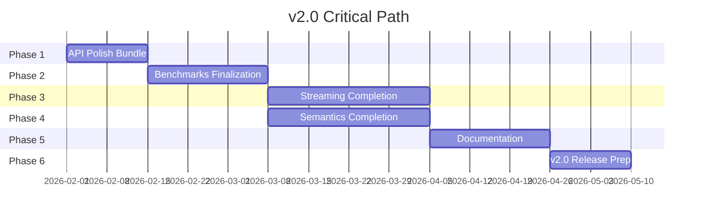

# v2.0 Implementation Roadmap

**Version:** 1.0
**Created:** 2026-01-25
**Purpose:** Comprehensive implementation roadmap from current state (v1.9.2) to fully implemented v2.0

---

## Executive Summary

This roadmap defines the phased approach to achieve v2.0 release readiness. The roadmap is organized into 6 phases, with clear dependencies, acceptance criteria, and risk levels for each task.

**Current State (v1.9.2):**
- Core Transcription (v1.x): ✅ Complete
- Enrichment (v1.x): ✅ Complete
- REST API: ⚠️ Partial - Basic endpoints exist, streaming missing
- WebSocket Streaming: ⚠️ Partial - Protocol designed, not implemented
- Semantics: ⚠️ Partial - Protocol complete, adapters missing wiring
- Benchmarks: ⚠️ Partial - Runners complete, CI integration partial
- Documentation: ⚠️ Partial - Core guides exist, streaming/semantic docs missing
- Testing: ⚠️ Partial - 191 tests passing, coverage gaps identified

**Critical Path:** API Polish Bundle → Track 1 (Benchmarks) → Track 2 (Streaming) & Track 3 (Semantics) → Documentation → v2.0 Release

---

## Phase 1: API Polish Bundle

**Goal:** Complete API surface polish to unblock downstream work and improve developer experience.

**Status:** 📋 Ready to Start

**Duration:** ~1-2 weeks

**Dependencies:** None (unblocks all other tracks)

### Tasks

| ID | Task | Effort | Dependencies | Acceptance Criteria | Risk |
|-----|-------|---------|--------------|------------------|------|
| 1.1 | Implement `transcribe_bytes()` API | Medium | None | - Function accepts bytes input and returns Transcript<br>- Works with all audio formats (WAV, MP3, M4A, FLAC, OGG)<br>- Test coverage > 80%<br>- Documented in API reference | Low |
| 1.2 | Add `word_timestamps` REST parameter | Small | None | - `/transcribe` endpoint accepts `word_timestamps=true/false`<br>- Parameter documented in OpenAPI spec<br>- Returns word-level timestamps in response<br>- Integration tests pass | Low |
| 1.3 | Create word-level timestamps example | Small | 1.1, 1.2 | - Example script demonstrates word-level alignment<br>- Shows speaker-word alignment<br>- Runs without errors<br>- Documented in examples README | Low |
| 1.4 | Implement `Transcript` convenience methods | Medium | None | - `get_segments_by_speaker()` method added<br>- `get_words_by_time_range()` method added<br>- `get_turns()` method added<br>- `filter_by_confidence()` method added<br>- All methods tested | Low |
| 1.5 | Update CLI for word_timestamps support | Small | 1.2 | - `--word-timestamps` flag added to CLI<br>- Works consistently with REST API<br>- Help text updated | Low |
| 1.6 | Integration testing across CLI, REST, Python API | Medium | 1.1-1.5 | - All three interfaces produce consistent results<br>- Word timestamps work identically across all interfaces<br>- Local gate passes (`./scripts/ci-local.sh`) | Low |

### Files Modified

- [`transcription/api.py`](transcription/api.py) - REST endpoints
- [`transcription/pipeline.py`](transcription/pipeline.py) - transcribe_bytes() implementation
- [`transcription/models.py`](transcription/models.py) - Transcript convenience methods
- [`transcription/cli.py`](transcription/cli.py) - CLI word_timestamps flag
- [`examples/word_timestamps_example.py`](examples/word_timestamps_example.py) - New example

### Phase 1 Completion Criteria

- [ ] All 4 API polish issues (#70, #71, #72, #78) closed
- [ ] `transcribe_bytes()` function works with bytes input
- [ ] Word timestamps parameter functional in REST API
- [ ] Example script demonstrates word-level alignment
- [ ] Transcript convenience methods implemented and tested
- [ ] Local gate passes (`./scripts/ci-local.sh`)
- [ ] Test coverage maintained > 75% on affected modules

---

## Phase 2: Track 1 - Benchmarks Finalization

**Goal:** Complete benchmark infrastructure with CI gate mode for production quality gates.

**Status:** 🔄 In Progress - Evaluation runners complete, CI integration remaining

**Duration:** ~2-3 weeks

**Dependencies:** Phase 1 (API Polish Bundle)

### Tasks

| ID | Task | Effort | Dependencies | Acceptance Criteria | Risk |
|-----|-------|---------|--------------|------------------|------|
| 2.1 | Complete CLI subcommand wiring for all tracks | Medium | None | - `slower-whisper benchmark list` works<br>- `slower-whisper benchmark status` works<br>- `slower-whisper benchmark run` works for all tracks<br>- `slower-whisper benchmark compare` works<br>- `slower-whisper benchmark save-baseline` works | Low |
| 2.2 | Stage full benchmark datasets (AMI, IEMOCAP, LibriCSS) | Medium | None | - AMI test split staged<br>- IEMOCAP staged<br>- LibriCSS staged<br>- Dataset manifests validated<br>- Smoke sets committed to repo | Medium |
| 2.3 | Implement CI gate mode with `--gate` flag | Medium | 2.1 | - `--gate` flag implemented<br>- Fails CI on regression exceeding threshold<br>- Configurable per-metric thresholds<br>- PR comments show gate status | Medium |
| 2.4 | Add baseline regression detection to CI workflow | Medium | 2.3 | - GitHub Actions workflow updated<br>- Gate mode enabled on main branch<br>- Regression detection functional<br>- Failing PRs are blocked | Medium |
| 2.5 | Create benchmark result comparison tooling | Small | 2.1 | - `compare_results.py` script works<br>- Shows before/after metrics<br>- Highlights regressions<br>- Generates comparison report | Low |
| 2.6 | Add performance targets validation | Small | 2.1, 2.3 | - ASR WER < 5% validated<br>- Diarization DER < 15% validated<br>- Streaming P95 < 500ms validated<br>- Semantic Topic F1 > 0.80 validated | Low |
| 2.7 | Update benchmark documentation | Medium | 2.1-2.6 | - All CLI options documented<br>- Dataset setup instructions complete<br>- Metric definitions updated<br>- Examples provided | Low |

### Files Modified

- [`transcription/benchmark_cli.py`](transcription/benchmark_cli.py) - CLI wiring
- [`benchmarks/`](benchmarks/) - Dataset staging
- [`.github/workflows/ci.yml`](.github/workflows/ci.yml) - CI gate mode
- [`benchmarks/compare_results.py`](benchmarks/compare_results.py) - New comparison tool
- [`docs/BENCHMARKS.md`](docs/BENCHMARKS.md) - Updated documentation

### Phase 2 Completion Criteria

- [ ] All benchmark tracks (ASR, diarization, streaming, emotion, semantic) work via CLI
- [ ] Full datasets staged for all tracks
- [ ] CI gate mode functional with `--gate` flag
- [ ] Regression detection blocks failing PRs
- [ ] Performance targets validated
- [ ] Benchmark documentation complete
- [ ] Local gate passes

---

## Phase 3: Track 2 - Streaming Completion

**Goal:** Implement WebSocket streaming server with real-time event delivery.

**Status:** 📋 Ready to Start (Blocked on Phase 1, 2)

**Duration:** ~3-4 weeks

**Dependencies:** Phase 1 (API Polish Bundle), Phase 2 (Benchmarks - for latency measurement)

### Tasks

| ID | Task | Effort | Dependencies | Acceptance Criteria | Risk |
|-----|-------|---------|--------------|------------------|------|
| 3.1 | Implement WebSocket endpoint `/stream` | Large | None | - WebSocket endpoint accepts connections<br>- Session lifecycle management works<br>- Event emission functional<br>- Backpressure handling implemented | High |
| 3.2 | Implement reference Python client | Medium | 3.1 | - Client connects to WebSocket<br>- Sends START_SESSION, AUDIO_CHUNK, END_SESSION<br>- Receives and parses all event types<br>- Handles RESUME_SESSION on reconnect | Medium |
| 3.3 | Implement contract tests for WebSocket protocol | Medium | 3.1, 3.2 | - All 5 ordering guarantees verified<br>- Backpressure contract tested<br>- Resume protocol tested<br>- 100% contract compliance | Medium |
| 3.4 | Implement REST streaming endpoints (SSE) | Medium | 3.1 | - `/stream/sessions` POST endpoint works<br>- SSE events for real-time transcription<br>- Session management endpoints work<br>- Integration tests pass | Medium |
| 3.5 | Implement incremental diarization hook | Large | 3.1 | - DiarizationHook protocol functional<br>- Hook integrates with streaming session<br>- DIARIZATION_UPDATE events emitted<br>- Speaker assignments applied to segments | High |
| 3.6 | Add session lifecycle endpoints | Medium | 3.1, 3.4 | - `/stream/sessions` POST creates sessions<br>- `/stream/sessions/{id}/status` GET returns status<br>- `/stream/sessions/{id}` DELETE closes sessions<br>- OpenAPI docs updated | Low |
| 3.7 | Implement event ordering guarantees | Medium | 3.1 | - Monotonic event_id verified<br>- PARTIAL before FINALIZED verified<br>- Monotonic FINALIZED timestamps verified<br>- SPEAKER_TURN after FINALIZED verified<br>- No out-of-order events | Medium |
| 3.8 | Implement backpressure contract | Medium | 3.1 | - Configurable buffer_size (default 100)<br>- drop_policy configurable (default partial_first)<br>- FINALIZED never dropped<br>- SEMANTIC_UPDATE drops after PARTIAL<br>- ERROR events on buffer overflow | Medium |
| 3.9 | Implement resume protocol | Medium | 3.1 | - RESUME_SESSION message handled<br>- last_event_id replay from buffer<br>- RESUME_GAP error on gap<br>- Replay buffer TTL (default 300s) | Medium |
| 3.10 | Add WebSocket server to FastAPI app | Medium | 3.1 | - WebSocket route registered<br>- CORS configured<br>- Connection lifecycle managed<br>- Error handling complete | Low |
| 3.11 | Integration testing with reference client | Large | 3.1-3.10 | - End-to-end streaming works<br>- All event types received<br>- Ordering guarantees verified<br>- Backpressure tested<br>- Resume tested | High |
| 3.12 | Performance testing and optimization | Medium | 3.11 | - Latency P50 < 50ms achieved<br>- Concurrent streams > 10 per GPU<br>- Memory usage stable<br>- No memory leaks | Medium |

### Files Modified

- [`transcription/api.py`](transcription/api.py) - WebSocket endpoint, REST streaming
- [`transcription/streaming_ws.py`](transcription/streaming_ws.py) - WebSocket session implementation
- [`transcription/streaming_client.py`](transcription/streaming_client.py) - Reference client
- [`tests/test_streaming_ws.py`](tests/test_streaming_ws.py) - Contract tests
- [`tests/test_streaming_client.py`](tests/test_streaming_client.py) - Client tests
- [`examples/websocket_client_example.py`](examples/websocket_client_example.py) - Client example

### Phase 3 Completion Criteria

- [ ] WebSocket endpoint `/stream` functional
- [ ] Reference Python client passes all contract tests
- [ ] REST streaming endpoints (SSE) functional
- [ ] Incremental diarization hook available
- [ ] All 5 ordering guarantees verified
- [ ] Backpressure contract implemented
- [ ] Resume protocol functional
- [ ] Test coverage > 80% on streaming modules
- [ ] Local gate passes

---

## Phase 4: Track 3 - Semantics Completion

**Goal:** Complete semantic adapters with guardrails, golden files, and benchmark.

**Status:** 🔄 In Progress - Protocol complete, wiring remaining

**Duration:** ~3-4 weeks

**Dependencies:** Phase 1 (API Polish Bundle), Phase 2 (Benchmarks - for semantic benchmark)

### Tasks

| ID | Task | Effort | Dependencies | Acceptance Criteria | Risk |
|-----|-------|---------|--------------|------------------|------|
| 4.1 | Wire cloud LLM interface to streaming pipeline | Medium | None | - OpenAI adapter integrated with streaming<br>- Anthropic adapter integrated with streaming<br>- SEMANTIC_UPDATE events emitted<br>- Adapter health checks work | Medium |
| 4.2 | Wire local LLM backend to streaming pipeline | Medium | None | - LocalLLMSemanticAdapter integrated<br>- Works without cloud API access<br>- SEMANTIC_UPDATE events emitted<br>- Performance targets met (P95 < 500ms) | Medium |
| 4.3 | Implement guardrails (#91) | Medium | None | - Rate limiting enforced (default 60 rpm)<br>- Cost budget enforced (default $1.00)<br>- PII detection functional<br>- All guardrails tested | Low |
| 4.4 | Create golden files (#92) | Large | None | - > 90% of samples have gold labels<br>- AMI samples labeled (topics, risks, actions)<br>- Golden files validate against schema<br>- Contract tests pass | High |
| 4.5 | Create golden file validation tests | Medium | 4.4 | - Schema validation tests pass<br>- Coverage validation tests pass<br>- Missing fields detected<br>- Invalid formats rejected | Medium |
| 4.6 | Implement semantic quality benchmark (#98) | Large | 4.4, 4.5 | - Topic F1 calculation correct<br>- Risk F1 calculation correct<br>- Action accuracy calculation correct<br>- LLM-as-judge mode functional | High |
| 4.7 | Add semantic benchmark CLI integration | Medium | 4.6 | - `slower-whisper benchmark run --track semantic` works<br>- Both tags and summary modes work<br>- Baseline comparison functional | Low |
| 4.8 | Update semantic adapter factory | Small | 4.1, 4.2 | - All adapters available via factory<br>- Provider selection works<br>- Default adapter configurable | Low |
| 4.9 | Integration testing with streaming | Medium | 3.1-4.8 | - Cloud LLM works in streaming context<br>- Local LLM works in streaming context<br>- Guardrails enforced in streaming<br>- Semantic events arrive correctly | Medium |

### Files Modified

- [`transcription/streaming_semantic.py`](transcription/streaming_semantic.py) - Streaming integration
- [`transcription/semantic_adapter.py`](transcription/semantic_adapter.py) - Factory update
- [`transcription/llm_guardrails.py`](transcription/llm_guardrails.py) - Guardrails (already complete)
- [`benchmarks/gold/semantic/`](benchmarks/gold/semantic/) - Golden files
- [`tests/test_semantic_golden_files.py`](tests/test_semantic_golden_files.py) - Golden file tests
- [`benchmarks/eval_semantic.py`](benchmarks/eval_semantic.py) - Semantic benchmark runner

### Phase 4 Completion Criteria

- [ ] Cloud LLM interface wired to streaming pipeline
- [ ] Local LLM backend wired to streaming pipeline
- [ ] Guardrails enforce rate limits and cost budgets
- [ ] Golden files exist with > 90% coverage
- [ ] Golden file validation tests pass
- [ ] Semantic benchmark produces valid metrics
- [ ] Topic F1 > 0.80, Risk F1 > 0.75, Action Accuracy > 0.70
- [ ] Test coverage > 75% on semantic modules
- [ ] Local gate passes

---

## Phase 5: Documentation & Examples

**Goal:** Complete documentation for all v2.0 features with working examples.

**Status:** 📋 Ready to Start (Blocked on Phases 1-4)

**Duration:** ~2-3 weeks

**Dependencies:** Phases 1-4 (all feature implementation complete)

### Tasks

| ID | Task | Effort | Dependencies | Acceptance Criteria | Risk |
|-----|-------|---------|--------------|------------------|------|
| 5.1 | Create streaming API documentation (#55) | Medium | 3 | - Complete streaming protocol reference<br>- WebSocket endpoint documentation<br>- Client integration examples<br>- Error handling patterns<br>- Security posture documented | Low |
| 5.2 | Update schema documentation for v2.0 events | Medium | 3 | - Event envelope schema documented<br>- All event types documented<br>- JSON schema examples provided<br>- ID contracts documented | Low |
| 5.3 | Create semantic adapter documentation | Medium | 4 | - All adapters documented (local, local-llm, openai, anthropic)<br>- Configuration options documented<br>- Usage examples provided<br>- Guardrails documentation | Low |
| 5.4 | Create streaming client examples | Medium | 3, 5.1 | - Python client example<br>- JavaScript client example<br>- WebSocket connection example<br>- Event handling examples | Low |
| 5.5 | Create semantic adapter examples | Medium | 4, 5.3 | - Cloud LLM adapter example<br>- Local LLM adapter example<br>- Guardrails configuration example<br>- Error handling examples | Low |
| 5.6 | Update API reference documentation | Medium | 1, 3, 5.1 | - All new endpoints documented<br>- Request/response schemas updated<br>- Examples updated<br>- Deprecation notices added | Low |
| 5.7 | Verify all examples run without errors | Medium | 5.1-5.6 | - All example scripts execute<br>- No errors in examples<br>- Output matches documentation | Medium |
| 5.8 | Update migration guide for v2.0 | Medium | 1, 5.1 | - v1.x to v2.0 migration documented<br>- Breaking changes listed<br>- Migration steps clear<br>- Rollback instructions | Low |
| 5.9 | Update quickstart guide | Small | 5.1-5.8 | - v2.0 features included<br>- Streaming quickstart added<br>- Semantic quickstart added<br>- Installation verified | Low |

### Files Modified

- [`docs/STREAMING_API.md`](docs/STREAMING_API.md) - New streaming docs
- [`docs/SCHEMA.md`](docs/SCHEMA.md) - Updated schema docs
- [`docs/SEMANTIC_ADAPTERS.md`](docs/SEMANTIC_ADAPTERS.md) - New semantic docs
- [`docs/API_REFERENCE.md`](docs/API_REFERENCE.md) - Updated API reference
- [`docs/MIGRATION_V2.md`](docs/MIGRATION_V2.md) - New migration guide
- [`examples/websocket_client_example.py`](examples/websocket_client_example.py) - WebSocket examples
- [`examples/semantic_adapter_example.py`](examples/semantic_adapter_example.py) - Semantic examples

### Phase 5 Completion Criteria

- [ ] Streaming API documentation complete
- [ ] Schema documentation updated for v2.0 events
- [ ] Semantic adapter documentation complete
- [ ] All examples run without errors
- [ ] Migration guide for v2.0 complete
- [ ] Quickstart guide updated
- [ ] All documentation links resolve correctly
- [ ] Local gate passes

---

## Phase 6: v2.0 Release Preparation

**Goal:** Prepare for v2.0 release with all quality gates passed.

**Status:** 📋 Ready to Start (Blocked on Phases 1-5)

**Duration:** ~1-2 weeks

**Dependencies:** Phases 1-5 (all implementation complete)

### Tasks

| ID | Task | Effort | Dependencies | Acceptance Criteria | Risk |
|-----|-------|---------|--------------|------------------|------|
| 6.1 | Update CHANGELOG.md with v2.0 features | Small | 5 | - All new features listed<br>- Breaking changes documented<br>- Migration notes included<br>- Version bump to 2.0.0 | Low |
| 6.2 | Update version constants | Small | 6.1 | - `transcription.__version__` set to 2.0.0<br>- Schema version updated<br>- Release date set | Low |
| 6.3 | Create v2.0 release notes | Medium | 6.1 | - Feature summary written<br>- Known issues listed<br>- Upgrade instructions provided<br>- Download links ready | Low |
| 6.4 | Final test coverage validation | Medium | 1-5 | - Overall coverage > 75% achieved<br>- Core modules > 85% achieved<br>- All gaps addressed | Medium |
| 6.5 | Run full test suite and fix any failures | Medium | 6.4 | - All 191+ tests pass<br>- No new test failures<br>- Integration tests pass | Medium |
| 6.6 | Run benchmark validation on all tracks | Medium | 2, 4, 6.5 | - ASR WER < 5% validated<br>- Diarization DER < 15% validated<br>- Streaming P95 < 500ms validated<br>- Semantic Topic F1 > 0.80 validated | Medium |
| 6.7 | Create and tag v2.0.0 release | Small | 6.1-6.6 | - Git tag created<br>- Release published<br>- PyPI package uploaded<br>- GitHub release created | Low |
| 6.8 | Post-release verification | Small | 6.7 | - Installation from PyPI works<br>- Quickstart guide verified<br>- No critical bugs reported | Low |

### Files Modified

- [`CHANGELOG.md`](CHANGELOG.md) - Release notes
- [`transcription/__init__.py`](transcription/__init__.py) - Version constant
- [`transcription/schemas/__init__.py`](transcription/schemas/__init__.py) - Schema version
- [`docs/RELEASE_NOTES_V2.md`](docs/RELEASE_NOTES_V2.md) - New release notes
- [`.github/workflows/release.yml`](.github/workflows/release.yml) - Release workflow

### Phase 6 Completion Criteria

- [ ] CHANGELOG.md updated with v2.0 features
- [ ] Version constants set to 2.0.0
- [ ] Release notes created
- [ ] All tests passing
- [ ] All benchmark targets met
- [ ] Test coverage targets met
- [ ] Git tag v2.0.0 created
- [ ] PyPI package published
- [ ] GitHub release created
- [ ] Installation verified

---

## Dependency Graph

```mermaid
graph TD
    subgraph Phase 1 [API Polish Bundle]
        P1_1[1.1 transcribe_bytes API]
        P1_2[1.2 word_timestamps REST param]
        P1_3[1.3 Word timestamps example]
        P1_4[1.4 Transcript convenience methods]
        P1_5[1.5 CLI word_timestamps]
        P1_6[1.6 Integration testing]

    subgraph Phase 2 [Track 1 Benchmarks]
        P2_1[2.1 CLI subcommand wiring]
        P2_2[2.2 Stage full datasets]
        P2_3[2.3 CI gate mode]
        P2_4[2.4 Baseline regression detection]
        P2_5[2.5 Comparison tooling]
        P2_6[2.6 Performance targets]
        P2_7[2.7 Benchmark documentation]

    subgraph Phase 3 [Track 2 Streaming]
        P3_1[3.1 WebSocket endpoint]
        P3_2[3.2 Reference Python client]
        P3_3[3.3 Contract tests]
        P3_4[3.4 REST SSE endpoints]
        P3_5[3.5 Incremental diarization]
        P3_6[3.6 Session lifecycle]
        P3_7[3.7 Event ordering]
        P3_8[3.8 Backpressure]
        P3_9[3.9 Resume protocol]
        P3_10[3.10 Add to FastAPI]
        P3_11[3.11 Integration testing]
        P3_12[3.12 Performance testing]

    subgraph Phase 4 [Track 3 Semantics]
        P4_1[4.1 Cloud LLM wiring]
        P4_2[4.2 Local LLM wiring]
        P4_3[4.3 Guardrails]
        P4_4[4.4 Golden files]
        P4_5[4.5 Golden file tests]
        P4_6[4.6 Semantic benchmark]
        P4_7[4.7 Semantic CLI integration]
        P4_8[4.8 Adapter factory]
        P4_9[4.9 Integration testing]

    subgraph Phase 5 [Documentation]
        P5_1[5.1 Streaming API docs]
        P5_2[5.2 Schema documentation]
        P5_3[5.3 Semantic adapter docs]
        P5_4[5.4 Streaming client examples]
        P5_5[5.5 Semantic adapter examples]
        P5_6[5.6 API reference update]
        P5_7[5.7 Verify examples]
        P5_8[5.8 Migration guide]
        P5_9[5.9 Quickstart update]

    subgraph Phase 6 [v2.0 Release Prep]
        P6_1[6.1 Update CHANGELOG]
        P6_2[6.2 Version constants]
        P6_3[6.3 Release notes]
        P6_4[6.4 Test coverage validation]
        P6_5[6.5 Run full test suite]
        P6_6[6.6 Benchmark validation]
        P6_7[6.7 Create and tag release]
        P6_8[6.8 Post-release verification]

    %% Dependencies
    Phase 1 --> Phase 2
    Phase 2 --> Phase 3
    Phase 2 --> Phase 4
    Phase 3 --> Phase 5
    Phase 4 --> Phase 5
    Phase 5 --> Phase 6

    %% Internal dependencies
    P1_1 --> P1_4
    P1_2 --> P1_5
    P1_2 --> P1_6
    P1_3 --> P1_6
    P1_4 --> P1_6

    P2_1 --> P2_3
    P2_3 --> P2_4
    P2_6 --> P2_4

    P3_1 --> P3_10
    P3_2 --> P3_3
    P3_3 --> P3_11
    P3_4 --> P3_10
    P3_5 --> P3_11
    P3_7 --> P3_8
    P3_8 --> P3_11
    P3_9 --> P3_11
    P3_10 --> P3_11
    P3_11 --> P3_12

    P4_1 --> P4_9
    P4_2 --> P4_9
    P4_3 --> P4_9
    P4_6 --> P4_9
    P4_7 --> P4_9
    P4_8 --> P4_9
    P4_9 --> P4_9

    P5_1 --> P5_7
    P5_2 --> P5_7
    P5_3 --> P5_7
    P5_4 --> P5_7
    P5_5 --> P5_7
    P5_6 --> P5_7
    P5_9 --> P5_7

    P6_1 --> P6_3
    P6_2 --> P6_3
    P6_3 --> P6_7
    P6_4 --> P6_5
    P6_5 --> P6_6
    P6_6 --> P6_7
    P6_7 --> P6_8
```

---

## Critical Path to v2.0

The critical path (minimum time to v2.0) follows this sequence:



**Critical Path Duration:** ~18 weeks (4.5 months)

---

## Parallel Work Opportunities

### Parallelizable Within Phases

| Phase | Parallel Tasks | Notes |
|-------|----------------|-------|
| **Phase 1** | P1.1, P1.2, P1.3, P1.4 can be done in parallel | All API polish tasks are independent |
| **Phase 2** | P2.2 (dataset staging) can be done while P2.1 (CLI wiring) in progress | Dataset staging is independent of CLI code |
| **Phase 2** | P2.5, P2.6, P2.7 can be done in parallel | Tooling and validation are independent |
| **Phase 3** | P3.2 (reference client) can be done while P3.1 (WebSocket endpoint) in progress | Client can be developed against spec |
| **Phase 3** | P3.3 (contract tests) can be developed in parallel with implementation | Tests can be written from spec |
| **Phase 3** | P3.4 (REST SSE) can be done in parallel with P3.1 (WebSocket) | REST endpoints are separate from WebSocket |
| **Phase 3** | P3.5 (incremental diarization) can be done in parallel with core streaming | Diarization is a pluggable hook |
| **Phase 3** | P3.7, P3.8, P3.9 (ordering, backpressure, resume) can be done in parallel | These are independent concerns |
| **Phase 4** | P4.1 (cloud LLM) and P4.2 (local LLM) can be done in parallel | Both adapters are independent |
| **Phase 4** | P4.4 (golden files) and P4.5 (golden tests) can be done in parallel | Tests can validate files as they're created |
| **Phase 4** | P4.6 (semantic benchmark) can be started once P4.4 has initial golden files | Benchmark can iterate as golden files grow |
| **Phase 5** | P5.1 (streaming docs), P5.2 (schema docs), P5.3 (semantic docs) can be done in parallel | Documentation is independent |
| **Phase 5** | P5.4 (streaming examples) and P5.5 (semantic examples) can be done in parallel | Examples are independent |
| **Phase 6** | P6.4 (test coverage) and P6.5 (test suite) can be done in parallel | Independent validation activities |

### Cross-Phase Parallel Opportunities

| Tracks | Can Work in Parallel | Notes |
|---------|---------------------|-------|
| **Track 2 (Streaming)** and **Track 3 (Semantics)** | After Phase 1 complete, both tracks can proceed independently | Streaming doesn't block semantics and vice versa |
| **Track 2 (Streaming)** and **Phase 5 (Documentation)** | Documentation can be written against streaming spec | Docs don't need streaming to be complete |
| **Track 3 (Semantics)** and **Phase 5 (Documentation)** | Documentation can be written against semantic spec | Docs don't need semantics to be complete |

### Recommended Parallel Execution Strategy

1. **Phase 1 (Week 1-2):** Execute all API polish tasks in parallel
2. **Phase 2 Start (Week 3):** Begin benchmarks work once Phase 1 complete
3. **Phase 3 & 4 Start (Week 6):** Begin streaming and semantics in parallel after Phase 2 complete
4. **Phase 5 Start (Week 10):** Begin documentation once streaming and semantics have initial deliverables
5. **Phase 6 (Week 12):** Begin release prep once all implementation complete

---

## Milestones

### Milestone 1: API Surface Complete

**Target:** End of Phase 1 (Week 2)

**Completion Criteria:**
- [ ] All 4 API polish issues (#70, #71, #72, #78) closed
- [ ] `transcribe_bytes()` function works with bytes input
- [ ] Word timestamps parameter functional in REST API
- [ ] Example script demonstrates word-level alignment
- [ ] Transcript convenience methods implemented and tested
- [ ] Local gate passes

**Success Metrics:**
- API adoption improved (measured by example usage)
- Developer experience enhanced (measured by convenience method usage)
- Unblocks downstream work (Phases 2-4 can start)

---

### Milestone 2: Benchmark Infrastructure Complete

**Target:** End of Phase 2 (Week 5)

**Completion Criteria:**
- [ ] All benchmark tracks work via CLI
- [ ] Full datasets staged for all tracks
- [ ] CI gate mode functional with `--gate` flag
- [ ] Regression detection blocks failing PRs
- [ ] Performance targets validated
- [ ] Benchmark documentation complete
- [ ] Local gate passes

**Success Metrics:**
- CI quality gates established
- Performance regression detection automated
- All tracks measurable against baselines
- Unblocks streaming work (latency measurement available)

---

### Milestone 3: Streaming Infrastructure Complete

**Target:** End of Phase 3 (Week 10)

**Completion Criteria:**
- [ ] WebSocket endpoint `/stream` functional
- [ ] Reference Python client passes all contract tests
- [ ] REST streaming endpoints (SSE) functional
- [ ] Incremental diarization hook available
- [ ] All 5 ordering guarantees verified
- [ ] Backpressure contract implemented
- [ ] Resume protocol functional
- [ ] Test coverage > 80% on streaming modules
- [ ] Local gate passes

**Success Metrics:**
- Real-time transcription capability delivered
- Event-driven architecture established
- Protocol compliance verified
- Performance targets met (P50 < 50ms, >10 streams/GPU)
- Unblocks semantic integration (events available)

---

### Milestone 4: Semantic Infrastructure Complete

**Target:** End of Phase 4 (Week 14)

**Completion Criteria:**
- [ ] Cloud LLM interface wired to streaming pipeline
- [ ] Local LLM backend wired to streaming pipeline
- [ ] Guardrails enforce rate limits and cost budgets
- [ ] Golden files exist with > 90% coverage
- [ ] Golden file validation tests pass
- [ ] Semantic benchmark produces valid metrics
- [ ] Topic F1 > 0.80, Risk F1 > 0.75, Action Accuracy > 0.70
- [ ] Test coverage > 75% on semantic modules
- [ ] Local gate passes

**Success Metrics:**
- LLM-based semantic annotation functional
- Production safety controls in place (guardrails)
- Quality measurement established (benchmark + golden files)
- Multiple adapter options available (cloud + local)
- Performance targets met (P95 < 500ms for cloud, < 200ms for local)

---

### Milestone 5: Documentation Complete

**Target:** End of Phase 5 (Week 13)

**Completion Criteria:**
- [ ] Streaming API documentation complete
- [ ] Schema documentation updated for v2.0 events
- [ ] Semantic adapter documentation complete
- [ ] All examples run without errors
- [ ] Migration guide for v2.0 complete
- [ ] Quickstart guide updated
- [ ] All documentation links resolve correctly
- [ ] Local gate passes

**Success Metrics:**
- Users can onboard to v2.0 features
- Developers can integrate streaming and semantics
- Migration path from v1.x clear
- All examples verified working

---

### Milestone 6: v2.0 Release Ready

**Target:** End of Phase 6 (Week 15)

**Completion Criteria:**
- [ ] CHANGELOG.md updated with v2.0 features
- [ ] Version constants set to 2.0.0
- [ ] Release notes created
- [ ] All tests passing
- [ ] All benchmark targets met
- [ ] Test coverage targets met
- [ ] Git tag v2.0.0 created
- [ ] PyPI package published
- [ ] GitHub release created
- [ ] Installation verified

**Success Metrics:**
- v2.0.0 released to PyPI
- All v2.0 features production-ready
- Quality gates passed
- Migration path available
- Community can upgrade safely

---

## Task Summary Table

| ID | Phase | Task | Effort | Priority | Dependencies | Risk |
|-----|-------|-------|----------|--------------|------|
| 1.1 | 1 | transcribe_bytes() API | Medium | P0 | None | Low |
| 1.2 | 1 | word_timestamps REST param | Small | P0 | None | Low |
| 1.3 | 1 | Word timestamps example | Small | 1.1, 1.2 | Low |
| 1.4 | 1 | Transcript convenience methods | Medium | None | Low |
| 1.5 | 1 | CLI word_timestamps | Small | 1.2 | Low |
| 1.6 | 1 | Integration testing | Medium | 1.1-1.5 | Low |
| 2.1 | 2 | CLI subcommand wiring | Medium | 1 | None | Low |
| 2.2 | 2 | Stage full datasets | Medium | None | Medium |
| 2.3 | 2 | CI gate mode | Medium | 2.1 | Medium |
| 2.4 | 2 | Baseline regression detection | Medium | 2.3 | Medium |
| 2.5 | 2 | Comparison tooling | Small | 2.1 | Low |
| 2.6 | 2 | Performance targets | Small | 2.1, 2.3 | Low |
| 2.7 | 2 | Benchmark documentation | Medium | 2.1-2.6 | Low |
| 3.1 | 3 | WebSocket endpoint | Large | 1, 2 | High |
| 3.2 | 3 | Reference Python client | Medium | 3.1 | Medium |
| 3.3 | 3 | Contract tests | Medium | 3.1, 3.2 | Medium |
| 3.4 | 3 | REST SSE endpoints | Medium | 3.1 | Medium |
| 3.5 | 3 | Incremental diarization | Large | 3.1 | High |
| 3.6 | 3 | Session lifecycle | Medium | 3.1, 3.4 | Low |
| 3.7 | 3 | Event ordering | Medium | 3.1 | Medium |
| 3.8 | 3 | Backpressure | Medium | 3.1 | Medium |
| 3.9 | 3 | Resume protocol | Medium | 3.1 | Medium |
| 3.10 | 3 | Add to FastAPI | Medium | 3.1 | Low |
| 3.11 | 3 | Integration testing | Large | 3.1-3.10 | High |
| 3.12 | 3 | Performance testing | Medium | 3.11 | Medium |
| 4.1 | 4 | Cloud LLM wiring | Medium | 1 | None | Medium |
| 4.2 | 4 | Local LLM wiring | Medium | 1 | None | Medium |
| 4.3 | 4 | Guardrails | Medium | None | Low |
| 4.4 | 4 | Golden files | Large | None | High |
| 4.5 | 4 | Golden file tests | Medium | 4.4 | Medium |
| 4.6 | 4 | Semantic benchmark | Large | 4.4, 4.5 | High |
| 4.7 | 4 | Semantic CLI integration | Medium | 4.6 | Low |
| 4.8 | 4 | Adapter factory | Small | 4.1, 4.2 | Low |
| 4.9 | 4 | Integration testing | Medium | 4.1-4.8 | Medium |
| 5.1 | 5 | Streaming API docs | Medium | 3 | None | Low |
| 5.2 | 5 | Schema documentation | Medium | 3 | None | Low |
| 5.3 | 5 | Semantic adapter docs | Medium | 4 | None | Low |
| 5.4 | 5 | Streaming client examples | Medium | 3, 5.1 | Low |
| 5.5 | 5 | Semantic adapter examples | Medium | 4, 5.3 | Low |
| 5.6 | 5 | API reference update | Medium | 1, 3, 5.1 | Low |
| 5.7 | 5 | Verify examples | Medium | 5.1-5.6 | Medium |
| 5.8 | 5 | Migration guide | Medium | 1, 5.1 | Low |
| 5.9 | 5 | Quickstart update | Small | 5.1-5.8 | Low |
| 6.1 | 6 | Update CHANGELOG | Small | 5 | None | Low |
| 6.2 | 6 | Version constants | Small | 6.1 | None | Low |
| 6.3 | 6 | Release notes | Medium | 6.1 | None | Low |
| 6.4 | 6 | Test coverage validation | Medium | 1-5 | Medium |
| 6.5 | 6 | Run full test suite | Medium | 6.4 | Medium |
| 6.6 | 6 | Benchmark validation | Medium | 2, 4, 6.5 | Medium |
| 6.7 | 6 | Create and tag release | Small | 6.1-6.6 | Low |
| 6.8 | 6 | Post-release verification | Small | 6.7 | Low |

**Priority Legend:**
- **P0:** Critical - Must complete before any other work
- **P1:** High - High priority, unblocks other work
- **P2:** Medium - Important for completeness
- **P3:** Low - Nice to have, can defer

**Effort Legend:**
- **Small:** 1-3 days
- **Medium:** 4-7 days
- **Large:** 8-14 days

**Risk Legend:**
- **Low:** Well-understood, low complexity
- **Medium:** Some uncertainty or complexity
- **High:** Significant uncertainty or high complexity

---

## Risk Assessment

### High Risk Items

| Risk | Impact | Mitigation |
|-------|----------|------------|
| **Incremental diarization complexity** (Task 3.5) | Could delay streaming completion | Implement basic hook first, defer full incremental diarization to v2.1+ |
| **Golden file creation effort** (Task 4.4) | Large manual effort required | Start with small sample set, expand incrementally; use LLM-assisted labeling |
| **Semantic benchmark accuracy** (Task 4.6) | Metric calculations may be complex | Leverage existing benchmark infrastructure; validate with known-good samples first |
| **WebSocket protocol complexity** (Tasks 3.7-3.9) | Ordering and backpressure are tricky | Strict contract tests; incremental implementation with validation at each step |
| **Cross-track integration** (Tasks 4.1, 4.2) | Wiring semantics to streaming may have edge cases | Comprehensive integration testing; graceful degradation on errors |

### Medium Risk Items

| Risk | Impact | Mitigation |
|-------|----------|------------|
| **Dataset staging** (Task 2.2) | External dependencies, download failures | Use smoke sets for CI; document manual staging process |
| **CI gate mode** (Task 2.3) | May block legitimate changes | Configurable thresholds; allow manual override with `--force` flag |
| **Performance targets** (Task 2.6, 3.12, 4.6) | Targets may not be achievable | Establish realistic baselines first; adjust targets based on measurements |
| **Documentation completeness** (Task 5.1-5.9) | Docs may lag implementation | Write docs in parallel with implementation; use doc-driven development |
| **Test coverage gaps** (Task 6.4) | May not reach 75% overall | Focus on critical paths first; defer non-critical module tests |

---

## Success Metrics for v2.0

### Functional Completeness

| Component | Target | Measurement |
|-----------|--------|-------------|
| Core Transcription | ✅ Already complete | All v1.x features work as documented |
| Enrichment | ✅ Already complete | All v1.x features work as documented |
| REST API | All endpoints documented and functional | API documentation accuracy verified |
| WebSocket Streaming | All event types emitted with ordering guarantees | Contract tests pass 100% |
| Semantics | All adapters work with guardrails | Golden file coverage > 90% |
| Benchmarks | All tracks produce valid metrics | CI gate mode functional |
| Documentation | All guides exist and are accurate | All examples run without errors |
| Testing | Overall coverage > 75%, core > 85% | Coverage report validates |

### Quality Metrics

| Metric | Target | Measurement |
|---------|--------|-------------|
| ASR WER (LibriSpeech test-clean) | < 5% | `slower-whisper benchmark run --track asr --dataset librispeech --split test-clean` |
| Diarization DER (AMI test) | < 15% | `slower-whisper benchmark run --track diarization --dataset ami --split test` |
| Streaming P95 latency | < 500ms | `slower-whisper benchmark run --track streaming` |
| Streaming P50 latency | < 50ms | Streaming benchmark runner reports P50 |
| Concurrent streams/GPU | > 10 | Load test with multiple WebSocket clients |
| Semantic Topic F1 | > 0.80 | `slower-whisper benchmark run --track semantic --mode tags` |
| Semantic Risk F1 | > 0.75 | Semantic benchmark runner reports Risk F1 |
| Semantic Action Accuracy | > 0.70 | Semantic benchmark runner reports Action Accuracy |
| Cloud LLM latency P95 | < 1000ms | Semantic benchmark with cloud adapter |
| Local LLM latency P95 | < 500ms | Semantic benchmark with local adapter |

### Release Readiness

| Criterion | Target | Measurement |
|-----------|--------|-------------|
| All v2.0 features work as documented | 100% | Manual verification |
| All benchmark targets met | 100% | Automated validation |
| Test coverage > 75% overall | Yes | Coverage report |
| Test coverage > 85% core | Yes | Coverage report |
| All examples run without errors | 100% | Example verification script |
| Migration path clear | Yes | User follows migration guide |
| CHANGELOG updated | Yes | Release notes in CHANGELOG |
| Version tag created | Yes | Git tag v2.0.0 exists |
| PyPI published | Yes | Package installable from PyPI |

---

## Appendix: Issue Mapping

This roadmap maps tasks to the GitHub issues referenced in the project:

| Phase | Issue | Title | Status |
|-------|--------|-------|--------|
| **Phase 1** | #70 | `transcribe_bytes()` API | Open |
| | #71 | `word_timestamps` REST parameter | Open |
| | #72 | Word-level timestamps example | Open |
| | #78 | `Transcript` convenience methods | Open |
| **Phase 2** | #95 | ASR WER runner | ✅ Complete |
| | #137 | Baseline file format | ✅ Complete |
| | #97 | Streaming latency harness | ✅ Complete |
| | #96 | Diarization DER runner | ✅ Complete |
| | #99 | CI integration | ⚠️ Partial (Phase 2.3-2.4) |
| **Phase 3** | #133 | Event envelope spec | ✅ Complete (in docs) |
| | #134 | Reference Python client | Open |
| | #84 | WebSocket endpoint | Open |
| | #85 | REST streaming endpoints | Open |
| | #55 | Streaming API docs | Open |
| | #86 | Incremental diarization | Open |
| **Phase 4** | #88 | LLM annotation schema | ✅ Complete |
| | #90 | Cloud LLM interface | ⚠️ Partial (adapters exist, wiring needed - Task 4.1, 4.2) |
| | #91 | Guardrails | ✅ Complete (in code) |
| | #92 | Golden files | Open |
| | #89 | Local LLM backend | ⚠️ Partial (adapter exists, wiring needed - Task 4.2) |
| | #98 | Semantic quality benchmark | Open |

---

## Conclusion

This roadmap provides a clear path from the current v1.9.2 state to a fully implemented v2.0 release. The critical path spans approximately 18 weeks (4.5 months), with significant parallel work opportunities to accelerate delivery.

**Key Success Factors:**
1. **Phase 1 (API Polish Bundle)** unblocks all downstream work and should be completed first
2. **Phase 2 (Benchmarks)** provides quality gates for all subsequent work
3. **Phases 3 and 4 (Streaming & Semantics)** can proceed in parallel after Phase 2
4. **Phase 5 (Documentation)** can begin once initial implementations are available
5. **Phase 6 (Release Prep)** finalizes the v2.0 release

**Next Steps:**
1. Begin Phase 1 tasks immediately
2. Establish regular milestone reviews
3. Track progress against this roadmap
4. Adjust based on learnings and blockers

---

**Document Version:** 1.0
**Last Updated:** 2026-01-25
