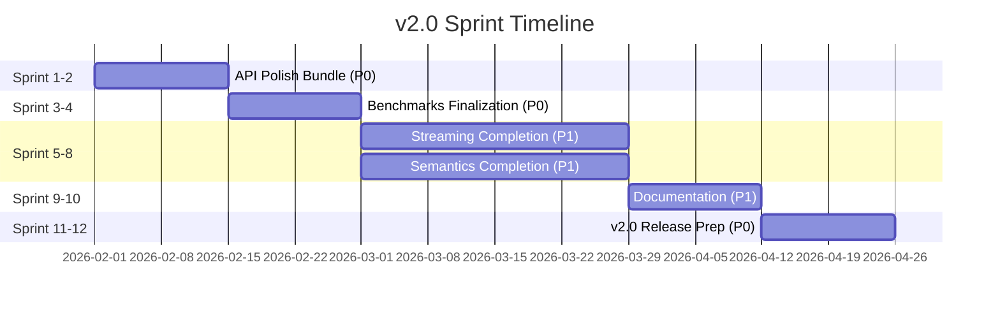
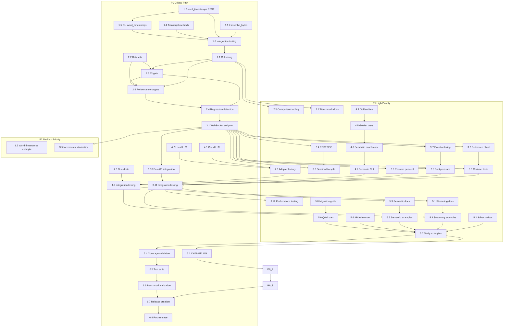

# v2.0 Prioritized Task Execution Plan

**Version:** 1.0
**Created:** 2026-01-25
**Purpose:** Prioritized execution plan for v2.0 implementation with sprint breakdown, team allocation, and task dependencies

---

## Executive Summary

This document provides a prioritized execution plan for the v2.0 implementation roadmap, organizing 48 tasks across 6 phases into 12 two-week sprints. The plan defines priority levels (P0-P3), identifies parallel work opportunities, and provides team allocation suggestions to optimize delivery velocity.

**Timeline:** 12 sprints (24 weeks) to v2.0 release
**Total Tasks:** 48
**Critical Path:** Phase 1 → Phase 2 → (Phase 3 || Phase 4) → Phase 5 → Phase 6

---

## Priority Level Definitions

| Priority | Definition | Criteria | Examples |
|----------|------------|----------|----------|
| **P0** | Critical | Blocks release or critical path; must complete before dependent work | API polish, CI gates, release prep |
| **P1** | High | Unblocks significant features; core user-facing functionality | Streaming core, semantics core, benchmarks |
| **P2** | Medium | Important for completeness; enhances quality or usability | Documentation, examples, validation |
| **P3** | Low | Nice to have; can defer to post-v2.0 | Optional features, nice-to-have polish |

---

## Sprint Overview

---

## Sprint-by-Sprint Execution Plan

### Sprint 1-2: API Polish Bundle (P0)

**Goal:** Complete API surface polish to unblock all downstream work

**Team Allocation:**
- **Team A (API/CLI):** 2 developers - Tasks 1.1, 1.2, 1.5
- **Team B (Models/Testing):** 2 developers - Tasks 1.4, 1.6
- **Team C (Examples):** 1 developer - Task 1.3

**Deliverables:**
- `transcribe_bytes()` API functional
- Word timestamps parameter in REST API
- Transcript convenience methods implemented
- CLI word_timestamps flag
- Word timestamps example
- Integration tests passing

| Task | Priority | Effort | Blocking | Unblocks | Team Size | Rationale |
|------|----------|--------|----------|----------|-----------|-----------|
| 1.1 | P0 | Medium | None | 1.3, 1.6, all downstream | 1 dev | Core API function; unblocks bytes input workflow |
| 1.2 | P0 | Small | None | 1.3, 1.5, 1.6 | 1 dev | REST parameter; enables word-level alignment |
| 1.4 | P0 | Medium | None | 1.6, downstream convenience usage | 1 dev | Developer experience; widely used methods |
| 1.5 | P0 | Small | 1.2 | 1.6 | 1 dev | CLI parity with REST API |
| 1.3 | P0 | Small | 1.1, 1.2 | None | 1 dev | User-facing example; demonstrates new features |
| 1.6 | P0 | Medium | 1.1-1.5 | Phase 2 start | 2 devs | Integration gate; ensures consistency across interfaces |

**Parallel Work:**
- Tasks 1.1, 1.2, 1.4 can start immediately in parallel
- Task 1.5 starts after 1.2
- Task 1.3 starts after 1.1 and 1.2
- Task 1.6 starts after all others

**Quick Wins in Sprint 1-2:**
- Task 1.2 (word_timestamps REST param) - Small effort, high impact
- Task 1.5 (CLI word_timestamps) - Small effort, completes API parity

---

### Sprint 3-4: Track 1 Benchmarks (P0)

**Goal:** Complete benchmark infrastructure with CI gate mode

**Team Allocation:**
- **Team A (CLI/Infrastructure):** 2 developers - Tasks 2.1, 2.3, 2.4
- **Team B (Datasets):** 1 developer - Task 2.2
- **Team C (Tooling/Docs):** 1 developer - Tasks 2.5, 2.6, 2.7

**Deliverables:**
- All benchmark CLI subcommands working
- Full datasets staged
- CI gate mode with `--gate` flag
- Baseline regression detection
- Comparison tooling
- Performance targets validated
- Benchmark documentation complete

| Task | Priority | Effort | Blocking | Unblocks | Team Size | Rationale |
|------|----------|--------|----------|----------|-----------|-----------|
| 2.1 | P0 | Medium | None | 2.3, 2.5, 2.6, 2.7 | 1 dev | CLI foundation; all benchmark work depends on this |
| 2.2 | P0 | Medium | None | 2.3, 2.6, all tracks | 1 dev | Dataset staging; required for all benchmark runs |
| 2.3 | P0 | Medium | 2.1 | 2.4, 2.6, CI gate | 1 dev | Quality gate; prevents regressions |
| 2.4 | P0 | Medium | 2.3 | Phase 3 latency measurement | 1 dev | CI integration; blocks failing PRs |
| 2.5 | P1 | Small | 2.1 | None | 1 dev | Developer tooling; nice-to-have comparison |
| 2.6 | P0 | Small | 2.1, 2.3 | 2.4, release validation | 1 dev | Quality targets; defines success criteria |
| 2.7 | P1 | Medium | 2.1-2.6 | None | 1 dev | Documentation; enables self-service benchmarking |

**Parallel Work:**
- Tasks 2.1 and 2.2 can start immediately in parallel
- Task 2.3 starts after 2.1
- Task 2.4 starts after 2.3
- Tasks 2.5, 2.6, 2.7 can start after 2.1 and 2.3

**Quick Wins in Sprint 3-4:**
- Task 2.5 (comparison tooling) - Small effort, independent
- Task 2.6 (performance targets) - Small effort, defines success

---

### Sprint 5-8: Track 2 Streaming (P1) + Track 3 Semantics (P1) in Parallel

#### Streaming Track (Sprint 5-8)

**Team Allocation:**
- **Team A (Core Streaming):** 2 developers - Tasks 3.1, 3.10, 3.7, 3.8, 3.9
- **Team B (Client/REST):** 1 developer - Tasks 3.2, 3.4, 3.6
- **Team C (Testing):** 1 developer - Tasks 3.3, 3.11, 3.12
- **Team D (Diarization):** 1 developer - Task 3.5

**Deliverables:**
- WebSocket endpoint `/stream` functional
- Reference Python client
- Contract tests passing
- REST SSE endpoints
- Incremental diarization hook
- Session lifecycle endpoints
- Event ordering guarantees
- Backpressure contract
- Resume protocol
- Integration tests passing
- Performance targets met

| Task | Priority | Effort | Blocking | Unblocks | Team Size | Rationale |
|------|----------|--------|----------|----------|-----------|-----------|
| 3.1 | P0 | Large | Phase 1, 2 | 3.2, 3.3, 3.4, 3.5, 3.6, 3.7, 3.8, 3.9, 3.10 | 2 devs | Core WebSocket; foundation for all streaming |
| 3.10 | P0 | Medium | 3.1 | 3.11 | 1 dev | FastAPI integration; required for deployment |
| 3.2 | P1 | Medium | 3.1 | 3.3, 3.11 | 1 dev | Reference client; enables testing and examples |
| 3.4 | P1 | Medium | 3.1 | 3.6, 3.11 | 1 dev | REST alternative; provides SSE streaming |
| 3.6 | P1 | Medium | 3.1, 3.4 | 3.11 | 1 dev | Session management; required for production |
| 3.7 | P1 | Medium | 3.1 | 3.8, 3.11 | 1 dev | Ordering guarantees; critical for correctness |
| 3.8 | P1 | Medium | 3.1 | 3.11 | 1 dev | Backpressure; prevents memory issues |
| 3.9 | P1 | Medium | 3.1 | 3.11 | 1 dev | Resume protocol; handles reconnections |
| 3.3 | P1 | Medium | 3.1, 3.2 | 3.11 | 1 dev | Contract tests; ensures protocol compliance |
| 3.11 | P0 | Large | 3.1-3.10 | 3.12, Phase 5 docs | 1 dev | End-to-end validation; critical for quality |
| 3.12 | P1 | Medium | 3.11 | Release validation | 1 dev | Performance targets; defines production readiness |
| 3.5 | P2 | Large | 3.1 | 3.11 | 1 dev | Incremental diarization; complex, can defer |

**Parallel Work:**
- Task 3.1 starts Sprint 5 (2 devs)
- Task 3.2, 3.4, 3.7, 3.8, 3.9 can start after 3.1 (Sprint 5-6)
- Task 3.6 starts after 3.1 and 3.4 (Sprint 6)
- Task 3.3 starts after 3.1 and 3.2 (Sprint 6)
- Task 3.10 starts after 3.1 (Sprint 6)
- Task 3.11 starts after all others (Sprint 7-8)
- Task 3.12 starts after 3.11 (Sprint 8)
- Task 3.5 can run in parallel with 3.7-3.9 (Sprint 6-7)

**Quick Wins in Streaming Track:**
- Task 3.6 (session lifecycle) - Medium effort, independent
- Task 3.10 (FastAPI integration) - Medium effort, straightforward

#### Semantics Track (Sprint 5-8)

**Team Allocation:**
- **Team A (Adapters):** 2 developers - Tasks 4.1, 4.2, 4.8
- **Team B (Golden Files):** 2 developers - Tasks 4.4, 4.5
- **Team C (Benchmark):** 1 developer - Tasks 4.6, 4.7
- **Team D (Guardrails):** 1 developer - Task 4.3
- **Team E (Testing):** 1 developer - Task 4.9

**Deliverables:**
- Cloud LLM interface wired to streaming
- Local LLM backend wired to streaming
- Guardrails enforced
- Golden files with >90% coverage
- Golden file validation tests
- Semantic benchmark functional
- Semantic CLI integration
- Adapter factory updated
- Integration tests passing

| Task | Priority | Effort | Blocking | Unblocks | Team Size | Rationale |
|------|----------|--------|----------|----------|-----------|-----------|
| 4.1 | P0 | Medium | Phase 1 | 4.8, 4.9 | 1 dev | Cloud LLM integration; primary use case |
| 4.2 | P0 | Medium | Phase 1 | 4.8, 4.9 | 1 dev | Local LLM integration; offline capability |
| 4.3 | P0 | Medium | None | 4.9, production safety | 1 dev | Guardrails; critical for cost/safety |
| 4.4 | P1 | Large | None | 4.5, 4.6, 4.9 | 2 devs | Golden files; required for benchmark |
| 4.5 | P1 | Medium | 4.4 | 4.6, 4.9 | 1 dev | Validation; ensures golden file quality |
| 4.6 | P1 | Large | 4.4, 4.5 | 4.7, release validation | 1 dev | Semantic benchmark; defines quality metrics |
| 4.7 | P1 | Medium | 4.6 | 4.9 | 1 dev | CLI integration; enables self-service testing |
| 4.8 | P1 | Small | 4.1, 4.2 | 4.9 | 1 dev | Factory pattern; clean adapter selection |
| 4.9 | P0 | Medium | 4.1-4.8 | Phase 5 docs, release validation | 1 dev | Integration testing; validates end-to-end |

**Parallel Work:**
- Tasks 4.1, 4.2, 4.3, 4.4 can start immediately (Sprint 5)
- Task 4.5 starts after 4.4 (Sprint 6-7)
- Task 4.6 starts after 4.4 and 4.5 (Sprint 7)
- Task 4.7 starts after 4.6 (Sprint 8)
- Task 4.8 starts after 4.1 and 4.2 (Sprint 6)
- Task 4.9 starts after all others (Sprint 8)

**Quick Wins in Semantics Track:**
- Task 4.3 (guardrails) - Medium effort, already mostly complete
- Task 4.8 (adapter factory) - Small effort, straightforward

---

### Sprint 9-10: Documentation (P1)

**Goal:** Complete documentation for all v2.0 features

**Team Allocation:**
- **Team A (Streaming Docs):** 1 developer - Tasks 5.1, 5.2, 5.4
- **Team B (Semantic Docs):** 1 developer - Tasks 5.3, 5.5
- **Team C (API/General):** 1 developer - Tasks 5.6, 5.8, 5.9
- **Team D (Verification):** 1 developer - Task 5.7

**Deliverables:**
- Streaming API documentation
- Schema documentation for v2.0 events
- Semantic adapter documentation
- Streaming client examples
- Semantic adapter examples
- API reference updated
- Migration guide
- Quickstart guide updated
- All examples verified

| Task | Priority | Effort | Blocking | Unblocks | Team Size | Rationale |
|------|----------|--------|----------|----------|-----------|-----------|
| 5.1 | P1 | Medium | Phase 3 | 5.4, 5.7 | 1 dev | Streaming docs; enables user adoption |
| 5.2 | P1 | Medium | Phase 3 | 5.7 | 1 dev | Schema docs; critical for integration |
| 5.3 | P1 | Medium | Phase 4 | 5.5, 5.7 | 1 dev | Semantic docs; enables LLM feature adoption |
| 5.4 | P1 | Medium | Phase 3, 5.1 | 5.7 | 1 dev | Client examples; practical guidance |
| 5.5 | P1 | Medium | Phase 4, 5.3 | 5.7 | 1 dev | Semantic examples; practical guidance |
| 5.6 | P1 | Medium | Phase 1, 3, 5.1 | 5.7 | 1 dev | API reference; comprehensive documentation |
| 5.8 | P1 | Medium | Phase 1, 5.1 | 5.9, 5.7 | 1 dev | Migration guide; critical for upgrades |
| 5.9 | P1 | Small | 5.1-5.8 | 5.7 | 1 dev | Quickstart; first user experience |
| 5.7 | P1 | Medium | 5.1-5.6 | Release readiness | 1 dev | Example verification; ensures quality |

**Parallel Work:**
- Tasks 5.1, 5.2, 5.3, 5.6, 5.8 can start immediately (Sprint 9)
- Tasks 5.4, 5.5 start after 5.1 and 5.3 (Sprint 9-10)
- Task 5.9 starts after 5.1-5.8 (Sprint 10)
- Task 5.7 starts after 5.1-5.6 (Sprint 10)

**Quick Wins in Sprint 9-10:**
- Task 5.9 (quickstart update) - Small effort, high impact
- Task 5.2 (schema documentation) - Medium effort, straightforward

---

### Sprint 11-12: v2.0 Release Prep (P0)

**Goal:** Prepare for v2.0 release with all quality gates passed

**Team Allocation:**
- **Team A (Release Artifacts):** 1 developer - Tasks 6.1, 6.2, 6.3, 6.7
- **Team B (Quality Validation):** 2 developers - Tasks 6.4, 6.5, 6.6
- **Team C (Post-Release):** 1 developer - Task 6.8

**Deliverables:**
- CHANGELOG.md updated
- Version constants set to 2.0.0
- Release notes created
- Test coverage validated
- All tests passing
- All benchmarks validated
- Git tag v2.0.0 created
- PyPI package published
- GitHub release created
- Installation verified

| Task | Priority | Effort | Blocking | Unblocks | Team Size | Rationale |
|------|----------|--------|----------|----------|-----------|-----------|
| 6.1 | P0 | Small | Phase 5 | 6.2, 6.3, 6.7 | 1 dev | CHANGELOG; release communication |
| 6.2 | P0 | Small | 6.1 | 6.3 | 1 dev | Version bump; required for release |
| 6.3 | P0 | Medium | 6.1, 6.2 | 6.7 | 1 dev | Release notes; user-facing announcement |
| 6.4 | P0 | Medium | Phase 1-5 | 6.5, 6.7 | 1 dev | Coverage validation; quality gate |
| 6.5 | P0 | Medium | 6.4 | 6.6, 6.7 | 1 dev | Test suite; critical for quality |
| 6.6 | P0 | Medium | Phase 2, 4, 6.5 | 6.7 | 1 dev | Benchmark validation; performance gate |
| 6.7 | P0 | Small | 6.1-6.6 | 6.8 | 1 dev | Release creation; final step |
| 6.8 | P0 | Small | 6.7 | None | 1 dev | Post-release verification; ensures success |

**Parallel Work:**
- Tasks 6.1, 6.4 can start immediately (Sprint 11)
- Tasks 6.2, 6.3 start after 6.1 (Sprint 11)
- Task 6.5 starts after 6.4 (Sprint 11-12)
- Task 6.6 starts after 6.5 (Sprint 12)
- Task 6.7 starts after 6.1-6.6 (Sprint 12)
- Task 6.8 starts after 6.7 (Sprint 12)

**Quick Wins in Sprint 11-12:**
- Task 6.1 (CHANGELOG) - Small effort, straightforward
- Task 6.2 (version constants) - Small effort, mechanical

---

## Prioritized Task Matrix

| Task ID | Description | Priority | Effort | Dependencies | Sprint | Team Size | Blocking | Unblocked By |
|---------|-------------|----------|--------|--------------|--------|-----------|----------|--------------|
| **Phase 1: API Polish Bundle** | | | | | | | | |
| 1.1 | Implement `transcribe_bytes()` API | P0 | Medium | None | 1-2 | 1 dev | 1.3, 1.6, Phase 2-6 | None |
| 1.2 | Add `word_timestamps` REST parameter | P0 | Small | None | 1-2 | 1 dev | 1.3, 1.5, 1.6 | None |
| 1.4 | Implement `Transcript` convenience methods | P0 | Medium | None | 1-2 | 1 dev | 1.6, downstream usage | None |
| 1.5 | Update CLI for word_timestamps support | P0 | Small | 1.2 | 1-2 | 1 dev | 1.6 | 1.2 |
| 1.3 | Create word-level timestamps example | P0 | Small | 1.1, 1.2 | 1-2 | 1 dev | None | 1.1, 1.2 |
| 1.6 | Integration testing across CLI, REST, Python API | P0 | Medium | 1.1-1.5 | 1-2 | 2 devs | Phase 2 start | 1.1, 1.2, 1.4, 1.5 |
| **Phase 2: Track 1 Benchmarks** | | | | | | | | |
| 2.1 | Complete CLI subcommand wiring for all tracks | P0 | Medium | None | 3-4 | 1 dev | 2.3, 2.5, 2.6, 2.7 | None |
| 2.2 | Stage full benchmark datasets (AMI, IEMOCAP, LibriCSS) | P0 | Medium | None | 3-4 | 1 dev | 2.3, 2.6, all tracks | None |
| 2.3 | Implement CI gate mode with `--gate` flag | P0 | Medium | 2.1 | 2.4, 2.6 | 1 dev | 2.4 | 2.1 |
| 2.4 | Add baseline regression detection to CI workflow | P0 | Medium | 2.3 | Phase 3 latency | 1 dev | Phase 3 latency measurement | 2.3 |
| 2.6 | Add performance targets validation | P0 | Small | 2.1, 2.3 | 2.4, release | 1 dev | 2.4, 6.6 | 2.1, 2.3 |
| 2.5 | Create benchmark result comparison tooling | P1 | Small | 2.1 | None | 1 dev | None | 2.1 |
| 2.7 | Update benchmark documentation | P1 | Medium | 2.1-2.6 | None | 3-4 | 1 dev | None | 2.1, 2.3, 2.6 |
| **Phase 3: Track 2 Streaming** | | | | | | | | |
| 3.1 | Implement WebSocket endpoint `/stream` | P0 | Large | Phase 1, 2 | 3.2, 3.3, 3.4, 3.5, 3.6, 3.7, 3.8, 3.9, 3.10 | 5-8 | 2 devs | All streaming tasks | Phase 1, 2 |
| 3.10 | Add WebSocket server to FastAPI app | P0 | Medium | 3.1 | 3.11 | 5-8 | 1 dev | 3.11 | 3.1 |
| 3.2 | Implement reference Python client | P1 | Medium | 3.1 | 3.3, 3.11 | 5-8 | 1 dev | 3.3, 3.11 | 3.1 |
| 3.4 | Implement REST streaming endpoints (SSE) | P1 | Medium | 3.1 | 3.6, 3.11 | 5-8 | 1 dev | 3.6, 3.11 | 3.1 |
| 3.6 | Add session lifecycle endpoints | P1 | Medium | 3.1, 3.4 | 3.11 | 5-8 | 1 dev | 3.11 | 3.1, 3.4 |
| 3.7 | Implement event ordering guarantees | P1 | Medium | 3.1 | 3.8, 3.11 | 5-8 | 1 dev | 3.8, 3.11 | 3.1 |
| 3.8 | Implement backpressure contract | P1 | Medium | 3.1 | 3.11 | 5-8 | 1 dev | 3.11 | 3.1 |
| 3.9 | Implement resume protocol | P1 | Medium | 3.1 | 3.11 | 5-8 | 1 dev | 3.11 | 3.1 |
| 3.3 | Implement contract tests for WebSocket protocol | P1 | Medium | 3.1, 3.2 | 3.11 | 5-8 | 1 dev | 3.11 | 3.1, 3.2 |
| 3.11 | Integration testing with reference client | P0 | Large | 3.1-3.10 | 3.12, Phase 5 docs | 5-8 | 1 dev | 3.12, 5.1, 5.4 | 3.1-3.10 |
| 3.12 | Performance testing and optimization | P1 | Medium | 3.11 | Release validation | 5-8 | 1 dev | 6.6 | 3.11 |
| 3.5 | Implement incremental diarization hook | P2 | Large | 3.1 | 3.11 | 5-8 | 1 dev | 3.11 | 3.1 |
| **Phase 4: Track 3 Semantics** | | | | | | | | |
| 4.1 | Wire cloud LLM interface to streaming pipeline | P0 | Medium | Phase 1 | 4.8, 4.9 | 5-8 | 1 dev | 4.8, 4.9 | Phase 1 |
| 4.2 | Wire local LLM backend to streaming pipeline | P0 | Medium | Phase 1 | 4.8, 4.9 | 5-8 | 1 dev | 4.8, 4.9 | Phase 1 |
| 4.3 | Implement guardrails (#91) | P0 | Medium | None | 4.9, production safety | 5-8 | 1 dev | 4.9 | None |
| 4.4 | Create golden files (#92) | P1 | Large | None | 4.5, 4.6, 4.9 | 5-8 | 2 devs | 4.5, 4.6, 4.9 | None |
| 4.5 | Create golden file validation tests | P1 | Medium | 4.4 | 4.6, 4.9 | 5-8 | 1 dev | 4.6, 4.9 | 4.4 |
| 4.6 | Implement semantic quality benchmark (#98) | P1 | Large | 4.4, 4.5 | 4.7, release validation | 5-8 | 1 dev | 4.7, 6.6 | 4.4, 4.5 |
| 4.7 | Add semantic benchmark CLI integration | P1 | Medium | 4.6 | 4.9 | 5-8 | 1 dev | 4.9 | 4.6 |
| 4.8 | Update semantic adapter factory | P1 | Small | 4.1, 4.2 | 4.9 | 5-8 | 1 dev | 4.9 | 4.1, 4.2 |
| 4.9 | Integration testing with streaming | P0 | Medium | 4.1-4.8 | Phase 5 docs, release validation | 5-8 | 1 dev | 5.3, 5.5, 6.6 | 4.1, 4.2, 4.3, 4.6, 4.7, 4.8 |
| **Phase 5: Documentation** | | | | | | | | |
| 5.1 | Create streaming API documentation (#55) | P1 | Medium | Phase 3 | 5.4, 5.7 | 9-10 | 1 dev | 5.4, 5.7 | Phase 3 |
| 5.2 | Update schema documentation for v2.0 events | P1 | Medium | Phase 3 | 5.7 | 9-10 | 1 dev | 5.7 | Phase 3 |
| 5.3 | Create semantic adapter documentation | P1 | Medium | Phase 4 | 5.5, 5.7 | 9-10 | 1 dev | 5.5, 5.7 | Phase 4 |
| 5.4 | Create streaming client examples | P1 | Medium | Phase 3, 5.1 | 5.7 | 9-10 | 1 dev | 5.7 | Phase 3, 5.1 |
| 5.5 | Create semantic adapter examples | P1 | Medium | Phase 4, 5.3 | 5.7 | 9-10 | 1 dev | 5.7 | Phase 4, 5.3 |
| 5.6 | Update API reference documentation | P1 | Medium | Phase 1, 3, 5.1 | 5.7 | 9-10 | 1 dev | 5.7 | Phase 1, 3, 5.1 |
| 5.8 | Update migration guide for v2.0 | P1 | Medium | Phase 1, 5.1 | 5.9, 5.7 | 9-10 | 1 dev | 5.9, 5.7 | Phase 1, 5.1 |
| 5.9 | Update quickstart guide | P1 | Small | 5.1-5.8 | 5.7 | 9-10 | 1 dev | 5.7 | 5.1, 5.8 |
| 5.7 | Verify all examples run without errors | P1 | Medium | 5.1-5.6 | Release readiness | 9-10 | 1 dev | 6.7 | 5.1, 5.2, 5.3, 5.4, 5.5, 5.6 |
| **Phase 6: v2.0 Release Prep** | | | | | | | | |
| 6.1 | Update CHANGELOG.md with v2.0 features | P0 | Small | Phase 5 | 6.2, 6.3, 6.7 | 11-12 | 1 dev | 6.2, 6.3, 6.7 | Phase 5 |
| 6.4 | Final test coverage validation | P0 | Medium | Phase 1-5 | 6.5, 6.7 | 11-12 | 1 dev | 6.5, 6.7 | Phase 1-5 |
| 6.2 | Update version constants | P0 | Small | 6.1 | 6.3 | 11-12 | 1 dev | 6.3 | 6.1 |
| 6.3 | Create v2.0 release notes | P0 | Medium | 6.1, 6.2 | 6.7 | 11-12 | 1 dev | 6.7 | 6.1, 6.2 |
| 6.5 | Run full test suite and fix any failures | P0 | Medium | 6.4 | 6.6, 6.7 | 11-12 | 1 dev | 6.6, 6.7 | 6.4 |
| 6.6 | Run benchmark validation on all tracks | P0 | Medium | Phase 2, 4, 6.5 | 6.7 | 11-12 | 1 dev | 6.7 | Phase 2, 4, 6.5 |
| 6.7 | Create and tag v2.0.0 release | P0 | Small | 6.1-6.6 | 6.8 | 11-12 | 1 dev | 6.8 | 6.1, 6.2, 6.3, 6.4, 6.5, 6.6 |
| 6.8 | Post-release verification | P0 | Small | 6.7 | None | 11-12 | 1 dev | None | 6.7 |

---

## Quick Wins Summary

Tasks that can be done independently with small effort and high impact:

| Task ID | Description | Sprint | Effort | Impact |
|---------|-------------|--------|--------|--------|
| 1.2 | Add `word_timestamps` REST parameter | 1-2 | Small | High - enables word-level alignment |
| 1.5 | Update CLI for word_timestamps support | 1-2 | Small | High - completes API parity |
| 2.5 | Create benchmark result comparison tooling | 3-4 | Small | Medium - developer tooling |
| 2.6 | Add performance targets validation | 3-4 | Small | High - defines success criteria |
| 3.6 | Add session lifecycle endpoints | 5-8 | Medium | Medium - production readiness |
| 3.10 | Add WebSocket server to FastAPI app | 5-8 | Medium | High - enables deployment |
| 4.3 | Implement guardrails | 5-8 | Medium | High - production safety |
| 4.8 | Update semantic adapter factory | 5-8 | Small | Medium - clean architecture |
| 5.9 | Update quickstart guide | 9-10 | Small | High - first user experience |
| 6.1 | Update CHANGELOG.md | 11-12 | Small | High - release communication |
| 6.2 | Update version constants | 11-12 | Small | Medium - release requirement |

---

## Team Allocation Summary

### Recommended Team Structure

| Team | Focus | Size | Primary Tasks |
|------|-------|------|---------------|
| **Team A** | Core API & Infrastructure | 2-3 devs | 1.1, 1.2, 2.1, 2.3, 3.1, 3.10, 4.1, 4.2 |
| **Team B** | Models & Data | 2 devs | 1.4, 2.2, 4.4, 4.5, 4.6 |
| **Team C** | Client & REST | 1-2 devs | 1.5, 3.2, 3.4, 3.6, 5.4, 5.5 |
| **Team D** | Testing & Quality | 1-2 devs | 1.6, 2.5, 2.6, 3.3, 3.11, 3.12, 4.7, 4.9, 5.7, 6.4, 6.5, 6.6 |
| **Team E** | Documentation | 1 dev | 1.3, 2.7, 5.1, 5.2, 5.3, 5.6, 5.8, 5.9 |
| **Team F** | Release & Operations | 1 dev | 3.5, 6.1, 6.2, 6.3, 6.7, 6.8 |

### Parallel Work by Sprint

| Sprint | Parallel Tracks | Notes |
|--------|----------------|-------|
| 1-2 | API Polish (all tasks) | 3 teams can work in parallel on API tasks |
| 3-4 | Benchmarks (all tasks) | CLI/Infra, Datasets, Tooling can work in parallel |
| 5-8 | Streaming + Semantics | Two major tracks can run independently |
| 9-10 | Documentation | 4 teams can work on different doc sections |
| 11-12 | Release Prep | Release artifacts and validation can run in parallel |

---

## Dependency Graph (Prioritized View)

---

## Risk Mitigation by Priority

### P0 Task Risks

| Task | Risk | Mitigation |
|------|------|------------|
| 1.6 | Integration testing may reveal inconsistencies | Start integration testing early; fix issues immediately |
| 2.3 | CI gate may block legitimate changes | Configurable thresholds; manual override flag |
| 2.4 | Regression detection may have false positives | Tune thresholds based on baseline measurements |
| 3.1 | WebSocket protocol complexity | Strict contract tests; incremental implementation |
| 3.11 | Integration testing may uncover edge cases | Comprehensive test coverage; early testing |
| 4.1, 4.2 | LLM adapter wiring may have edge cases | Graceful degradation; error handling |
| 4.9 | Cross-track integration issues | Early integration testing; mock dependencies |
| 6.4 | Coverage targets may not be met | Focus on critical paths; defer non-critical tests |
| 6.5 | Test failures may delay release | Fix tests immediately; maintain test health |
| 6.6 | Benchmark targets may not be achievable | Establish realistic baselines; adjust targets |

### P1 Task Risks

| Task | Risk | Mitigation |
|------|------|------------|
| 4.4 | Golden file creation effort | Start with small sample; use LLM-assisted labeling |
| 4.6 | Semantic benchmark accuracy | Validate with known-good samples; iterate |
| 5.1-5.9 | Documentation may lag implementation | Write docs in parallel; doc-driven development |

---

## Sprint Deliverables Summary

| Sprint | Primary Deliverables | Success Criteria |
|--------|---------------------|------------------|
| 1-2 | API Polish Bundle | All API polish issues closed; transcribe_bytes works; word timestamps functional; integration tests pass |
| 3-4 | Benchmarks Finalization | All benchmark tracks work via CLI; CI gate mode functional; datasets staged; performance targets validated |
| 5-8 | Streaming + Semantics | WebSocket endpoint functional; reference client passes tests; cloud/local LLM wired; golden files created; semantic benchmark functional |
| 9-10 | Documentation | Streaming docs complete; semantic docs complete; all examples verified; migration guide ready |
| 11-12 | v2.0 Release | CHANGELOG updated; version set to 2.0.0; all tests passing; all benchmarks validated; release published |

---

## Conclusion

This prioritized execution plan provides a clear path to v2.0 release over 12 sprints (24 weeks). The plan optimizes for:

1. **Critical Path Focus:** P0 tasks on the critical path are prioritized first
2. **Parallel Work:** Streaming and semantics can proceed independently after Phase 2
3. **Team Efficiency:** Teams can work on independent tasks in parallel
4. **Risk Mitigation:** High-risk tasks are identified with mitigation strategies
5. **Quick Wins:** Small-effort, high-impact tasks are identified for early delivery

**Key Success Factors:**
- Complete Phase 1 (API Polish) before starting other phases
- Establish CI gates in Phase 2 to prevent regressions
- Execute Phase 3 and 4 in parallel to save time
- Start documentation in Phase 5 while features are fresh
- Allocate dedicated time for release prep in Phase 6

---

**Document Version:** 1.0
**Last Updated:** 2026-01-25
